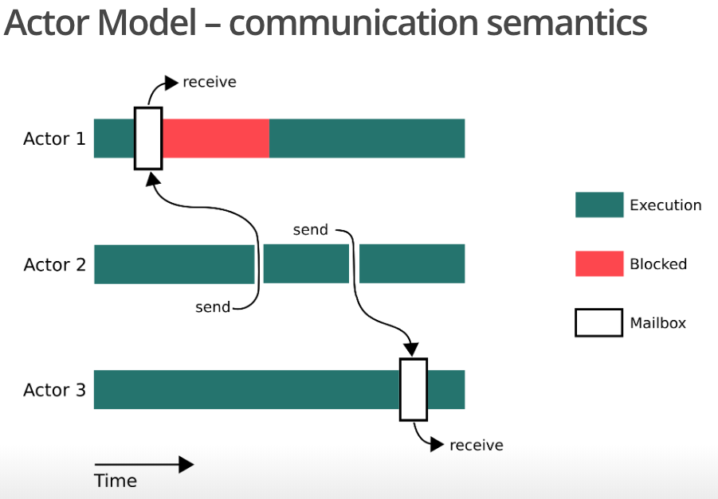

# 并发与并行

并发与并行是两个古老的概念，常见这两个概念被混为一谈，而理解如何区分这两个概念对学习语言、系统都至关重要：

* 并发\(concurrency\)：程序设计上，切分多个任务去运行。
* 并行\(parallelism\)：计算机物理上，多个任务同时执行。

并发概念和并行概念不是一个层级的，一个是程序设计运行上的，一个是计算机物理执行上的，并发物理执行上，不一定是并行的，有可能只是切分时间片，造成并行的假象。

## 并发程序设计\(现代操作系统\)

现代操作系统提供了三种方式支持并发程序设计：进程、事件驱动、线程。

### 进程

第一种方式是进程，进程有自己的内存空间，互相通过IPC通信。进程这种方式由于内存隔离，通信机制复杂度高，且进程本身开销较大。

### 事件驱动

第二种方式是通过现代操作系统内核提供的select/poll/epoll函数，构造事件驱动机制。事件驱动完全可以在进程内使用，也就可以共享内存，通信相比进程简单，当然共享内存本身也会带来问题。除此之外，事件驱动编程复杂度较高，不过控制力也更强。

### 线程

第三种方式是线程，线程开销小、编程较简单、通信也简单，是最轻量也是最常用的方式。当然，多线程导致的问题也不少：

* 线程有独立的栈存储，线程数量较多的情况下，内存开销可观。
* 线程上下文切换，多线程频繁切换效率不如单线程。
* 线程创建销毁开销，线程数量较多的情况下，开销可观。
* 对共享内存需要有线程安全的保护措施。

### 线程池

解决方案也随之而来，**高效使用线程模式的线程池**。线程池限制了线程的数量上限，提高了线程的使用率。线程池基本的工作模式就是worker和job的调度，线程为worker，丢入线程池的操作为job，线程池通过调度算法安排工作。

线程池一定程度上缓解了前三个问题，对于最后一个问题，为了保证线程安全，需要添加保护措施，保护措施是另一个大的话题了。总体来看，保护措施需要人模拟计算机的思维去预防问题，这成了编程的老大难问题。

## 并发程序设计\(现代语言\)

现代操作系统虽然提供了并发程序设计的方式，但无论是其模型还是其使用还是太复杂了，现代语言在其上抽象了一层，简化了并发程序设计。

### 协程

协程并不是为了简化并发程序设计而诞生，却以简化并发程序设计进入了大众的视野。协程还有一个兄弟子程。**协程和子程只是程序的一个关键模块化方式**。

* 子程：分为主程序和子程序，有主次关系。
* 协程：程序之间是平行的关系，没有即定的调用顺序。

子程序可以这样描述：

协程可以这样描述：

### 入口和出口

> Subroutines are special cases of ... coroutines.
>
> — [Donald Knuth](https://en.wikipedia.org/wiki/Donald_Knuth)

祖师爷说可以将子程看做是一种特殊的协程，可以从入口和出口来理解这一点。子程很简单，主程序从入口进入，调用每个子程序后，从出口出去。而协程就不一样了，每次外部发送信号\(next/send\)，协程都是进入或再次进入入口，然后自由地将任何位置作为出口出去。这样来看，子程就是全自动进入的协程。

### 角色

在协程中有这样的三种角色：

* Producer：生产者，只调用send/next。
* Filter：转换器，调用send/next和yield。
* Consumer：消费者，只调用yield。

那么，这三种角色在执行流中可以这样描述：

### generator

generator是协程的子集，generator可以叫做[半协程\(semicoroutines\)](https://en.wikipedia.org/wiki/Coroutine#Comparison_with_generators)，半协程与协程不同的地方就是在于半协程不能自由出去，只能是遇到yield作为出口。这从一定程度上简化了协程的操作和隐藏了协程的概念。从generator取名来看，和producer有异曲同工之妙。

### async/await

async/await最早是在[C\#中提出的](https://msdn.microsoft.com/en-us/library/hh191443%28v=vs.120%29.aspx)，同样为简化并发程序设计而诞生，发展到现在，async/await已成了GUI系统异步编程的标配。

## 共享内存

上文阐述的共享内存老大难问题也有解决方案，问题的本质还是对共享内存的操作是有序的，有序性这点是无法改变的，解决的思路只能到共享内存上来，思路是：**将共享内存转化为通信问题**，保持一个单位对共享资源的持有，其他单位想要访问可以与持有单位通信。这也是著名的**不要通过共享内存来通信，而应该通过通信来共享内存**。这个思路可以通过两个著名的模型实现，CSP和Actor。

### Communicating Sequential Process Model

模型中的通信基本单位叫做process，多个process通过channel通信，通信过程是线性阻塞的。

CSP其实早在几十年前就被提出了，在go语言的引进下，才进入大众视野。

### Actor Model

另一种模型则是Actor Model，模型中的基本通信单位都是actor，多个actor通过mailbox通信，通信过程是充分隔离的投递消息：

Actor不单单是个通信模型，模型更多的是种以并发角度出发的范式，**范式世界观就是一切都是接收消息后做响应的角色，其实就是面向对象的并发版本**。

范式有几点关键设计：

* 发送者以异步消息形式等待响应。
* 角色之间通过地址通信，角色只能与拥有地址的角色通信。
* 消息不保证抵达和顺序。
* 响应者可以创建新角色去响应消息。

这种并发范式的几点设计难以大规模普及，毕竟与流行的范式相差甚远。但Actor也有用武之地，第一点使得模型本地调用和远程调用一致，第三点承认出通信网络的不稳定性，第四点使得模型天然支持扩容，这几点使得模型很适合去做分布式系统。

## 引用

[CSP And Actor](http://jolestar.com/parallel-programming-model-thread-goroutine-actor/)

