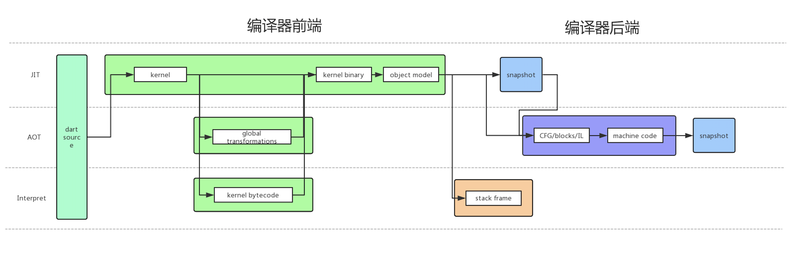

# dart编译的台前幕后

dart是一门既支持JIT也支持AOT还支持Interpret的语言，这就意味着dart集**JIT、编译型、解释型**为一体，能够实现集三种编译类型为一体，dart在编译这方面很值得研究。JIT、AOT、Interpret的背后都是dartVM，本文深入到dartVM源码中，探索JIT、AOT、Interpret背后的原理。

dartVM取名叫做虚拟机，这是历史原因造成的。dartVM不仅是个虚拟机，dartVM实际上是**dart语言的实现**：

* runtime
  * 对象模型\(Object Model\)
  * GC
  * Snapshot
* 核心库
* 开发套装协议
  * Debugging
  * Profiling
  * Hot-reload
* JIT、AOT编译流水线
  * 编译前端
  * 编译后端
* 解释器\(Interpreter\)
* ARM模拟器

当dart使用JIT时，dartVM会保持完整提供动态加载代码的能力。当dart使用AOT时，dartVM会提供一个删减版，叫做_precompiled runtime_，不包含任何动态加载代码的能力。JIT的编译器叫做_Compiler_，AOT的编译器叫做_Precompiler_。Interpret是dartVM比较独立的一块，单独由_Interpreter_负责解释。

JIT、AOT、Interpret较为复杂，下文从JIT、AOT、Interpret依赖的编译器前端和编译器后端出发，途经Snapshot，最终回到JIT、AOT、Interpret。

> 源码地址：[https://github.com/dart-lang/sdk/tree/master/runtime/vm](https://github.com/dart-lang/sdk/tree/master/runtime/vm)
>
> 源码版本：2.5.0-dev.10

## 虚拟机的选择

**虚拟机就是对计算机本身的抽象，计算机可以接受机器码然后执行，虚拟机在机器码抽象一层，就是可以接受自定义的指令集。**

技术是关乎trade-off的，虚拟机也一样，需要做选择：

* bytecode vm还是language vm：是基于bytecode的虚拟机，还是针对某个特定语言的虚拟机。
* base on stack还是base on register：虚拟机指令集是基于栈还是寄存器。

### bytecode vm VS language vm

bytecode vm的优缺点：

* bytecode作为中间语言抽象，可以面向多种编译前端，也就支持多种语言。
* bytecode如果要支持新的特性，面向多种语言，vm的复杂度会比较高。

language vm的优缺点：

* 针对特定语言设计，无法支持其他语言。
* 针对特定语言设计，vm可以做到更好的性能。
* 针对特定语言设计，vm实现可假设语言特性，简单一点。

这其实就是通用和特化的选择，dart在立项时，选择了language vm，但随着dart应用场景的丰富，也提供了基于language vm的bytecode模式，bytecode模式的实现是在基于language vm的前端流水线和后端流水线中，添加了个相关阶段。

### base on register VS base on stack

指令是由操作和目标地址组成，地址可以有n个，形如：

```text
op address_1 .... address_n
```

基于寄存器的指令就是目标地址都是寄存器，比如：

```text
mov  eax, 1  
add  eax, 2 
```

基于寄存器的指令集比较常见，比如三地址指令、二地址指令。

而基于栈的指令就是目标地址是0个，操作都是基于栈执行的，形如：

```text
iconst_1  
iconst_2  
iadd  
istore_0 
```

上面这段指令，会先将两个常量压栈，然后add操作会弹出栈上两个值，并执行加，再压回栈，store操作会将栈弹出一个值，并保存到变量区。

大部分主流的VM\(包括JVM\)都是选择基于栈的指令集，基于栈的指令集将目标地址都隐含了，指令的密度比较高，可以用更少的空间放下更多的指令，在有限的空间环境下，是更可取的方式。除此之外，基于栈的指令集实现也比较简单，遇到较少寄存器的设备也有很好的效率。

## 编译器前端

编译器前端流水线分为普通模式和dbc下的bytecode模式：

```text
normal:
dart source -> kernel -> global transformations(AOT) -> kernel binary -> object model
​
bytecode:
dart source -> kernel -> kernel bytecode -> kernel binary -> object model
```

common front end：将dart源码通过编译器前端编译成kernel，如果需要，针对kernel进行多种代码分析，如果是bytecode模式，再将kernel编译成kernel bytecode，最后将kernel或kernel bytecode序列化出kernel binary。kernel和kernel bytecode是编译器前端的中间语言抽象，隐藏具体编译输入的细节，也可以看做是编译器前端的输出，编译器后端的输入。

dartVM front end：dartVM加载kernel binary，读取二进制文件结构并载入对象模型。dartVM中有两层对象模型，外层就叫Library、Class，内层以Raw为命名规范，叫做RawLibrary、RawClass，非Raw层会引用Raw层。

### kernel、kernel bytecode、kernel binary

实际上，kernel会将dart程序构件\(component\)以自顶向下的方式组织，并添加必要的注解，kernel其实就是dart的AST，kernel本身是由[dart写的](https://github.com/dart-lang/sdk/blob/cb6127570889bed147cbe6292cb2c0ba35271d58/pkg/kernel/lib/ast.dart)。kernel bytecode可理解为基于kernel设计的字节码指令集，详细定义可见[这里](https://github.com/dart-lang/sdk/blob/cb6127570889bed147cbe6292cb2c0ba35271d58/pkg/vm/lib/bytecode/dbc.dart)和[这里](https://github.com/dart-lang/sdk/blob/cb6127570889bed147cbe6292cb2c0ba35271d58/runtime/vm/constants_dbc.h)，kernel binary可理解为kernel/kernel bytecode的二进制文件\(dill文件\)，二进制定义可见[这里](https://github.com/dart-lang/sdk/blob/master/pkg/kernel/binary.md)。

dart程序：

```dart
abstract class HelloWorldInterface {
​
  String welcome();
}
​
mixin HelloworldMixin {
​
  void applyWelcome(void apply(void functor)) {
    var clsoure = () {
      print('hello world!');
    };
    apply(clsoure);
  }
}
​
class HelloWorldSon {
​
  @override
  noSuchMethod(Invocation invocation) {
    // TODO: implement noSuchMethod
    return super.noSuchMethod(invocation);
  }
}
​
class HelloWorldFather extends HelloWorldSon with HelloworldMixin implements HelloWorldInterface {
​
  @override
  String welcome() {
    return 'hello world!';
  }
}
​
String futureHelloWorld() {
  return 'hello world!';
}
​
void main() {
​
  Future<String> future = new Future(futureHelloWorld);
  future.then((str){
    return str;
  });
​
  HelloWorldFather father = new HelloWorldFather();
  print(father.welcome());
}
```

对应的kernel：

```dart
main = int::main;
library from "file:///Users/mayufeng/Desktop/hello.dart" as int {
​
  abstract class HelloWorldInterface extends core::Object {
    synthetic constructor •() → int::HelloWorldInterface
      : super core::Object::•()
      ;
    abstract method welcome() → core::String;
  }
  abstract class HelloworldMixin extends core::Object {
    method applyWelcome((void) → void apply) → void {
      () → core::Null clsoure = () → core::Null {
        core::print("hello world!");
      };
      [@vm.call-site-attributes.metadata=receiverType:(void) → void] apply.call(clsoure);
    }
  }
  class HelloWorldSon extends core::Object {
    synthetic constructor •() → int::HelloWorldSon
      : super core::Object::•()
      ;
    @core::override
    method noSuchMethod(core::Invocation invocation) → dynamic {
      return super.{core::Object::noSuchMethod}(invocation);
    }
  }
  abstract class _HelloWorldFather&HelloWorldSon&HelloworldMixin extends int::HelloWorldSon implements int::HelloworldMixin {
    synthetic constructor •() → int::_HelloWorldFather&HelloWorldSon&HelloworldMixin
      : super int::HelloWorldSon::•()
      ;
    method applyWelcome((void) → void apply) → void {
      () → core::Null clsoure = () → core::Null {
        core::print("hello world!");
      };
      [@vm.call-site-attributes.metadata=receiverType:(void) → void] apply.call(clsoure);
    }
  }
  class HelloWorldFather extends int::_HelloWorldFather&HelloWorldSon&HelloworldMixin implements int::HelloWorldInterface {
    synthetic constructor •() → int::HelloWorldFather
      : super int::_HelloWorldFather&HelloWorldSon&HelloworldMixin::•()
      ;
    @core::override
    method welcome() → core::String {
      return "hello world!";
    }
  }
  static method futureHelloWorld() → core::String {
    return "hello world!";
  }
  static method main() → void {
    asy::Future<core::String> future = asy::Future::•<core::String>(int::futureHelloWorld);
    future.{asy::Future::then}<core::String>((core::String str) → core::String {
      return str;
    });
    int::HelloWorldFather father = new int::HelloWorldFather::•();
    core::print(father.{int::HelloWorldFather::welcome}());
  }
}
```

### 编译前端流水线

编译前端流水线在[kernel\_front\_end](https://github.com/dart-lang/sdk/blob/cb6127570889bed147cbe6292cb2c0ba35271d58/pkg/vm/lib/kernel_front_end.dart)中，流水线透过[kernel\_generator\_impl](https://github.com/dart-lang/sdk/blob/master/pkg/front_end/lib/src/kernel_generator_impl.dart)的`generateKernelInternal`调用[kernel\_target](https://github.com/dart-lang/sdk/blob/master/pkg/front_end/lib/src/fasta/kernel/kernel_target.dart)的`buildComponent`构建kernel程序构件`Component`，如果是bytecode模式，会调用[gen\_bytecode](https://github.com/dart-lang/sdk/blob/cb6127570889bed147cbe6292cb2c0ba35271d58/pkg/vm/lib/bytecode/gen_bytecode.dart)的`BytecodeGenerator`去遍历kernel，根据语法调用`BytecodeAssembler`生成bytecode，如果需要，交给transformer们去分析代码，再由[BinaryPrinter](https://github.com/dart-lang/sdk/blob/cb6127570889bed147cbe6292cb2c0ba35271d58/pkg/kernel/lib/binary/ast_to_binary.dart)去序列化成kernel binary，最后写入目标文件：

```dart
// Run kernel compiler tool with given [options] and [usage]
/// and return exit code.
Future<int> runCompiler(ArgResults options, String usage) async {
  ...
  Uri mainUri = convertFileOrUriArgumentToUri(fileSystem, input);
  if (packagesUri != null) {
    mainUri = await convertToPackageUri(fileSystem, mainUri, packagesUri);
  }
  ...
  final component = await compileToKernel(mainUri, compilerOptions,
      aot: aot,
      useGlobalTypeFlowAnalysis: tfa,
      environmentDefines: environmentDefines,
      genBytecode: genBytecode,
      emitBytecodeSourcePositions: emitBytecodeSourcePositions,
      dropAST: dropAST && !splitOutputByPackages,
      useFutureBytecodeFormat: useFutureBytecodeFormat,
      enableAsserts: enableAsserts,
      enableConstantEvaluation: enableConstantEvaluation);
  ...
  final IOSink sink = new File(outputFileName).openWrite();
  final BinaryPrinter printer = new BinaryPrinter(sink);
  printer.writeComponentFile(component);
  await sink.close();
​
  if (depfile != null) {
    await writeDepfile(fileSystem, component, outputFileName, depfile);
  }
  ...
  return successExitCode;
}
​
/// Generates a kernel representation of the program whose main library is in
/// the given [source]. Intended for whole program (non-modular) compilation.
///
/// VM-specific replacement of [kernelForProgram].
///
Future<Component> compileToKernel(Uri source, CompilerOptions options,
    {bool aot: false,
    bool useGlobalTypeFlowAnalysis: false,
    Map<String, String> environmentDefines,
    bool genBytecode: false,
    bool emitBytecodeSourcePositions: false,
    bool dropAST: false,
    bool useFutureBytecodeFormat: false,
    bool enableAsserts: false,
    bool enableConstantEvaluation: true}) async {
  ...
  final component = await kernelForProgram(source, options);
  ...
  // Run global transformations only if component is correct.
  if (aot && component != null) {
    await _runGlobalTransformations(
        source,
        options,
        component,
        useGlobalTypeFlowAnalysis,
        environmentDefines,
        enableAsserts,
        enableConstantEvaluation,
        errorDetector);
  }
  
  if (genBytecode) {
    await runWithFrontEndCompilerContext(source, options, component, () {
      generateBytecode(component, options: bytecodeOptions);
    });
​
    if (dropAST) {
      component = createFreshComponentWithBytecode(component);
    }
  }
  ...
  return component;
}
​
void generateBytecode(
  Component component, {
  bool dropAST: false,
  bool emitSourcePositions: false,
  bool omitAssertSourcePositions: false,
  bool useFutureBytecodeFormat: false,
  Map<String, String> environmentDefines,
  ErrorReporter errorReporter,
  List<Library> libraries,
}) {
  ...
  final bytecodeGenerator = new BytecodeGenerator(
      component,
      coreTypes,
      hierarchy,
      typeEnvironment,
      constantsBackend,
      emitSourcePositions,
      omitAssertSourcePositions,
      useFutureBytecodeFormat,
      errorReporter);
  for (var library in libraries) {
    bytecodeGenerator.visitLibrary(library);
  }
  if (dropAST) {
    final astRemover = new DropAST(component);
    for (var library in libraries) {
      astRemover.visitLibrary(library);
    }
  }
}
​
Future _runGlobalTransformations(
    Uri source,
    CompilerOptions compilerOptions,
    Component component,
    bool useGlobalTypeFlowAnalysis,
    Map<String, String> environmentDefines,
    bool enableAsserts,
    bool enableConstantEvaluation,
    ErrorDetector errorDetector) async {
  ...
  // TODO(alexmarkov, dmitryas): Consider doing canonicalization of identical
  // mixin applications when creating mixin applications in frontend,
  // so all backends (and all transformation passes from the very beginning)
  // can benefit from mixin de-duplication.
  // At least, in addition to VM/AOT case we should run this transformation
  // when building a platform dill file for VM/JIT case.
  mixin_deduplication.transformComponent(component);
  ...
  if (useGlobalTypeFlowAnalysis) {
    globalTypeFlow.transformComponent(
        compilerOptions.target, coreTypes, component);
  } else {
    devirtualization.transformComponent(coreTypes, component);
    no_dynamic_invocations_annotator.transformComponent(component);
  }
  ...
  final hierarchy = new ClassHierarchy(component,
      onAmbiguousSupertypes: ignoreAmbiguousSupertypes);
  call_site_annotator.transformLibraries(
      component, component.libraries, coreTypes, hierarchy);
  ...
}
```

#### **TFA\(Type Flow Analysis\)**

在多种代码分析中，TFA是比较关键的一种，只在AOT编译下有。TFA基于全局信息进行代码中的类型流动分析，通过类型判断出哪些类、哪些方法是不可达的，并且去虚拟化方法调用。在[transformer.dart](https://github.com/dart-lang/sdk/blob/cb6127570889bed147cbe6292cb2c0ba35271d58/pkg/vm/lib/transformations/type_flow/transformer.dart)中：

```dart
/// Whole-program type flow analysis and transformation.
/// Assumes strong mode and closed world.
Component transformComponent(
    Target target, CoreTypes coreTypes, Component component,
    [PragmaAnnotationParser matcher]) {
  ...
  final typeFlowAnalysis = new TypeFlowAnalysis(target, component, coreTypes,
      hierarchy, genericInterfacesInfo, types, libraryIndex,
      matcher: matcher);
​
  Procedure main = component.mainMethod;
  final Selector mainSelector = new DirectSelector(main);
  typeFlowAnalysis.addRawCall(mainSelector);
  typeFlowAnalysis.process();
  ...
  final transformsStopWatch = new Stopwatch()..start();
​
  new TreeShaker(component, typeFlowAnalysis).transformComponent(component);
​
  new TFADevirtualization(component, typeFlowAnalysis)
      .visitComponent(component);
​
  new AnnotateKernel(component, typeFlowAnalysis).visitComponent(component);
  ...
  return component;
}
```

#### **加载kernel binary**

dartVM front end在编译前端中的角色就是加载kernel binary，读取二进制文件结构并载入对象模型。`Program`是kernel binary二进制文件结构的抽象，二进制文件头部的读取过程，即`Program`的创建过程：

```cpp
std::unique_ptr<Program> Program::ReadFrom(Reader* reader, const char** error) {
  if (reader->size() < 60) {
    // A kernel file currently contains at least the following:
    //   * Magic number (32)
    //   * kernel version (32)
    //   * List of problems (8)
    //   * Length of source map (32)
    //   * Length of canonical name table (8)
    //   * Metadata length (32)
    //   * Length of string table (8)
    //   * Length of constant table (8)
    //   * Component index (10 * 32)
    //
    // so is at least 60 bytes.
    // (Technically it will also contain an empty entry in both source map and
    // string table, taking up another 8 bytes.)
    if (error != nullptr) {
      *error = kkernelInvalidFilesize;
    }
    return nullptr;
  }
​
  uint32_t magic = reader->ReadUInt32();
  if (magic != kMagicProgramFile) {
    if (error != nullptr) {
      *error = kkernelInvalidMagicIdentifier;
    }
    return nullptr;
  }
​
  uint32_t formatVersion = reader->ReadUInt32();
  if ((formatVersion < kMinSupportedkernelFormatVersion) ||
      (formatVersion > kMaxSupportedkernelFormatVersion)) {
    if (error != nullptr) {
      *error = kkernelInvalidBinaryFormatVersion;
    }
    return nullptr;
  }
​
  std::unique_ptr<Program> program(new Program());
  program->binary_version_ = formatVersion;
  program->kernel_data_ = reader->buffer();
  program->kernel_data_size_ = reader->size();
​
  // Dill files can be concatenated (e.g. cat a.dill b.dill > c.dill). Find out
  // if this dill contains more than one program.
  int subprogram_count = 0;
  reader->set_offset(reader->size() - 4);
  while (reader->offset() > 0) {
    intptr_t size = reader->ReadUInt32();
    intptr_t start = reader->offset() - size;
    if (start < 0) {
      if (error != nullptr) {
        *error = kkernelInvalidSizeIndicated;
      }
      return nullptr;
    }
    ++subprogram_count;
    if (subprogram_count > 1) break;
    reader->set_offset(start - 4);
  }
  program->single_program_ = subprogram_count == 1;
​
  // Read backwards at the end.
  program->library_count_ = reader->ReadFromIndexNoReset(
      reader->size_, LibraryCountFieldCountFromEnd, 1, 0);
  program->source_table_offset_ = reader->ReadFromIndexNoReset(
      reader->size_,
      LibraryCountFieldCountFromEnd + 1 + program->library_count_ + 1 +
          SourceTableFieldCountFromFirstLibraryOffset,
      1, 0);
  program->name_table_offset_ = reader->ReadUInt32();
  program->metadata_payloads_offset_ = reader->ReadUInt32();
  program->metadata_mappings_offset_ = reader->ReadUInt32();
  program->string_table_offset_ = reader->ReadUInt32();
  program->constant_table_offset_ = reader->ReadUInt32();
​
  program->main_method_reference_ = NameIndex(reader->ReadUInt32() - 1);
​
  return program;
}
```

`Program`被创建出来后，会交给`KernelLoader`去加载。加载会通过kernel translation helper们/bytecode helper们自顶向下的构建出程序构件，包括`Library`、`Class`、`Class`中的`Field`、`Class`中的`Constructor`、`Class`中的`Function`、常量等其他元素。

加载`Program`主要过程如下，加载`Program`相关的`Library`，并返回`Program`的main Library：

```cpp
RawObject* KernelLoader::LoadProgram(bool process_pending_classes) {
    bool libraries_loaded = false;
    if (FLAG_enable_interpreter || FLAG_use_bytecode_compiler) {
      libraries_loaded = bytecode_metadata_helper_.ReadLibraries();
    }
    ...
    if (FLAG_enable_interpreter || FLAG_use_bytecode_compiler) {
      libraries_loaded = bytecode_metadata_helper_.ReadLibraries();
    }
  
    if (!libraries_loaded) {
      // Note that `problemsAsJson` on Component is implicitly skipped.
      const intptr_t length = program_->library_count();
      for (intptr_t i = 0; i < length; i++) {
        LoadLibrary(i);
      }
    }
​
    // Sets the constants array to an empty hash and leaves the constant
    // table's raw bytes in place for lazy reading. We can fix up all
    // "pending" processing now, and must ensure we don't create new
    // ones from this point on.
    const Array& array =
        Array::Handle(Z, HashTables::New<KernelConstantsMap>(16, Heap::kOld));
    kernel_program_info_.set_constants(array);
    H.SetConstants(array);  // for caching
​
    NameIndex main = program_->main_method();
    if (main != -1) {
      NameIndex main_library = H.EnclosingName(main);
      return LookupLibrary(main_library);
    }
​
    return bytecode_metadata_helper_.GetMainLibrary();
}
```

加载`Library`主要过程如下，构建`Library`并加载相关的`Class`：

```cpp
RawLibrary* KernelLoader::LoadLibrary(intptr_t index) {
  ...
  const GrowableObjectArray& classes =
      GrowableObjectArray::Handle(Z, I->object_store()->pending_classes());
​
  // Load all classes.
  intptr_t next_class_offset = library_index.ClassOffset(0);
  Class& klass = Class::Handle(Z);
  for (intptr_t i = 0; i < class_count; ++i) {
    helper_.SetOffset(next_class_offset);
    next_class_offset = library_index.ClassOffset(i + 1);
    LoadClass(library, toplevel_class, next_class_offset, &klass);
    if (register_class) {
      classes.Add(klass, Heap::kOld);
    }
  }
​
  return library.raw();
}
```

加载`Class`主要过程如下，构建`Class`并加载相关的`Field` 、`Constructor`、`Function` ：

```cpp
void KernelLoader::LoadClass(const Library& library,
                             const Class& toplevel_class,
                             intptr_t class_end,
                             Class* out_class) {
  ...
  *out_class = LookupClass(library, class_helper.canonical_name_);
  ...
​
  // We do not register expression evaluation classes with the VM:
  // The expression evaluation functions should be GC-able as soon as
  // they are not reachable anymore and we never look them up by name.
  const bool register_class =
      library.raw() != expression_evaluation_library_.raw();
​
  if (loading_native_wrappers_library_ || !register_class) {
    FinishClassLoading(*out_class, library, toplevel_class, class_offset,
                       class_index, &class_helper);
  }
}
​
void KernelLoader::FinishClassLoading(const Class& klass,
                                      const Library& library,
                                      const Class& toplevel_class,
                                      intptr_t class_offset,
                                      const ClassIndex& class_index,
                                      ClassHelper* class_helper) {
​
  fields_.Clear();
  functions_.Clear();
  if (!discard_fields) {
    class_helper->ReadUntilExcluding(ClassHelper::kFields);
    int field_count = helper_.ReadListLength();  // read list length.
    for (intptr_t i = 0; i < field_count; ++i) {
      ...
      Field& field = Field::Handle(
          Z,
          Field::New(name, field_helper.IsStatic(), is_final,
                     field_helper.IsConst(), is_reflectable, script_class, type,
                     field_helper.position_, field_helper.end_position_));
      ...
      fields_.Add(&field);
    }
    class_helper->SetJustRead(ClassHelper::kFields);
​
  class_helper->ReadUntilExcluding(ClassHelper::kConstructors);
  int constructor_count = helper_.ReadListLength();  // read list length.
  for (intptr_t i = 0; i < constructor_count; ++i) {
    ConstructorHelper constructor_helper(&helper_);
    constructor_helper.ReadUntilExcluding(ConstructorHelper::kAnnotations);
    ...
    Function& function = Function::ZoneHandle(
        Z, Function::New(name, RawFunction::kConstructor,
                         false,  // is_static
                         constructor_helper.IsConst(),
                         false,  // is_abstract
                         constructor_helper.IsExternal(),
                         false,  // is_native
                         *owner, constructor_helper.start_position_));
    functions_.Add(&function);
    ...
  }
​
  // Everything up til the procedures are skipped implicitly, and class_helper
  // is no longer used.
​
  intptr_t procedure_count = class_index.procedure_count();
  // Procedure offsets within a class index are whole program offsets and not
  // relative to the library of the class. Hence, we need a correction to get
  // the currect procedure offset within the current data.
  intptr_t correction = correction_offset_ - library_kernel_offset_;
  intptr_t next_procedure_offset = class_index.ProcedureOffset(0) + correction;
  for (intptr_t i = 0; i < procedure_count; ++i) {
    helper_.SetOffset(next_procedure_offset);
    next_procedure_offset = class_index.ProcedureOffset(i + 1) + correction;
    LoadProcedure(library, klass, true, next_procedure_offset);
  }
}
​
void KernelLoader::LoadProcedure(const Library& library,
                                 const Class& owner,
                                 bool in_class,
                                 intptr_t procedure_end) {
  intptr_t procedure_offset = helper_.ReaderOffset() - correction_offset_;
  ProcedureHelper procedure_helper(&helper_);
  ...
  // We do not register expression evaluation libraries with the VM:
  // The expression evaluation functions should be GC-able as soon as
  // they are not reachable anymore and we never look them up by name.
  const bool register_function = !name.Equals(Symbols::DebugProcedureName());
​
  Function& function = Function::ZoneHandle(
      Z, Function::New(name, kind,
                       !is_method,  // is_static
                       false,       // is_const
                       is_abstract, is_external,
                       !native_name.IsNull(),  // is_native
                       script_class, procedure_helper.start_position_));
  function.set_has_pragma(has_pragma_annotation);
  function.set_end_token_pos(procedure_helper.end_position_);
  function.set_is_no_such_method_forwarder(
      procedure_helper.IsNoSuchMethodForwarder());
  if (register_function) {
    functions_.Add(&function);
  } else {
    expression_evaluation_function_ = function.raw();
  }
  ...
}
```

## 编译器后端

**虚拟机比较关键的一块就是指令集，dartVM虚拟机内部就有一套基于栈的指令集，这套指令集不像字节码指令集是可以直接输出的，这套指令集是面向对象抽象出来的。**

编译器后端流水线分为优化或非优化两种：

```text
unoptimized:
​
CFG/blocks/IL -> machine code
​
optimized:
​
CFG/blocks/IL -> optimized piepeline pass -> machine code
​
```

编译器将函数的函数体kernel转化为基于求值栈的指令集，具体数据结构为CFG\(Control Flow Graph\)，CFG由blocks组成，而blocks又是由IL\(intermediate language\)组成，IL即是指令，都会基于求值栈。如果不需要优化则直接将指令降级到机器码，需要优化要经过优化流水线，其中很关键的一步是把IL改写成SSA\(Static Single Assignment\)形式，最后降级到机器码。

* CFG：程序流程控制的图表示，CFG是编译器对程序做处理/优化/分析的常用抽象。
* IL：架构无关的指令抽象，方便对指令做优化，所有IL组成了指令集。
* SSA：中间语言的一种形式，每个变量只可赋值一次。形成SSA形式，可使编译器进行更多深入的优化。

### CFG、Block、IL

CFG、Block、IL是编译后端处理过程中的关键数据结构，整体结构是以IL作为基本元素构成的有向图CFG，每个Block由特殊的Block入口IL来表示。

IL就是架构无关的指令，不同架构有不同实现，不同指令有不同抽象，基本抽象就是`Instruction`类：

```cpp
class Instruction : public ZoneAllocated {
 public:
  ...
  // Visiting support.
  virtual void Accept(FlowGraphVisitor* visitor) = 0;
​
  Instruction* previous() const { return previous_; }
  void set_previous(Instruction* instr) {
    previous_ = instr;
  }
​
  Instruction* next() const { return next_; }
  void set_next(Instruction* instr) {
    // TODO(fschneider): Also add Throw and ReThrow to the list of instructions
    // that do not have a successor. Currently, the graph builder will continue
    // to append instruction in case of a Throw inside an expression. This
    // condition should be handled in the graph builder
    next_ = instr;
  }
​
  // Link together two instruction.
  void LinkTo(Instruction* next) {
    this->set_next(next);
    next->set_previous(this);
  }
​
  // Removed this instruction from the graph, after use lists have been
  // computed.  If the instruction is a definition with uses, those uses are
  // unaffected (so the instruction can be reinserted, e.g., hoisting).
  Instruction* RemoveFromGraph(bool return_previous = true);
  ...
  private:
    Instruction* previous_;
    Instruction* next_;
}
```

Block没有整体的抽象，直接由`BlockEntryInstr`作为Block入口表示，构建Block的算法在`DiscoverBlock`中：

```cpp
/ Basic block entries are administrative nodes.  There is a distinguished
// graph entry with no predecessor.  Joins are the only nodes with multiple
// predecessors.  Targets are all other basic block entries.  The types
// enforce edge-split form---joins are forbidden as the successors of
// branches.
class BlockEntryInstr : public Instruction {
 public:
 ...
  // Discover basic-block structure of the current block.  Must be called
  // on all graph blocks in preorder to yield valid results.  As a side effect,
  // the block entry instructions in the graph are assigned preorder numbers.
  // The array 'preorder' maps preorder block numbers to the block entry
  // instruction with that number.  The depth first spanning tree is recorded
  // in the array 'parent', which maps preorder block numbers to the preorder
  // number of the block's spanning-tree parent.  As a side effect of this
  // function, the set of basic block predecessors (e.g., block entry
  // instructions of predecessor blocks) and also the last instruction in the
  // block is recorded in each entry instruction.  Returns true when called the
  // first time on this particular block within one graph traversal, and false
  // on all successive calls.
  bool DiscoverBlock(BlockEntryInstr* predecessor,
                     GrowableArray<BlockEntryInstr*>* preorder,
                     GrowableArray<intptr_t>* parent);
  ...
 private:
  ...
  intptr_t block_id_;
  Instruction* last_instruction_;
};
```

CFG是函数体的有向图，后续的分析、优化过程都会直接操作CFG，抽象为`FlowGraph`：

```cpp
// Class to encapsulate the construction and manipulation of the flow graph.
class FlowGraph : public ZoneAllocated {
 public:
  FlowGraph(const ParsedFunction& parsed_function,
            GraphEntryInstr* graph_entry,
            intptr_t max_block_id,
            PrologueInfo prologue_info);
​
  // Function properties.
  const ParsedFunction& parsed_function() const { return parsed_function_; }
  const Function& function() const { return parsed_function_.function(); }
  ...
    // Flow graph orders.
  const GrowableArray<BlockEntryInstr*>& preorder() const { return preorder_; }
  const GrowableArray<BlockEntryInstr*>& postorder() const {
    return postorder_;
  }
  const GrowableArray<BlockEntryInstr*>& reverse_postorder() const {
    return reverse_postorder_;
  }
  ...
  void InsertBefore(Instruction* next,
                    Instruction* instr,
                    Environment* env,
                    UseKind use_kind);
  void InsertAfter(Instruction* prev,
                   Instruction* instr,
                   Environment* env,
                   UseKind use_kind);
  Instruction* AppendTo(Instruction* prev,
                        Instruction* instr,
                        Environment* env,
                        UseKind use_kind);
     // Operations on the flow graph.
  void ComputeSSA(intptr_t next_virtual_register_number,
                  ZoneGrowableArray<Definition*>* inlining_parameters);
  void DiscoverBlocks();
  
  void MergeBlocks();
  ...
  private:
  ...
  GraphEntryInstr* graph_entry_;
  GrowableArray<BlockEntryInstr*> preorder_;
  GrowableArray<BlockEntryInstr*> postorder_;
  GrowableArray<BlockEntryInstr*> reverse_postorder_;
  ...
}
```

### 编译器后端流水线

编译器后端流水线在`ParsedFunctionHelper`的`Compile`中，先由`FlowGraphBuilder`构造出CFG，然后由`BlockScheduler`给CFG加权，再由`CompilerPass::RunPipeline`进行优化流水线，最后交给`Assembler`和`FlowGraphCompiler`降级到机器码：

```cpp
RawCode* CompileParsedFunctionHelper::Compile(CompilationPipeline* pipeline) {
  ...
  CompilerState compiler_state(thread());
  kernel::FlowGraphBuilder builder(parsed_function, ic_data_array,
                                  /* not building var desc */ NULL,
                                  /* not inlining */ NULL, optimized, osr_id);
  FlowGraph* flow_graph = builder.BuildGraph();
  ...
  
  BlockScheduler block_scheduler(flow_graph);
  const bool reorder_blocks =
          FlowGraph::ShouldReorderBlocks(function, optimized());
  if (reorder_blocks) {
    block_scheduler.AssignEdgeWeights();
  }
  ...
    
  CompilerPassState pass_state(thread(), flow_graph, &speculative_policy);
  pass_state.block_scheduler = &block_scheduler;
  pass_state.reorder_blocks = reorder_blocks;
​
  if (optimized()) {
    pass_state.inline_id_to_function.Add(&function);
​
    JitCallSpecializer call_specializer(flow_graph, &speculative_policy);
    pass_state.call_specializer = &call_specializer;
​
    CompilerPass::RunPipeline(CompilerPass::kJIT, &pass_state);
  }
  ...
    
  Assembler assembler(&object_pool_builder, use_far_branches);
  FlowGraphCompiler graph_compiler(
    &assembler, flow_graph, *parsed_function(), optimized(),
    &speculative_policy, pass_state.inline_id_to_function,
    pass_state.inline_id_to_token_pos, pass_state.caller_inline_id,
    ic_data_array);
  
  graph_compiler.CompileGraph();
  pipeline->FinalizeCompilation(flow_graph);
  
  *result = FinalizeCompilation(&assembler, &graph_compiler, flow_graph);
  return result->raw();
}
```

#### **基于求值栈的指令**

编译后端流水线中首先要做的就是构造CFG，构造过程通过编译器前端的kernel translation helper们/bytecode helper们解析函数体kernel/kernel bytecode，再通过`FlowGraphBuilder`/`BytecodeFlowGraphBuilder`将kernel/kernel bytecode转换成基于求值栈的指令集，最后形成指令的有向图数据结构。

编译后端流水线中，由`FlowGraphBuilder`构建`FlowGraph`，会走到`StreamingFlowGraphBuilder`的`BuildGraph`：

```cpp
FlowGraph* StreamingFlowGraphBuilder::BuildGraph() {
  const Function& function = parsed_function()->function();
  ...
   if (function.is_declared_in_bytecode()) {
    ...
    bytecode_metadata_helper_.ParseBytecodeFunction(parsed_function());
    ...
    BytecodeFlowGraphBuilder bytecode_compiler(
        flow_graph_builder_, parsed_function(),
        &(flow_graph_builder_->ic_data_array_));
    ...
    return bytecode_compiler.BuildGraph();
  }
  ...
  ParseKernelASTFunction();
  ...
  switch (function.kind()) {
    case RawFunction::kRegularFunction:
    case RawFunction::kGetterFunction:
    case RawFunction::kSetterFunction:
    case RawFunction::kClosureFunction:
    case RawFunction::kConstructor: {
      if (B->IsRecognizedMethodForFlowGraph(function)) {
        return B->BuildGraphOfRecognizedMethod(function);
      }
      return BuildGraphOfFunction(function.IsGenerativeConstructor());
    }
    case RawFunction::kImplicitGetter:
    case RawFunction::kImplicitStaticGetter:
    case RawFunction::kImplicitSetter: {
      const Field& field = Field::Handle(Z, function.accessor_field());
      if (field.is_const() && field.IsUninitialized()) {
        EvaluateConstFieldValue(field);
      }
      return B->BuildGraphOfFieldAccessor(function);
    }
    case RawFunction::kStaticFieldInitializer:
      return BuildGraphOfFieldInitializer();
    case RawFunction::kDynamicInvocationForwarder:
      return B->BuildGraphOfDynamicInvocationForwarder(function);
    case RawFunction::kMethodExtractor:
      return flow_graph_builder_->BuildGraphOfMethodExtractor(function);
    case RawFunction::kNoSuchMethodDispatcher:
      return flow_graph_builder_->BuildGraphOfNoSuchMethodDispatcher(function);
    case RawFunction::kInvokeFieldDispatcher:
      return flow_graph_builder_->BuildGraphOfInvokeFieldDispatcher(function);
    case RawFunction::kImplicitClosureFunction:
      return flow_graph_builder_->BuildGraphOfImplicitClosureFunction(function);
    case RawFunction::kFfiTrampoline:
      return flow_graph_builder_->BuildGraphOfFfiTrampoline(function);
    case RawFunction::kSignatureFunction:
    case RawFunction::kIrregexpFunction:
      break;
  }
}
```

普通模式下，`StreamingFlowGraphBuilder`继承了编译前端的`KernelReaderHelper`，在`ParseKernelASTFunction`过程中复用kernel解析过程：

```cpp
void StreamingFlowGraphBuilder::ParseKernelASTFunction() {
  const Function& function = parsed_function()->function();
  ...
  // Mark forwarding stubs.
  switch (function.kind()) {
    case RawFunction::kRegularFunction:
    case RawFunction::kImplicitClosureFunction:
    case RawFunction::kGetterFunction:
    case RawFunction::kSetterFunction:
    case RawFunction::kClosureFunction:
    case RawFunction::kConstructor:
    case RawFunction::kDynamicInvocationForwarder:
      ReadForwardingStubTarget(function);
      break;
    default:
      break;
  }
  ...
  switch (function.kind()) {
    case RawFunction::kRegularFunction:
    case RawFunction::kGetterFunction:
    case RawFunction::kSetterFunction:
    case RawFunction::kClosureFunction:
    case RawFunction::kConstructor:
    case RawFunction::kImplicitClosureFunction:
      ReadUntilFunctionNode();
      SetupDefaultParameterValues();
      ReadDefaultFunctionTypeArguments(function);
      break;
    case RawFunction::kImplicitGetter:
    case RawFunction::kImplicitStaticGetter:
    case RawFunction::kImplicitSetter:
    case RawFunction::kStaticFieldInitializer:
    case RawFunction::kMethodExtractor:
    case RawFunction::kNoSuchMethodDispatcher:
    case RawFunction::kInvokeFieldDispatcher:
    case RawFunction::kFfiTrampoline:
      break;
    case RawFunction::kDynamicInvocationForwarder:
      if (PeekTag() != kField) {
        ReadUntilFunctionNode();
        SetupDefaultParameterValues();
        ReadDefaultFunctionTypeArguments(function);
      }
      break;
    case RawFunction::kSignatureFunction:
    case RawFunction::kIrregexpFunction:
      UNREACHABLE();
      break;
  }
}
```

普通模式下，在`FlowGraphBuilder`中，区分不同逻辑，将kernel转换成虚拟指令。比如，`BuildGraphOfFunction`会走到`BuildFunctionBody`再到`NativeFunctionBody`：

```cpp
Fragment FlowGraphBuilder::NativeFunctionBody(const Function& function,
                                              LocalVariable* first_parameter) {
  Fragment body;
  String& name = String::ZoneHandle(Z, function.native_name());
  if (function.IsGeneric()) {
    body += LoadLocal(parsed_function_->RawTypeArgumentsVariable());
    body += PushArgument();
  }
  for (intptr_t i = 0; i < function.NumParameters(); ++i) {
    body += LoadLocal(parsed_function_->RawParameterVariable(i));
    body += PushArgument();
  }
  body += NativeCall(&name, &function);
  // We typecheck results of native calls for type safety.
  body +=
      Return(TokenPosition::kNoSource, /* omit_result_type_check = */ false);
  return body;
}
​
Fragment FlowGraphBuilder::LoadLocal(LocalVariable* variable) {
  if (variable->is_captured()) {
    Fragment instructions;
    instructions += LoadContextAt(variable->owner()->context_level());
    instructions +=
        LoadNativeField(Slot::GetContextVariableSlotFor(thread_, *variable));
    return instructions;
  } else {
    return BaseFlowGraphBuilder::LoadLocal(variable);
  }
}
​
Fragment StreamingFlowGraphBuilder::PushArgument() {
  return flow_graph_builder_->PushArgument();
}
```

指令基于栈的模型在`BaseFlowGraphBuilder`中，由`FlowGraphBuilder`所继承：

```cpp
class BaseFlowGraphBuilder {
public:
  ...
  void Push(Definition* definition);
  Value* Pop();
  Fragment LoadLocal(LocalVariable* variable);
  Fragment PushArgument();
  ...
protected:
...
  const ParsedFunction* parsed_function_;
  const Function& function_;
  Value* stack_;
...
}
​
void BaseFlowGraphBuilder::Push(Definition* definition) {
  SetTempIndex(definition);
  Value::AddToList(new (Z) Value(definition), &stack_);
}
  
Value* BaseFlowGraphBuilder::Pop() {
  Value* value = stack_;
  stack_ = value->next_use();
  if (stack_ != NULL) stack_->set_previous_use(NULL);
​
  value->set_next_use(NULL);
  value->set_previous_use(NULL);
  value->definition()->ClearSSATempIndex();
  return value;
}
  
Fragment BaseFlowGraphBuilder::LoadLocal(LocalVariable* variable) {
  LoadLocalInstr* load =
      new (Z) LoadLocalInstr(*variable, TokenPosition::kNoSource);
  Push(load);
  return Fragment(load);
}
  
Fragment BaseFlowGraphBuilder::PushArgument() {
  PushArgumentInstr* argument = new (Z) PushArgumentInstr(Pop());
  Push(argument);
  ++pending_argument_count_;
  return Fragment(argument);
}
```

bytecode模式下，通过编译前端的`BytecodeMetadataHelper`，复用kernel bytecode解析过程。在`BytecodeFlowGraphBuilder`中，统一通过`BuildInstruction`，将kernel bytecode转换成虚拟指令，分发到以Build + 指令名称的方法：

```cpp
void BytecodeFlowGraphBuilder::BuildInstruction(KernelBytecode::Opcode opcode) {
  switch (opcode) {
#define WIDE_CASE(name) case KernelBytecode::k##name##_Wide:
#define WIDE_CASE_0(name)
#define WIDE_CASE_A(name)
#define WIDE_CASE_D(name) WIDE_CASE(name)
#define WIDE_CASE_X(name) WIDE_CASE(name)
#define WIDE_CASE_T(name) WIDE_CASE(name)
#define WIDE_CASE_A_E(name) WIDE_CASE(name)
#define WIDE_CASE_A_Y(name) WIDE_CASE(name)
#define WIDE_CASE_D_F(name) WIDE_CASE(name)
#define WIDE_CASE_A_B_C(name)
​
#define BUILD_BYTECODE_CASE(name, encoding, kind, op1, op2, op3)               \
  BUILD_BYTECODE_CASE_##kind(name, encoding)
​
#define BUILD_BYTECODE_CASE_WIDE(name, encoding)
#define BUILD_BYTECODE_CASE_RESV(name, encoding)
#define BUILD_BYTECODE_CASE_ORDN(name, encoding)                               \
  case KernelBytecode::k##name:                                                \
    WIDE_CASE_##encoding(name) Build##name();                                  \
    break;
​
    PUBLIC_KERNEL_BYTECODES_LIST(BUILD_BYTECODE_CASE)
​
#undef WIDE_CASE
#undef WIDE_CASE_0
#undef WIDE_CASE_A
#undef WIDE_CASE_D
#undef WIDE_CASE_X
#undef WIDE_CASE_T
#undef WIDE_CASE_A_E
#undef WIDE_CASE_A_Y
#undef WIDE_CASE_D_F
#undef WIDE_CASE_A_B_C
#undef BUILD_BYTECODE_CASE
#undef BUILD_BYTECODE_CASE_WIDE
#undef BUILD_BYTECODE_CASE_RESV
#undef BUILD_BYTECODE_CASE_ORDN
​
    default:
      FATAL1("Unsupported bytecode instruction %s\n",
             KernelBytecode::NameOf(opcode));
  }
}
```

比如，`BuildLoadFieldTOS`方法：

```cpp
void BytecodeFlowGraphBuilder::BuildLoadFieldTOS() {
  ...
  const Field& field = Field::Cast(ConstantAt(cp_index, 1).value());
  ...
  if (field.Owner() == isolate()->object_store()->closure_class()) {
    // Loads from _Closure fields are lower-level.
    code_ += flow_graph_builder_->LoadNativeField(ClosureSlotByField(field));
  } else {
    code_ += flow_graph_builder_->LoadField(field);
  }
}
```

#### **优化流水线**

优化流水线中包括多项优化，在编译后端流水线中由`CompilerPass`作为入口：

```cpp
void CompilerPass::RunPipeline(PipelineMode mode,
                               CompilerPassState* pass_state) {
  INVOKE_PASS(ComputeSSA);
#if defined(DART_PRECOMPILER)
  if (mode == kAOT) {
    INVOKE_PASS(ApplyClassIds);
    INVOKE_PASS(TypePropagation);
  }
#endif
  INVOKE_PASS(ApplyICData);
  INVOKE_PASS(TryOptimizePatterns);
  INVOKE_PASS(SetOuterInliningId);
  INVOKE_PASS(TypePropagation);
  INVOKE_PASS(ApplyClassIds);
  INVOKE_PASS(Inlining);
  INVOKE_PASS(TypePropagation);
  INVOKE_PASS(ApplyClassIds);
  INVOKE_PASS(TypePropagation);
  INVOKE_PASS(ApplyICData);
  INVOKE_PASS(Canonicalize);
  INVOKE_PASS(BranchSimplify);
  INVOKE_PASS(IfConvert);
  INVOKE_PASS(Canonicalize);
  INVOKE_PASS(ConstantPropagation);
  INVOKE_PASS(OptimisticallySpecializeSmiPhis);
  INVOKE_PASS(TypePropagation);
#if defined(DART_PRECOMPILER)
  if (mode == kAOT) {
    // The extra call specialization pass in AOT is able to specialize more
    // calls after ConstantPropagation, which removes unreachable code, and
    // TypePropagation, which can infer more accurate types after removing
    // unreachable code.
    INVOKE_PASS(ApplyICData);
  }
  if (mode == kAOT) {
    INVOKE_PASS(OptimizeTypedDataAccesses);
  }
#endif
  INVOKE_PASS(WidenSmiToInt32);
  INVOKE_PASS(SelectRepresentations);
  INVOKE_PASS(CSE);
  INVOKE_PASS(LICM);
  INVOKE_PASS(TryOptimizePatterns);
  INVOKE_PASS(DSE);
  INVOKE_PASS(TypePropagation);
  INVOKE_PASS(RangeAnalysis);
  INVOKE_PASS(OptimizeBranches);
  INVOKE_PASS(TypePropagation);
  INVOKE_PASS(TryCatchOptimization);
  INVOKE_PASS(EliminateEnvironments);
  INVOKE_PASS(EliminateDeadPhis);
  INVOKE_PASS(Canonicalize);
  INVOKE_PASS(AllocationSinking_Sink);
  INVOKE_PASS(EliminateDeadPhis);
  INVOKE_PASS(TypePropagation);
  INVOKE_PASS(SelectRepresentations);
  INVOKE_PASS(Canonicalize);
  INVOKE_PASS(EliminateStackOverflowChecks);
  INVOKE_PASS(Canonicalize);
  INVOKE_PASS(AllocationSinking_DetachMaterializations);
  INVOKE_PASS(WriteBarrierElimination);
  INVOKE_PASS(FinalizeGraph);
  INVOKE_PASS(AllocateRegisters);
  INVOKE_PASS(ReorderBlocks);
}
```

优化代码分散在具体的负责方，比如SSA：

```cpp
COMPILER_PASS(ComputeSSA, {
  // Transform to SSA (virtual register 0 and no inlining arguments).
  flow_graph->ComputeSSA(0, NULL);
});
```

#### **机器码降级**

机器码降级会先将基于求值栈的虚拟指令翻译成目标架构的指令集，再翻译成机器码。`Assembler`抽象了架构的指令集，不同架构有不同实现。`FlowGraphCompiler`会以Block为单位访问程序，执行翻译。

x86架构的`Assembler`：

```cpp
class Assembler : public AssemblerBase {
 public:
  ...
  /*
   * Emit Machine Instructions.
   */
  void call(Register reg) { EmitUnaryL(reg, 0xFF, 2); }
  void call(const Address& address) { EmitUnaryL(address, 0xFF, 2); }
  void call(Label* label);
  void call(const ExternalLabel* label);
​
  void pushq(Register reg);
  void pushq(const Address& address) { EmitUnaryL(address, 0xFF, 6); }
  void pushq(const Immediate& imm);
  void PushImmediate(const Immediate& imm);
​
  void popq(Register reg);
  void popq(const Address& address) { EmitUnaryL(address, 0x8F, 0); }
  ...
}
​
void Assembler::EmitUnaryL(Register reg, int opcode, int modrm_code) {
  AssemblerBuffer::EnsureCapacity ensured(&buffer_);
  EmitRegisterREX(reg, REX_NONE);
  EmitUint8(opcode);
  EmitOperand(modrm_code, Operand(reg));
}
​
inline void Assembler::EmitRegisterREX(Register reg, uint8_t rex, bool force) {
  rex |= (reg > 7 ? REX_B : REX_NONE);
  if (rex != REX_NONE || force) EmitUint8(REX_PREFIX | rex);
}
​
inline void Assembler::EmitUint8(uint8_t value) {
  buffer_.Emit<uint8_t>(value);
}
​
void Assembler::EmitOperand(int rm, const Operand& operand) {
  const intptr_t length = operand.length_;
  // Emit the ModRM byte updated with the given RM value.
  EmitUint8(operand.encoding_[0] + (rm << 3));
  // Emit the rest of the encoded operand.
  for (intptr_t i = 1; i < length; i++) {
    EmitUint8(operand.encoding_[i]);
  }
}
```

不同种的虚拟指令都会通过`EmitNativeCode`交给`Assembler`翻译：

```cpp
void PushArgumentInstr::EmitNativeCode(FlowGraphCompiler* compiler) {
  // In SSA mode, we need an explicit push. Nothing to do in non-SSA mode
  // where PushArgument is handled by BindInstr::EmitNativeCode.
  if (compiler->is_optimizing()) {
    Location value = locs()->in(0);
    if (value.IsRegister()) {
      compiler->assembler()->Push(value.reg());
    } else if (value.IsConstant()) {
      compiler->assembler()->PushObject(value.constant());
    } else {
      ASSERT(value.IsStackSlot());
      const intptr_t value_offset = value.ToStackSlotOffset();
      compiler->assembler()->LoadFromOffset(TMP, value.base_reg(), value_offset);
      compiler->assembler()->Push(TMP);
    }
  }
}
​
void ClosureCallInstr::EmitNativeCode(FlowGraphCompiler* compiler) {
  // Load arguments descriptor in R4.
  const intptr_t argument_count = ArgumentCount();  // Includes type args.
  const Array& arguments_descriptor =
      Array::ZoneHandle(Z, GetArgumentsDescriptor());
  compiler->assembler()->LoadObject(R4, arguments_descriptor);
​
  // R4: Arguments descriptor.
  // R0: Function.
  compiler->assembler()->LoadFieldFromOffset(CODE_REG, R0, Function::code_offset());
  compiler->assembler()->LoadFieldFromOffset(R2, R0, Function::entry_point_offset());
​
  // R2: instructions.
  // R5: Smi 0 (no IC data; the lazy-compile stub expects a GC-safe value).
  compiler->assembler()->LoadImmediate(R5, 0);
  //??
  __ blr(R2);
  compiler->EmitCallsiteMetadata(token_pos(), deopt_id(),
                                 RawPcDescriptors::kOther, locs());
  compiler->assembler()->Drop(argument_count);
}
```

`FlowGraphCompiler`会以Block为单位访问程序，翻译机器码：

```cpp
// Input parameters:
//   LR: return address.
//   SP: address of last argument.
//   FP: caller's frame pointer.
//   PP: caller's pool pointer.
//   R4: arguments descriptor array.
void FlowGraphCompiler::CompileGraph() {
  InitCompiler();
  ...
  VisitBlocks();
  ...
}
​
void FlowGraphCompiler::VisitBlocks() {
  ...
  for (intptr_t i = 0; i < block_order().length(); ++i) {
    // Compile the block entry.
    BlockEntryInstr* entry = block_order()[i];
    assembler()->Comment("B%" Pd "", entry->block_id());
    set_current_block(entry);
    ...
    entry->EmitNativeCode(this);
    ...
​
    // Compile all successors until an exit, branch, or a block entry.
    for (ForwardInstructionIterator it(entry); !it.Done(); it.Advance()) {
      Instruction* instr = it.Current();
      StatsBegin(instr);
      ...
      if (instr->IsParallelMove()) {
        parallel_move_resolver_.EmitNativeCode(instr->AsParallelMove());
      } else {
        ...
        instr->EmitNativeCode(this);
        ...
      }
      StatsEnd(instr);
    }
  }
}
```

## Snapshot

snapshot顾名思义，是isolate堆上内存存储的对象图的快照，可以快速还原出一个一模一样的isolate。snapshot实体就是isolate中的对象存储和相关的指令。snapshot主要用途：

* 相比于还要进行编译器前端流水线解析出vm内部数据结构，不如直接载入这些内部数据结构，这样能大幅度提升启动时间。
* 在isolate之间传输对象。

在应用场景，dart衍生出了多种snapshot，snapshot种类为：

```cpp
enum SnapshotKind {
  kCore,
  kCoreJIT,
  kApp,
  kAppJIT,
  kAppAOTBlobs,
  kAppAOTAssembly,
  kAppAOTElf,
  kVMAOTAssembly,
};
```

总体来看，snapshot有三种格式：

* Blob
* Assembly
* Elf

snapshot的主体是isolate的对象存储，对象存储会被序列化到RO可读数据段，三种格式是完全相同的。不同的是会被序列化到Text段的命令格式，Blob是二进制格式的，Assembly是汇编格式的，Elf也是二进制格式的。

### RO

isolate的`object_store`会被`FullSnapshotWriter`导出并交给`Serializer`序列化，最终由`ImageWriter`写入RO段，主要过程如下：

```cpp
void FullSnapshotWriter::WriteIsolateSnapshot(intptr_t num_base_objects) {
  Serializer serializer(thread(), kind_, isolate_snapshot_data_buffer_, alloc_,
                        kInitialSize, isolate_image_writer_, /*vm=*/false,
                        profile_writer_);
  ObjectStore* object_store = isolate()->object_store();
  
  ...
  // Isolate snapshot roots are:
  // - the object store
  serializer.WriteIsolateSnapshot(num_base_objects, object_store);
  ...
}
​
void Serializer::WriteIsolateSnapshot(intptr_t num_base_objects,
                                      ObjectStore* object_store) {
  ...
  // Push roots.
  RawObject** from = object_store->from();
  RawObject** to = object_store->to_snapshot(kind_);
  for (RawObject** p = from; p <= to; p++) {
    Push(*p);
  }
​
  Serialize();
  ...
}
​
void ImageWriter::WriteROData(WriteStream* stream) {
  ...
  for (intptr_t i = 0; i < objects_.length(); i++) {
    const Object& obj = *objects_[i].obj_;
    
    uword start = reinterpret_cast<uword>(obj.raw()) - kHeapObjectTag;
    uword end = start + obj.raw()->HeapSize();
    ...
    start += sizeof(uword);
    for (uword* cursor = reinterpret_cast<uword*>(start);
         cursor < reinterpret_cast<uword*>(end); cursor++) {
      stream->WriteWord(*cursor);
    }
  }
}
​
```

### Blob

Blob格式会由`BlobImageWriter`导出指令的二进制到Text段，主要过程如下：

```cpp
void BlobImageWriter::WriteText(WriteStream* clustered_stream, bool vm) {
  ...
  // This header provides the gap to make the instructions snapshot look like a
  // HeapPage.
  intptr_t instructions_length = next_text_offset_;
  instructions_blob_stream_.WriteWord(instructions_length);
  intptr_t header_words = Image::kHeaderSize / sizeof(uword);
  for (intptr_t i = 1; i < header_words; i++) {
    instructions_blob_stream_.WriteWord(0);
  }
​
  for (intptr_t i = 0; i < instructions_.length(); i++) {
    const Instructions& insns = *instructions_[i].insns_;
​
    uword beginning = reinterpret_cast<uword>(insns.raw_ptr());
    uword entry = beginning + Instructions::HeaderSize();
    uword payload_size = insns.Size();
    payload_size = Utils::RoundUp(payload_size, OS::PreferredCodeAlignment());
    uword end = entry + payload_size;
    
    ...
​
#if defined(IS_SIMARM_X64)
    instructions_blob_stream_.WriteBytes(
        reinterpret_cast<const void*>(insns.PayloadStart()), insns.Size());
#else   // defined(IS_SIMARM_X64)
    beginning += sizeof(uword);
    text_offset += WriteByteSequence(beginning, end);
#endif  // defined(IS_SIMARM_X64)
    ...
  }
}
```

### Assembly

Assembly格式会由`AssemblyImageWriter`导出指令的汇编到Text段，主要过程如下：

```cpp
void AssemblyImageWriter::WriteText(WriteStream* clustered_stream, bool vm) {
  const char* instructions_symbol =
      vm ? "_kDartVmSnapshotInstructions" : "_kDartIsolateSnapshotInstructions";
  assembly_stream_.Print(".text\n");
  assembly_stream_.Print(".globl %s\n", instructions_symbol);
​
  // Start snapshot at page boundary.
  assembly_stream_.Print(".balign %" Pd ", 0\n", VirtualMemory::PageSize());
  assembly_stream_.Print("%s:\n", instructions_symbol);
  ...
    // Creates DWARF's .debug_frame
  // CFI = Call frame information
  // CFA = Canonical frame address
  assembly_stream_.Print(".cfi_startproc\n");
​
#if defined(TARGET_ARCH_X64)
  assembly_stream_.Print(".cfi_def_cfa rbp, 0\n");  // CFA is fp+0
  assembly_stream_.Print(".cfi_offset rbp, 0\n");   // saved fp is *(CFA+0)
  assembly_stream_.Print(".cfi_offset rip, 8\n");   // saved pc is *(CFA+8)
  // saved sp is CFA+16
  // Should be ".cfi_value_offset rsp, 16", but requires gcc newer than late
  // 2016 and not supported by Android's libunwind.
  // DW_CFA_expression          0x10
  // uleb128 register (rsp)        7   (DWARF register number)
  // uleb128 size of operation     2
  // DW_OP_plus_uconst          0x23
  // uleb128 addend               16
  assembly_stream_.Print(".cfi_escape 0x10, 31, 2, 0x23, 16\n");
​
#elif defined(TARGET_ARCH_ARM64)
  COMPILE_ASSERT(FP == R29);
  COMPILE_ASSERT(LR == R30);
  assembly_stream_.Print(".cfi_def_cfa x29, 0\n");  // CFA is fp+0
  assembly_stream_.Print(".cfi_offset x29, 0\n");   // saved fp is *(CFA+0)
  assembly_stream_.Print(".cfi_offset x30, 8\n");   // saved pc is *(CFA+8)
  // saved sp is CFA+16
  // Should be ".cfi_value_offset sp, 16", but requires gcc newer than late
  // 2016 and not supported by Android's libunwind.
  // DW_CFA_expression          0x10
  // uleb128 register (x31)       31
  // uleb128 size of operation     2
  // DW_OP_plus_uconst          0x23
  // uleb128 addend               16
  assembly_stream_.Print(".cfi_escape 0x10, 31, 2, 0x23, 16\n");
​
#elif defined(TARGET_ARCH_ARM)
#if defined(TARGET_OS_MACOS) || defined(TARGET_OS_MACOS_IOS)
  COMPILE_ASSERT(FP == R7);
  assembly_stream_.Print(".cfi_def_cfa r7, 0\n");  // CFA is fp+j0
  assembly_stream_.Print(".cfi_offset r7, 0\n");   // saved fp is *(CFA+0)
#else
  COMPILE_ASSERT(FP == R11);
  assembly_stream_.Print(".cfi_def_cfa r11, 0\n");  // CFA is fp+0
  assembly_stream_.Print(".cfi_offset r11, 0\n");   // saved fp is *(CFA+0)
#endif
  assembly_stream_.Print(".cfi_offset lr, 4\n");   // saved pc is *(CFA+4)
  // saved sp is CFA+8
  // Should be ".cfi_value_offset sp, 8", but requires gcc newer than late
  // 2016 and not supported by Android's libunwind.
  // DW_CFA_expression          0x10
  // uleb128 register (sp)        13
  // uleb128 size of operation     2
  // DW_OP_plus_uconst          0x23
  // uleb128 addend                8
  assembly_stream_.Print(".cfi_escape 0x10, 13, 2, 0x23, 8\n");
​
// libunwind on ARM may use .ARM.exidx instead of .debug_frame
#if !defined(TARGET_OS_MACOS) && !defined(TARGET_OS_MACOS_IOS)
  COMPILE_ASSERT(FP == R11);
  assembly_stream_.Print(".fnstart\n");
  assembly_stream_.Print(".save {r11, lr}\n");
  assembly_stream_.Print(".setfp r11, sp, #0\n");
#endif
​
#endif
  ...
    
  #if defined(TARGET_ARCH_ARM)
#if !defined(TARGET_OS_MACOS) && !defined(TARGET_OS_MACOS_IOS)
  assembly_stream_.Print(".fnend\n");
#endif
#endif
  assembly_stream_.Print(".cfi_endproc\n");
 
    const char* data_symbol =
      vm ? "_kDartVmSnapshotData" : "_kDartIsolateSnapshotData";
  assembly_stream_.Print(".globl %s\n", data_symbol);
  assembly_stream_.Print(".balign %" Pd ", 0\n",
                         OS::kMaxPreferredCodeAlignment);
  assembly_stream_.Print("%s:\n", data_symbol);
}
```

## JIT、AOT、Interpret

dart为JIT和AOT引入了snapshot优化，而Interpret比较独立，这使得dart在编译这块较为复杂。总的来看，dart可以直接执行kernel binary，包含kernel或者kernel bytecode都可以，也可以直接执行snapshot，JIT即可以加载kernel也可以基于snapshot，而AOT完全是基于snapshot。树状关系图：

* JIT：编译前端处理好后，函数体通过stub交给编译后端处理。
  * kernel binary\(kernel\)
  * JIT snapshot
* AOT：编译前端、编译后端一次性处理。
  * AOT snapshot
* Interpret：编译前端处理好后，解释器解释字节码。
  * kernel binary\(kernel bytecode\)



### JIT编译流水线

JIT编译主要流程：由编译器前端输出kernel binary，dartvm加载kernel binary，处理好后导出snapshot，运行时通过stub交给编译后端处理。加载kernel binary和导出snapshot，主要过程在[gen\_snapshot](https://github.com/dart-lang/sdk/blob/master/runtime/bin/gen_snapshot.cc)中，gen\_snapshot会通`Dart_CreateIsolateFromKernel`或`Dart_CreateIsolate`dartvm api去初始化isolate，在isolate初始化时，会初始化Object\(`Object::Init`\)，这时会加载kernel binary。随后针对不同格式的snapshot调用不同的dartvm api，过程如下：

```cpp
static int CreateIsolateAndSnapshot(const CommandLineOptions& inputs) {
  uint8_t* kernel_buffer = NULL;
  intptr_t kernel_buffer_size = NULL;
  ReadFile(inputs.GetArgument(0), &kernel_buffer, &kernel_buffer_size);
  ...
  if (isolate_snapshot_data == NULL) {
    // We need to capture the vmservice library in the core snapshot, so load it
    // in the main isolate as well.
    isolate_flags.load_vmservice_library = true;
    isolate = Dart_CreateIsolateFromKernel(NULL, NULL, kernel_buffer,
                                           kernel_buffer_size, &isolate_flags,
                                           isolate_data, &error);
  } else {
    isolate = Dart_CreateIsolate(NULL, NULL, isolate_snapshot_data,
                                 isolate_snapshot_instructions, NULL, NULL,
                                 &isolate_flags, isolate_data, &error);
  }
​
  // The root library has to be set to generate AOT snapshots, and sometimes we
  // set one for the core snapshot too.
  // If the input dill file has a root library, then Dart_LoadScript will
  // ignore this dummy uri and set the root library to the one reported in
  // the dill file. Since dill files are not dart script files,
  // trying to resolve the root library URI based on the dill file name
  // would not help.
  //
  // If the input dill file does not have a root library, then
  // Dart_LoadScript will error.
  //
  // TODO(kernel): Dart_CreateIsolateFromKernel should respect the root library
  // in the kernel file, though this requires auditing the other loading paths
  // in the embedders that had to work around this.
  result = Dart_SetRootLibrary(
      Dart_LoadLibraryFromKernel(kernel_buffer, kernel_buffer_size));
  CHECK_RESULT(result);
​
  MaybeLoadExtraInputs(inputs);
​
  MaybeLoadCode();
​
  switch (snapshot_kind) {
    case kCore:
      CreateAndWriteCoreSnapshot();
      break;
    case kCoreJIT:
      CreateAndWriteCoreJITSnapshot();
      break;
    case kApp:
      CreateAndWriteAppSnapshot();
      break;
    case kAppJIT:
      CreateAndWriteAppJITSnapshot();
      break;
    case kAppAOTAssembly:
    case kAppAOTBlobs:
    case kAppAOTElf:
      CreateAndWritePrecompiledSnapshot();
      break;
    case kVMAOTAssembly: {
      File* file = OpenFile(assembly_filename);
      RefCntReleaseScope<File> rs(file);
      result = Dart_CreateVMAOTSnapshotAsAssembly(StreamingWriteCallback, file);
      CHECK_RESULT(result);
      break;
    }
    default:
      UNREACHABLE();
  }
  ...
}
​
static void CreateAndWriteCoreJITSnapshot() {
  ...
  // First create a snapshot.
  result = Dart_CreateCoreJITSnapshotAsBlobs(
      &vm_snapshot_data_buffer, &vm_snapshot_data_size,
      &vm_snapshot_instructions_buffer, &vm_snapshot_instructions_size,
      &isolate_snapshot_data_buffer, &isolate_snapshot_data_size,
      &isolate_snapshot_instructions_buffer,
      &isolate_snapshot_instructions_size);
  ...
}
​
static void CreateAndWriteAppJITSnapshot() {
  ...
  result = Dart_CreateAppJITSnapshotAsBlobs(
      &isolate_snapshot_data_buffer, &isolate_snapshot_data_size,
      &isolate_snapshot_instructions_buffer,
      &isolate_snapshot_instructions_size, reused_instructions);
  ...
}
```

### AOT编译流水线

AOT编译主要流程：由编译器前端输出kernel binary，输出过程中会针对kernel进行TFA\(Type Flow Analysis\)，dartvm加载kernel binary，再交给编译器后端处理，处理好后导出snapshot。[脚本如下](https://github.com/dart-lang/sdk/blob/cb6127570889bed147cbe6292cb2c0ba35271d58/pkg/vm/tool/precompiler2)：

```bash
if [ $BUILD_ELF -eq 1 ]; then
  GEN_SNAPSHOT_OPTION="--snapshot-kind=app-aot-assembly"
  GEN_SNAPSHOT_FILENAME="--assembly=${SNAPSHOT_FILE}.S"
else
  GEN_SNAPSHOT_OPTION="--snapshot-kind=app-aot-blobs"
  GEN_SNAPSHOT_FILENAME="--blobs_container_filename=${SNAPSHOT_FILE}"
fi
​
# Step 1: Generate kernel binary from the input Dart source.
"$BIN_DIR"/dart                                                                \
     "${SDK_DIR}/pkg/vm/bin/gen_kernel.dart"                                   \
     --platform "${BIN_DIR}/vm_platform_strong.dill"                           \
     --aot                                                                     \
     "${GEN_kernel_OPTIONS[@]}"                                                \
     $PACKAGES                                                                 \
     -o "$SNAPSHOT_FILE.dill"                                                  \
     "$SOURCE_FILE"
​
# Step 2: Generate snapshot from the kernel binary.
"$BIN_DIR"/gen_snapshot                                                        \
     "$GEN_SNAPSHOT_OPTION"                                                    \
     "$GEN_SNAPSHOT_FILENAME"                                                  \
     "${OPTIONS[@]}"                                                           \
     "$SNAPSHOT_FILE.dill"
​
# Step 3: Assemble the assembly file into an ELF object.
if [ $BUILD_ELF -eq 1 ]; then
    gcc -shared -o "$SNAPSHOT_FILE" "${SNAPSHOT_FILE}.S"
fi
```

编译器后端的处理和snapshot的导出同样在[gen\_snapshot](https://github.com/dart-lang/sdk/blob/master/runtime/bin/gen_snapshot.cc)中，gen\_snapshot会通过`Dart_Precompile`dartvm api，调用`Precompiler`去`CompileAll`进行后端处理。随后针对不同格式的snapshot调用不同的dartvm api，过程如下：

```cpp
static void CreateAndWritePrecompiledSnapshot() {
  Dart_Handle result;
​
  // Precompile with specified embedder entry points
  result = Dart_Precompile();
  
  // Create a precompiled snapshot.
  if (snapshot_kind == kAppAOTAssembly) {
    ...
    result = Dart_CreateAppAOTSnapshotAsAssembly(StreamingWriteCallback, file);
  } else if (snapshot_kind == kAppAOTElf) {
    ...
    result =
        Dart_CreateAppAOTSnapshotAsElf(StreamingWriteCallback, file, strip);
    CHECK_RESULT(result);
  } else if (snapshot_kind == kAppAOTBlobs) {
    ...
    result = Dart_CreateAppAOTSnapshotAsBlobs(
      &vm_snapshot_data_buffer, &vm_snapshot_data_size,
      &vm_snapshot_instructions_buffer, &vm_snapshot_instructions_size,
      &isolate_snapshot_data_buffer, &isolate_snapshot_data_size,
      &isolate_snapshot_instructions_buffer,
      &isolate_snapshot_instructions_size, shared_data, shared_instructions);
  }
}
```

### Interpret

dart加入bytecode模式就是为了支持Interpret，这也就是说Interpret完全是基于bytecode模式来做的。Interpret解释主要流程：由编译器前端输出包含kernel bytecode的kernel binary，dartvm加载kernel binary，kernel bytecode不交给编译后端，而交给Interpreter处理。

Interpreter会维护栈帧，根据函数的bytecode指令操作数dispatch到相应代码段处理：

```cpp
RawObject* Interpreter::Call(RawFunction* function,
                             RawArray* argdesc,
                             intptr_t argc,
                             RawObject* const* argv,
                             Thread* thread) {
  // Interpreter state (see constants_kbc.h for high-level overview).
  const KBCInstr* pc;  // Program Counter: points to the next op to execute.
  RawObject** FP;      // Frame Pointer.
  RawObject** SP;      // Stack Pointer.
​
  uint32_t op;  // Currently executing op.
  // Setup entry frame:
  //
  //                        ^
  //                        |  previous Dart frames
  //                        |
  //       | ........... | -+
  // fp_ > | exit fp_    |     saved top_exit_frame_info
  //       | argdesc_    |     saved argdesc_ (for reentering interpreter)
  //       | pp_         |     saved pp_ (for reentering interpreter)
  //       | arg 0       | -+
  //       | arg 1       |  |
  //         ...            |
  //                         > incoming arguments
  //                        |
  //       | arg argc-1  | -+
  //       | function    | -+
  //       | code        |  |
  //       | caller PC   | ---> special fake PC marking an entry frame
  //  SP > | fp_         |  |
  //  FP > | ........... |   > normal Dart frame (see stack_frame_kbc.h)
  //                        |
  //                        v
  //
  // A negative argc indicates reverse memory order of arguments.
  ...
#ifdef DART_HAS_COMPUTED_GOTO
  static const void* dispatch[] = {
#define TARGET(name, fmt, kind, fmta, fmtb, fmtc) &&bc##name,
      KERNEL_BYTECODES_LIST(TARGET)
#undef TARGET
  };
  DISPATCH();  // Enter the dispatch loop.
#else
  DISPATCH();  // Enter the dispatch loop.
SwitchDispatch:
  switch (op & 0xFF) {
#define TARGET(name, fmt, kind, fmta, fmtb, fmtc)                              \
  case KernelBytecode::k##name:                                                \
    goto bc##name;
    KERNEL_BYTECODES_LIST(TARGET)
#undef TARGET
    default:
      FATAL1("Undefined opcode: %d\n", op);
  }
#endif
​
  // KernelBytecode handlers (see constants_kbc.h for bytecode descriptions).
  {
    BYTECODE(Entry, D);
    const intptr_t num_locals = rD;
​
    // Initialize locals with null & set SP.
    for (intptr_t i = 0; i < num_locals; i++) {
      FP[i] = null_value;
    }
    SP = FP + num_locals - 1;
​
    DISPATCH();
  }
​
  {
    BYTECODE(EntryFixed, A_E);
    const intptr_t num_fixed_params = rA;
    const intptr_t num_locals = rE;
​
    const intptr_t arg_count = InterpreterHelpers::ArgDescArgCount(argdesc_);
    const intptr_t pos_count = InterpreterHelpers::ArgDescPosCount(argdesc_);
    if ((arg_count != num_fixed_params) || (pos_count != num_fixed_params)) {
      goto NoSuchMethodFromPrologue;
    }
​
    // Initialize locals with null & set SP.
    for (intptr_t i = 0; i < num_locals; i++) {
      FP[i] = null_value;
    }
    SP = FP + num_locals - 1;
​
    DISPATCH();
  }
​
  {
    BYTECODE(EntryOptional, A_B_C);
    if (CopyParameters(thread, &pc, &FP, &SP, rA, rB, rC)) {
      DISPATCH();
    } else {
      goto NoSuchMethodFromPrologue;
    }
  }
​
  {
    BYTECODE(Frame, D);
    // Initialize locals with null and increment SP.
    const intptr_t num_locals = rD;
    for (intptr_t i = 1; i <= num_locals; i++) {
      SP[i] = null_value;
    }
    SP += num_locals;
​
    DISPATCH();
  }
​
  {
    BYTECODE(SetFrame, A);
    SP = FP + rA - 1;
    DISPATCH();
  }
  ...
}
```

## 引用

[https://mrale.ph/dartvm/](https://mrale.ph/dartvm/)

[http://dartdoc.takyam.com/articles/why-not-bytecode/](http://dartdoc.takyam.com/articles/why-not-bytecode/)

[https://rednaxelafx.iteye.com/blog/492667](https://rednaxelafx.iteye.com/blog/492667)

