# 多媒体基础

## 色彩模型

无论静态图像、动态视频，其最根本承载信息的数据就是像素点，像素点表示色彩基于色彩模型。

* RGB、CMYK、YUV：从显示系统出发，用红\(Red\)、绿\(Green\)、蓝\(Blue\)描述色彩。
* HSI、HSL、HSB：从人的视觉系统出发，用色调\(Hue\)、饱和度\(Saturation\)、亮度描述色彩\(Intensity、Lightness、Brightness\)。

而RGB这种从显示系统出发的色彩模型又分为两大类：

* 基于色相：RGB和CMYK，CMYK，C代表青色\(Cyan\)、M代表洋红色\(Magenta\)、Y代表黄色\(Yellow\)、K代表黑色\(Black\)，利用色料的三原色混色原理，加上黑色油墨，共计四种颜色混合叠加，形成所谓“全彩印刷”。
* 色量分离：YUV，Y代表色彩亮度\(Luminance\)、U代表色度\(Chrominance\)、V代表浓度\(Chroma\)。由于人眼相对于亮度对色度和浓度不敏感，在YUV色彩模型下，可以做到局部减少色度和浓度的存储而不损失图像质量。

最常见的YUV以4:1:1表示色彩，每四个像素点，存储4个Y、1个U、一个V。而YUV和RGB一样每个component都用8位来表示，YUV色彩模型相比RGB色彩模型所需的存储模型少一半，数据被压缩到了一半。

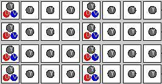

显示系统只认RGB，任何色彩模型，不是RGB最后到显示这一步都要转换为RGB。

## 逐行扫描和隔行扫描

逐行扫描\(progressive scanning\)和隔行扫描\(interlaced scanning\)是两种显示设备显示图像的方法。

### 动态视频

动态视频中，逐行扫描则将图像一次性扫描，作为一帧。隔行扫描将扫描图像分为两次pass，区分奇数行、偶数行，一帧图像就被分为两个field\(场\)，奇数field和偶数field，每张图像由两个field构成一帧。

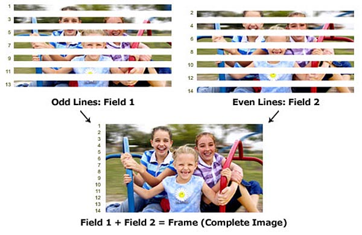

在扫描帧频上不来的年代，隔行扫描比逐行扫描有更好的视觉效果，不会造成闪烁。而在帧频上来的现代，逐行扫描比隔行扫描更加广泛。

### 静态图像

静态图像中没有帧，同样也存在逐行扫描和隔行扫描。隔行扫描会将图像分为多次pass，边解码图像边显示，形成一种隐隐出现的效果，提供一种更友好的视觉体验。

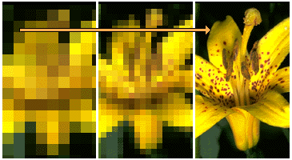

## 冗余

无论是动态视频还是静态图像，其编码原理相近，**本质上就是去冗余\(Redundancy\)**。多媒体是一门交叉学科，编码中的去冗余是其主要研究方向，冗余也有多种维度的区分。

从动态和静态维度：

**空间冗余：**静态图像中相邻取样点的相似性、重复性，造成了数据的冗余。

**时间冗余：**动态视频帧中，相邻帧的相似性、重复性，造成了数据的冗余。

从信息学维度：

**信息熵：**一段消息中的平均信息量，描述消息承载信息的不确定性，因为具体承载信息量很难得知，而不起衡量信息量的作用。信源发出的一段消息中，其中发生承载信息的事件是概率分布，事件的概率分布和每个事件的信息量构成了一个随机变量，这个随机变量的期望就是这个分布产生信息量的平均值。为了简化，信息量的衡量单位是一般比特，不同信息源只要概率分布一致，熵便一致。熵越高，传输的信息量越大，反之，则传输的信息量越小。

信息熵计算公式：

$$
H(X)=E[I(X)]=-\sum_{i}P(x_i)\log_{b}^{P(x_i)}
$$

其中​是​的概率质量函数，即为​在离散的各取值的概率。从公式上来看，当​为​时，存在使得​最大值，即信息量极限。但在真实应用下，​的概率值并不会使得​最大值达到信息量极限，这种情况就是**信息熵冗余**。

从人体感官维度：

**视觉冗余：**人的视觉系统并不是对于图像场所有信息都敏感，即感知非均匀、非线性，比如图像高频信号中的数据，对于人的视觉系统是多余，这些数据就是冗余数据。

**听觉冗余：**类似视觉冗余，人的听觉系统对于某些频率不敏感，一般来说再20HZ-20kHZ，其余频率的数据为冗余数据。

## 编码

总体来说，编码分为有损编码和无损编码。

* 统计编码\(熵编码\)：不考虑介质的具体特征，纯粹从信息出现的概率分布特征编码。将出现概率高的符号用较少比特数表示，出现概率低的符号用较多比特数表示，这种方式目的是有效降低信息熵冗余。比如：游程编码、LZW编码、霍夫曼编码等。
* 预测编码：利用采样信号的连续性，通过前面的信号预测目前的信号，将预测信号的原数据减去预测出来的数据，得到差值\(residual\)，然后对差值进行编码。差值比原数据小得多，达到压缩的目的。在同一帧内去除空间冗余则为帧内预测\(intra-prediction\)，在相邻帧之间去除时间冗余则为帧间预测\(inter-prediction\)。
* 变换编码：通过一系列数学转换到另一值域再进行编码处理，变换编码通常与量化一起使用，这种方式目的是去除视觉冗余、听觉冗余。比如，DCT\(离散余弦变换\)。

真正应用时，会将多种编码方式混合起来达到最佳的压缩效果。不同视频编码标准都是在同一个流水线模型，即DPCM模型\(差分预测编码调制\)基础上：预测编码、变换编码、量化、统计编码，不过其中细节优化大相径庭。标准规范的只是解码，而编码是厂商自由发挥进行优化的。

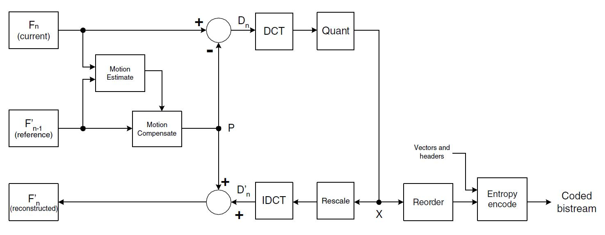

## 运动估计和运动补偿

帧间预测是动态视频编码模型的基础方法，帧间指的是对某帧进行编码时，要找到编码帧的**参考帧**，可能是之前或之后的帧，针对参考帧对编码帧进行预测。而在动态视频采样时有个特点，采样时不同帧的差异，往往是镜头、物体等因素运动所致，这种运动就是以像素点为单位的位移，容易量化。帧间预测如果不想办法消除运动导致的差异，差值会较大，帧间预测的效果无法最大化。**对帧间进行预测的两帧寻找其运动位移就是运动估计。对帧间进行预测的两帧抹平运动导致的差异就是运动补偿。**

计算运动估计以及运动补偿一般基于宏块\(macroblock\)匹配，而宏块匹配不是唯一的计算方法，光流法\(optical flow or optic flow\)也可以用来计算，宏块匹配计算成本低并且便于后续步骤的处理被广泛运用。

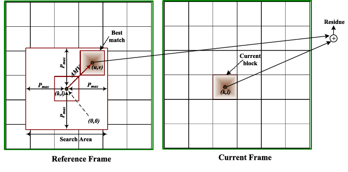

### **宏块匹配**

对编码帧宏块预测时，到参考帧匹配一个近似宏块，再求差值，并编码编码帧中宏块与参考帧中宏块的相对位移，即运动矢量。这其中有两点算法，定义“近似”以及如何匹配。

定义“近似”有以下几种算法，其中，、​表示宏块大小，​表示像素值，、​表示像素坐标，、​表示运动矢量：

* 最小绝对差\(MAD\)：​

$$
MAD(i,j)=\frac{1}{MN}\sum^{M}_{m-0}\sum^{N}_{n=0}\left|f_k(m,n)-f_{k-1}(m+i,n+j)\right|
$$

* 最小均方误差\(MSE\)：​

$$
MSE(i,j)=\frac{1}{MN}\sum^{M}_{m-0}\sum^{N}_{n=0}\left[f_k(m,n)-f_{k-1}(m+i,n+j)\right]^2
$$

* 归一化互相关函数\(NCCF\)：​

$$
NCCF(i,j)=\frac{\sum^{M}_{m-0}\sum^{N}_{n=0}f_k(m,n)f_{k-1}(m+i,n+j)}{\sum^{M}_{m-0}\sum^{N}_{n=0}\left[f_{k}^2(m,n)\right]^\frac{1}{2}\sum^{M}_{m-0}\sum^{N}_{n=0}\left[f_{k-1}^2(m,n)\right]^\frac{1}{2}}
$$

* 求和绝对误差\(SAD\)：​

$$
SAD(i,j)=\sum^{M}_{m-0}\sum^{N}_{n=0}\left|f_k(m,n)-f_{k-1}(m+i,n+j)\right|
$$

求和绝对误差没有乘除法，计算成本最小，是最常用的算法。

匹配有以下几种算法：

* 全局搜索：光栅或螺旋全量像素点搜索。一定能搜索全局最近似，但计算成本大。
* 快速搜索：运用一定的规则，只采样少量像素点，重复过程搜索最近似。容易搜索局部最近似，但计算成本小。

快速搜索比较经典的有三步搜索、菱形搜索、六边形搜索等。

三步搜索：以像素点为中心，固定步长，进行周围构成正方形的8个点搜索SAD。重复过程三次，每次以上次搜索结果为中心并不断缩小步长。

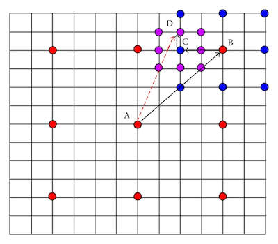

菱形搜索：以像素点为中心，进行邻近菱形区域内点搜索SAD，重复过程直到中心像素点为最近似，每次以上次搜索结果为中心。菱形搜索还会用大菱形模板和小菱形模板，小菱形模板就是紧贴像素点的区域，大菱形就是比小菱形更远一层的菱形区域，菱形搜索会先用大菱形模板，待大菱形模板搜索到结果后再切换为小菱形模板。

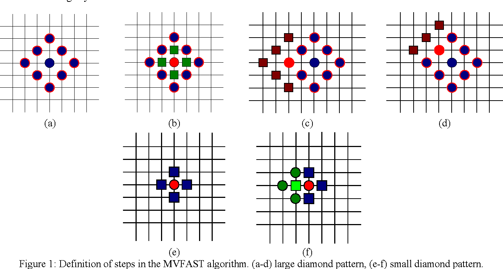

六边形搜索：以像素点为中心，进行邻近六边形区域内点搜索SAD，重复过程直到中心像素点为最近似，每次以上次搜索结果为中心。六边形同样有大六边形模板和小六边形模板，搜索时同样会切换。

### **宏块自适应**

宏块自适应也是在运动补偿中的一个技术权衡的体现。宏块粒度越细，越容易在参考帧中找到近似的宏块，预测收益越大，而宏块粒度越细，需要存储的运动矢量就越多，这就造成了一个技术权衡。应用宏块匹配时，宏块的大小都是自适应的，运动越复杂、一致性越弱，越会选择较细的粒度，反之则选择较粗粒度。

### **运动矢量精度**

运动矢量可以以小数为单位位移，不以图像中的自然宏块，而用插值得到模拟宏块来提高运动补偿收益。以小数为单位位移，是对位移提高了精度，从而获得更高的运动补偿收益。

## 帧内预测

静态图像采样时有个特点，图像局部会趋向近似。**利用统计学原理结合重建像素做出预测就是帧内预测**。帧内预测有多种预测模式，不同的宏块粒度、亮度、色度有不同的预测模式集，其中主要包括平面\(Planar\)、直流\(DC\)、角度\(Angular\)等。

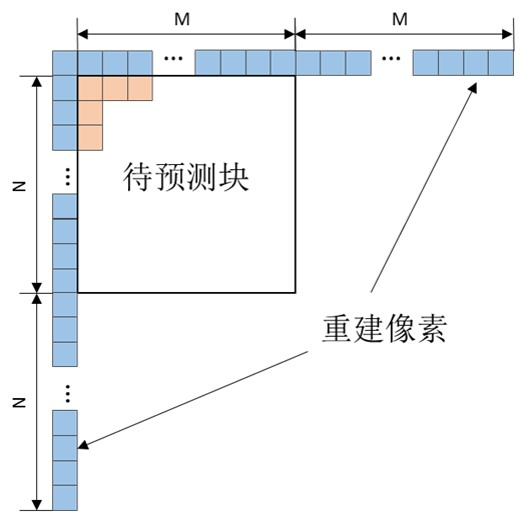

**DC预测：**DC预测即均值预测，预测值为重建像素的均值。当大面积平坦区域出现，此种模式被采用。

**Planar预测：**DC预测可能会造成块边界不连续的失真效果即块效应\(Blocking Artifact\)，Planar即平面预测就是为了解决这个问题，预测值为水平、垂直两个方向的线性平均值。当变化缓慢区域出现，此模式被采用。

**Angular预测：**除了边缘区域，纹理会呈现出从方向变化，即存在一个方向纹理是相同的。角度预测就是从方向匹配纹理。

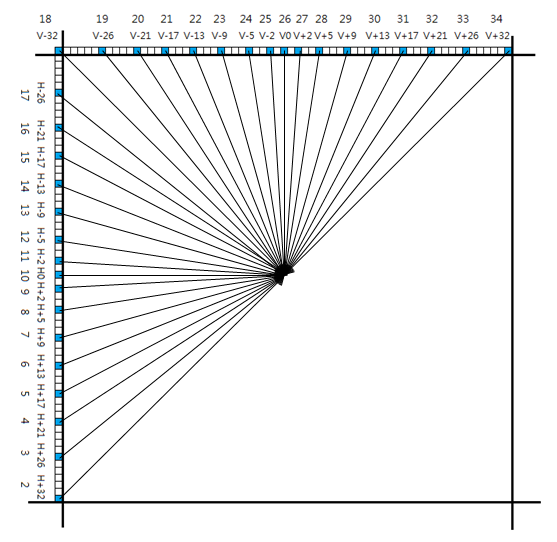

而要匹配到最佳，需要计算衡量预测的错误程度\(SAE\)，对于可能的预测模式都要计算出来，然后计算出每种模式的SAE，最后选用错误程度最小的模式。

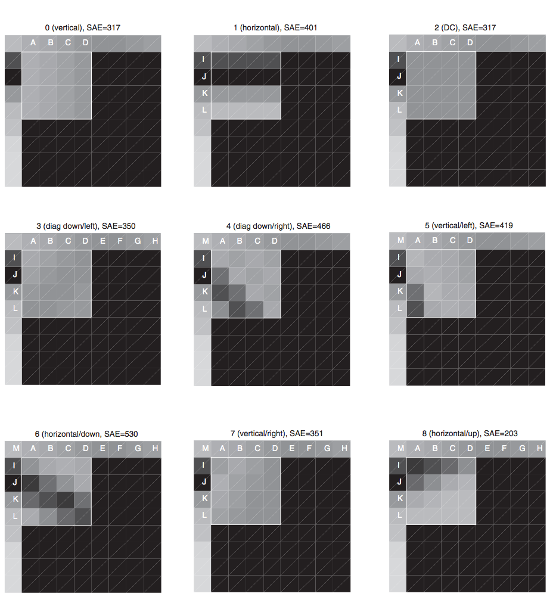

## 傅里叶变换

**傅里叶变换描述的就是从时域到频域的一种穿越方法。**其数学原理基于任何周期函数，都可以看作是不同振幅，不同相位正弦波的叠加。任意周期函数都是以时间作为关键维度的存在，而将函数拆分为无穷多个正弦波以后，从构成正弦波关键要素振幅、相位，这两个角度去看正弦波，就将原本作为关键维度的时间巧妙地摘除了。在这场等价的转换中，借用数学原理，巧妙地摘除了时间这一维度。


傅里叶变换和傅里叶级数统称为傅里叶分析，傅里叶变换就是傅里叶级数在非周期性函数上的拓展。傅里叶变换还有大量的变种，傅里叶变换描述的是连续的时域，而离散傅里叶变换\(DFT\)是描述离散的时域，得出的频域也是离散的。快速傅里叶变换\(FFT\)则是低复杂度计算离散傅里叶变换的一种方法。

而傅里叶变换的作用就在于，在时域很困难进行的计算，有了傅里叶变换，转换到频域，拆分为正弦波，计算的难度就降低了。过滤高频信号就是傅里叶变换的变种离散余弦变换\(DCT\)在多媒体领域最经典的应用。

## 块变换

**块变换为了区分能量集中在哪些分量上，将图像数据进行域变换**。DCT变换是经久不衰的块变换，**DCT变换将通过DCT矩阵形式与样本进行矩阵变换得到系数矩阵**，系数矩阵指示出了能量的分布，也明显的区分出了低频和高频，低频包含更多的能量，高频包含很少或不包含能量。

二维DCT公式：


其中，​N是f\(\)​元素总数，​c\(\)是为了构成正交矩阵而添加的系数。

为了优化计算机计算，转化为矩阵形式：


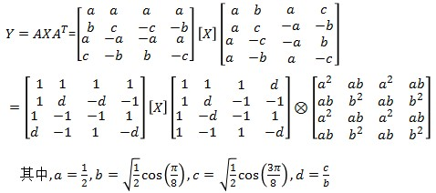

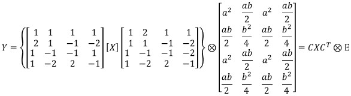

转化为矩阵形式后，进行矩阵运算就可以了。

直观的来看，假如取样块：

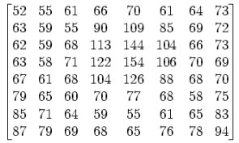

经过DCT变换得到的系数矩阵：

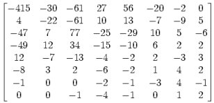

左上的系数幅度值最大，越往右下，系数的幅度值越小，频率越高。

### **量化**

变换编码后通常会跟随着量化，**量化将信号映射到更小的取值范围，达到压缩的目的**。最常用的量化就是样本对步长进行除法四舍五入。此过程会丢失数据的精确值，导致过程不可逆、有损压缩。量化的输出是一个包含少量非零大量零的稀疏矩阵。

直观的来看，将上步得到的系数矩阵除以非均匀步长形成的量化表：

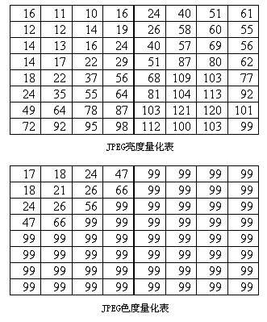

进行量化计算：

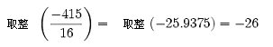

得到稀疏矩阵：

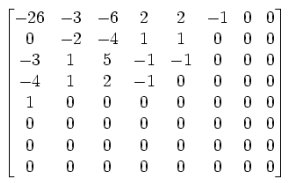

矩阵中存在大量零，高频分量被丢弃，解码时无法还原，导致图像质量变低，但人的肉眼几乎无法察觉。

经过DCT变换后，直流分量\(DC\)集中在矩阵左上角，交流分量\(AC\)分布在矩阵其余位置。通常会对直流分量和交流分量有不同处理，将交流分量直接量化，将直流分量先组合起来进行Hadamard变换再量化。

## 统计编码

统计编码又称熵编码，主要目的就是减少熵冗余。统计编码不会在乎被编码体的背景，纯粹从信息出现的概率分布特征编码。

### zig-zag游程编码

**zig-zag游程编码会对信息进行Z形编排，并用变动长度码\(run-level\)代替重复数据的出现**。变动长度码是多元组，在二维指示的是\(该位前序重复数据的个数，该位数据\)。对重复数据多的数据zig-zag游程编码会有较好的压缩效果，反之，zig-zag游程编码不仅没有压缩效果，还可能导致数据更大。

zig-zag游程编码只将数据中最常见的0为重复数据，简化其表示。

直观的来看，上步得到的稀疏矩阵有非常多的重复信息，对其进行Z形编排：

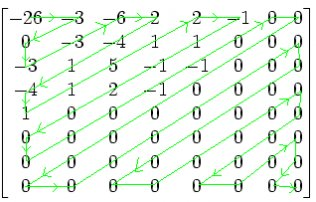

所得结果为：

```text
−26，−3，0，−3，−3，−6，2，−4，1 −4，1，1，5，1，2，−1，1，−1，2，0，0，0，0，0，−1，
−1，0，0，0，0，0，0，0，0，0，0，0，0，0，0，0，0，0，0，0，0，0，0，0，0，0，0，0，
0，0，0，0，0，0，0，0，0，0，0
```

对其编码为：

```text
(0,-26);(0,-3);(1,-3);(0,-3);(0,-6);(0,2);(0,-4);(0,1);(0,-4);(0,1);(0,1);
(0,5);(0,1);(0,2);(0,-1);(0,1);(0,-1);(0,2);(5,-1);(0,-1);EOB;
```

### 霍夫曼编码

**霍夫曼编码将出现概率高的符号用较少比特数表示，出现概率低的符号用较多比特数表示，有效降低信息熵冗余**。霍夫曼编码先评估出符号的出现概率，将出现概率拟作权重用贪心算法构建霍夫曼树，最后构建出变长编码表。

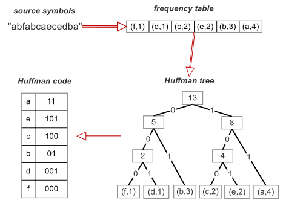

霍夫曼编码编解码必须用同一张变长编码表，这代表传输数据还需带上概率表，这给数据传输带来了负担。真正应用霍夫曼编码会参照标准制定的变长编码表，而不会再评估符号的出现概率。标准制定的表完全是基于统计学原理对大量数据计算得出的。

### 算术编码

**算术编码将数据整体编码成一个数，依据符号概率分布不断划分区间，并在此过程中依据符号不断取区间或值**。

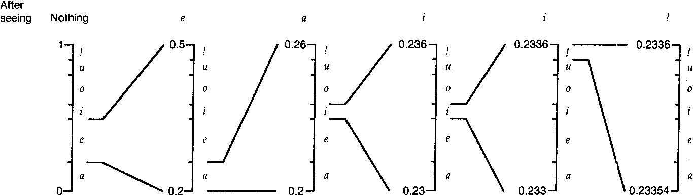

初始区间是段一到零的小数区间，根据符号分布概率划分区间，再根据出现的符号取其所在的区间，递归此过程，将全部符号编码后，在区间中取一个精度较高的小数。算术编码是一个递归过程，这意味着算术编码需要终止符，在区间上划分终止区间以结束递归过程。最终得到一个小数后，将小数的小数位转化为二进制就得到编码结果。

相比与霍夫曼编码，算术编码的优势在于可以做到用少于一位来表示一个符号。霍夫曼编码也可以看做算术编码的整位特殊形式。

### 基于上下文

最基本的算术编码概率分布是恒定不变的，而实际运用中上下文可能会影响概率分布。**基于上下文算术编码会随着符号的出现，自适应更新概率分布。**基于上下文的算术编码在实际应用中更加广泛。

## 引用

音频视频编码技术-武汉大学

[https://zhuanlan.zhihu.com/p/19763358](https://zhuanlan.zhihu.com/p/19763358)

[http://media.pkusz.edu.cn/achievements/?p=186](http://media.pkusz.edu.cn/achievements/?p=186)  


