# 视频

## 视频标准进化史

H.261通过于1988年，广泛应用于视频会议。MPEG-1通过于1993年，广泛应用于CD。MPEG-2通过于1996年淘汰了VCD，广泛应用于DVD。同年，H.262通过。H.263通过于1996年。MPEG-4通过于1999年，基于H.263。H.264通过于2003年，并纳入MPEG-4第十部分。H.265通过于2013年。

H.26x系列每次迭代从提案到发布大约是十年的时间，每次迭代都会有一倍左右的压缩比提升，这一倍的压缩比提升对于商业应用就是真金白银，直接导致每次迭代对工业界都是次冲击。而这些提升的优化会消耗大量的计算资源，为了跟上标准就需要性能更加强劲的硬件，也就是说**现代视频标准的发展依赖于硬件摩尔定律**，当摩尔定律被打破，视频标准的优化就会遇到瓶颈。

## 编码权衡与评价

视频编码要在质量、压缩比、计算开销三者之间做权衡，即失真、码率、计算复杂度三变量约束问题。

视频质量的评价分为主观和客观，主观即人的视觉系统，客观即数理计算方式，任何一方都有其缺点。主观评价费时费力，客观评价的结果往往不符合人的视觉感受。对于客观评价，其研究方向就是如何更好的照顾人的视觉感受。

### PSNR

PSNR\(峰值信号与噪声比\)特点是直接、简单，通过计算解码图像与原始图像的均方差与峰值信号的比来评价质量。PSNR越高，图像质量越高。PSNR的缺点是，其客观评价没有很好的照顾到人的视觉感受。

$$
PSNB=10\frac{\log_{10}{(2^{n}-1)^{2}}}{MSE}
$$

其中，​为像素比特数。

### SSIM

SSIM\(结构相似性\)则更加关注人的视觉感受，从亮度、对比度、结构相似程度三个维度来评价质量，均值作为亮度的度量，标准差作为对比度的度量，协方差作为结构相似程度的度量。

均值：

$$
u_x=\frac{1}{R+C}\sum_{i=1}^{R}\sum_{j=1}^{C}X(i,j),u_y=\frac{1}{R+C}\sum_{i=1}^{R}\sum_{j=1}^{C}Y(i,j)
$$

$$
L(X,Y)=\frac{2u_xu_y+C_1}{u_x^2+u_y^2+C_1}
$$

标准差：

$$
σ_X^2=\frac{1}{R \cdot C-1}\sum_{i=1}^{R}\sum_{j=1}^{C}(X(i,j)-u_x),σ_y^2=\frac{1}{R \cdot C-1}\sum_{i=1}^{R}\sum_{j=1}^{C}(Y(i,j)-u_y)
$$

$$
σ_X=\sqrt{σ_X^2},σ_Y=\sqrt{σ_Y^2}
$$

$$
C(X,Y)=\frac{2σ_xσ_y+C_2}{σ_x^2+σ_y^2+C_2}
$$

协方差：

$$
σ_{XY}=\frac{1}{R \cdot C-1}\sum_{i=1}^{R}\sum_{j=1}^{C}(X(i,j)-u_x)(Y(i,j)-u_y)
$$

$$
S(X,Y)=\frac{2σ_{xy}+C_3}{σ_xσ_y+C_3}
$$

SSIM​：

$$
SSIM(X,Y)=L(X,Y) \cdot C(X,Y) \cdot Y(X,Y)=\frac{(2u_xu_y+C_1)(2σ_{xy}+C_2)}{(u_x^2+u_y^2+C_1)(σ_x^2+σ_y^2+C_2)}
$$

### 码率控制

视频编码过程中，编码参数时刻影响码率。如果对于整个视频，编码参数不自适应的话，会造成视频码率的不断变化。而为了通过固定比特率的介质并流畅播放，码率控制是必要的。码率控制算法会不断改变编码参数，使视频码率固定，以通过介质，达到另一端无延迟解码。

## 图像类型

* I帧：帧内编码图像，帧内预测代替帧间预测，作为后续P帧、B帧的参考帧。
* P帧：前向帧间编码图像，将之前的I帧、P帧作为其参考帧，也作为后续P帧、之前或后续B帧的参考帧。虽然名称叫做帧间编码图像，但其内部遇到运动变化剧烈的部分可以选择帧内预测代替帧间预测。
* B帧：双向帧间编码图像，将之前的I帧、P帧作为其参考帧，将后续的P帧作为其参考帧，其本身不作为参考帧。与P帧类似，其内部遇到运动变化剧烈的部分可以选择帧内预测代替帧间预测。

参考帧通常是前向已经编码过的帧，真正的参考实体并不是这个已编码后的帧，**其参考的实体是缓存中的有损帧**。编码过程中，在经过量化后，会将帧进行解码然后缓存，作为参考实体。在解码过程中，只有经过量化的有损帧，为了保证编解码使用同样的参考帧，参考实体必须经过量化这一步骤。

## MPEG-4

**MPEG-4不在将视频图像单单看做是像素块的集合，而是对是视频图像分解，形成在时间或空间上互相联系的视频对象\(Video Object\)，对其分别编码处理，最后再组合成视频对象序列**。但由于缺少高效的分解对象的算法，这种思路没有在实际应用中广泛应用。

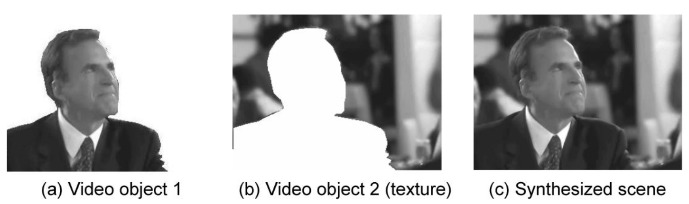

### 逻辑层级

VOP\(Video Object Plane\)为VO在某一时刻的表示，即一帧中的VO。对应I帧、P帧、B帧，MPEG-4中存在I-VOP、P-VOP、B-VOP。VOL\(Video Object Layer\)是为分级编码而添加的层级。一个VO的不同帧是连续的结构，不同VO是拆分开的。

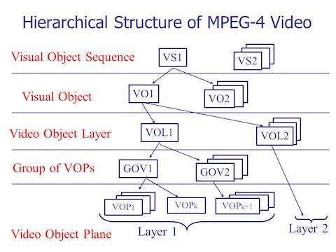

### 编码模型

**用形状信息、运动信息、纹理信息这三种信息就可以描述出VO。**而对VO编码也主要针对这三种信息，分别对应着形状编码、运动编码、纹理编码，后两种编码就是针对VO版本的DPCM模型。

**形状编码的目的是给运动编码、纹理编码描述出VOP的轮廓，对边界宏块的特殊处理，以提高运动编码的时间相关性、纹理编码的空间相关性。**

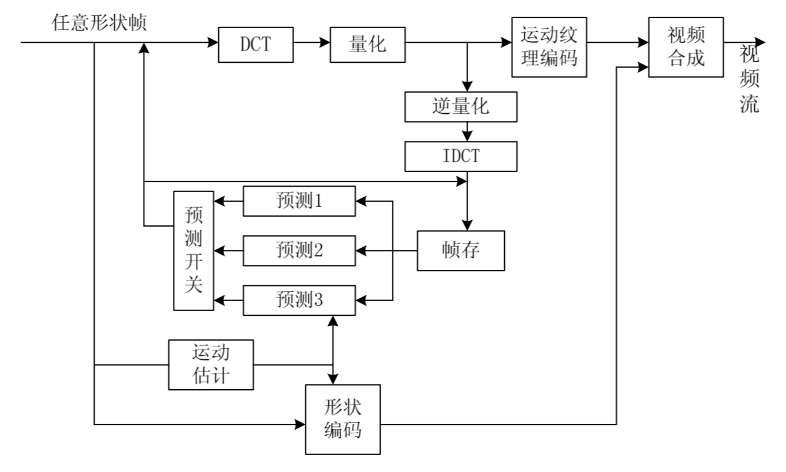

### 形状编码

轮廓是一个长和宽均为16的整数倍，并同时保证最小的边框。

边框信息有两种表示方式，二值形状信息和灰度级别形状信息。二值形状信息用0、1表示，0表示非VOP区域，1表示VOP区域。灰度级形状信息用0~255表示，0表示透明区域，即非VOP区域，255表示不透明区域，即VOP区域，0~255表示不同透明度区域。灰度级别形状信息比二值形状信息更加平滑，表示出的边界不会太生硬。

形状编码描述出边框后需要对其编码。二值形状信息表示的边框由BAB\(Binary Alpha Block\)组成，对其进行上下文算术编码\(CAE\)。灰度级别形状信息表示的边框由alpha辅助掩膜和alpha平面组成。由于alpha平面进行有损编码，alpha辅助掩膜作为辅助精确地描述出轮廓，对其进行与RAB一致的编码。alpha平面描述透明度，对其进行纹理编码。

### 运动编码

对应DPCM模型中预测编码中的运动补偿。特殊的地方在于，对于边界参考宏块进行**重复填充**以提高时间相关性以提高运动补偿的收益。

**重复填充**

在轮廓中的宏块，其运动预测的参考宏块可能不在轮廓中。对于这种边界宏块就要进行重复填充，思路就是将在轮廓中的像素从垂直、水平两个方向向不在轮廓中的像素填充。而对于整个宏块都不在轮廓中的参考宏块，需将其附近在轮廓中的宏块对其填充。

### 纹理编码

对应DPCM模型中的变换编码、量化、统计编码。特殊的地方在于，对于边界宏块进行重复填充以提高空间相关性，以提高后面进行的变换编码、量化、统计编码的收益。

## H.264

不同于MPEG-4，H.264的关注点除了在高效率的压缩，还着眼于高可靠性的网络传输。

### 编码模型

在DPCM模型上基础上多加了滤波器。

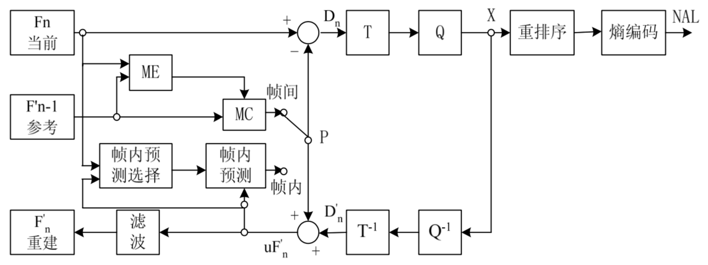

### 滤波器

**模型中添加滤波器是为了消除由量化导致的块效应和提高运动补偿中边界宏块的预测收益**。滤波器针对边界宏块的边界从水平和垂直两个方向滤波，从方向上在边界两边各取三个像素样点，共六个像素样点。

由边界两边图像编码方式决定滤波强度\(Bs\)：

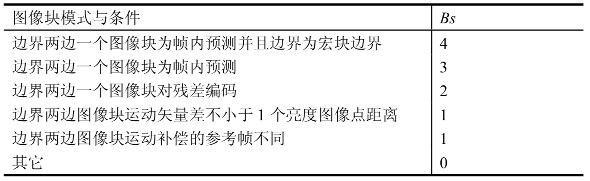

由像素样点和量化参数决定是否启用滤波，其目的是区分是编码造成的块效应，还是图像的自然边界。

### SP帧、SI帧

**SP帧和SI帧是为了高效切换码流、实时纠错而设计的P帧、I帧**。最简单的切换码流的方式是直接使用I帧来重新同步，而在切换点上使用I帧，没有了帧间预测会增加冗余数据。**SP帧设计为灵活选用参考帧，用预测收益换取一组SP帧以不同参考帧预测得出一致结果的特性。**。SP帧可以在切换点上，仍采用帧间预测，基于原码流帧预测出新码流帧。SP帧也可以绕过差错帧，选取非差错帧做参考帧，实时纠错。SP帧用主SP帧\(Primiary\)、辅SP帧\(Secondary\)相对概念来描述一组SP帧，并保证主SP帧、辅SP帧以不同参考帧预测出的结果一致。SP帧与P帧编码上的不同是在变换编码后再做一次差值运算得到残差。

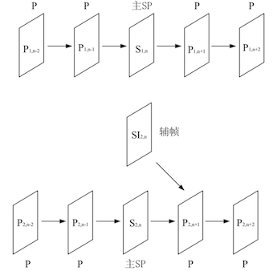

### 基本流

H.264基本流由NAL\(Network Abstraction Layer\)和VCL\(Video Coding Layer\)两层构成，NAL隔离网络传输的细节，VCL隔离视频编码的细节。

从NAL层来看，将视频看做比特流，其基本单位是NALU\(Network Abstraction Layer Unit\)和同步标记\(Synchronization Marker\)，宏观H.264 bit stream：

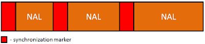

NALU又是由Header和RBSP\(Raw Byte Sequence Payload\)构成的，标准的网络数据传输构成：

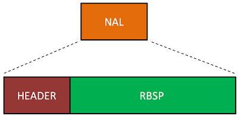

RBSP是一序列的字节，其承载的数据是一序列的比特，学名叫做SODB\(String Of Data Bits\)，而SODB不一定是整数字节，所以RBSP为了构成字节序列，还负责添加Trailing，补全字节：

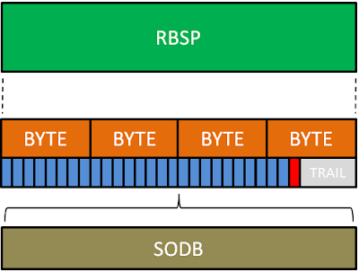

从VCL层来看，将视频看做一个序列，每个序列元素是以I帧起始到遇见下个I帧结束的一组图像，序列元素的划分为了将错误影响限制到局部，方便解码器重新同步，从误码、丢包等异常中恢复。IDR\(Instantaneous Decoding Refresh、即时解码刷新\)则为序列元素的首个I帧，IDR代表将新起一个序列元素，将缓存中的参考帧丢弃，后向帧不可以再以IDR之前帧作为参考。而序列元素的基本单位为slice，也就是最小可译码单位\(self-decodable unit\)，划分slice的目的与划分序列类似，将错误影响限制到局部：

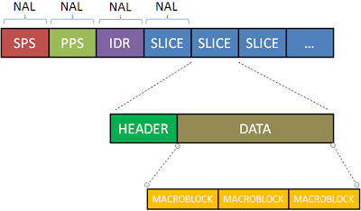

slice中包含图像信息的最基本单位为macroblock或submacroblock。slice可以形成组，macroblock以不同方式映射入slice组，以提高灵活性和容错性：

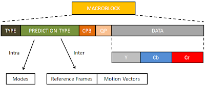

I帧、P帧、B帧分别都有自己的I-Slice、P-Slice、B-Slice。除此之外，还有SP-Slice和SI-Slice，其中S指的是Switch，即连接不同基本流的切换slice。提供一种根据网络状况切换不同码率的方法。

### CABAC

CABAC\(context-based adaptive binary arithmetic coding\)学名是基于上下文的二进制算术编码。

**二进制算术编码**

二进制算术编码指的是只有两个符号"0"和"1"的算术编码。其中，MPS\(Most Probability Symbol\)代表最可能出现的符号，LPS\(Least Probability Symbol\)代表最不可能出现的符号。​

$$
P_{MPS}为MPS的概率，​P_{LPS}为LPS的概率，P_{MPS}+P_{LPS}=1
$$

**概率变化模型**

在二进制的编码的基础上，引入上下文模型，会**引起MPS和LPS根据上下的不断符号互换、概率变化，CABAC用exponential aging模型去量化，用FSM\(有限状态机\)去描述这个量化的概率变化**。

CABAC引入HOWARD和VITTER的exponential aging模型来量化：

$$
\begin{equation}
P^{t+1}_{LPS}= 
\begin{cases}
\alpha \cdot P^{t}_{LPS} & 出现了MPS\\
\alpha \cdot P^{t}_{LPS}+(1-\alpha) & 出现了LPS
\end{cases}
\end{equation}
$$

除此之外，当​，MPS和LPS互换符号。FSM很适合来描述出exponential aging模型，状态迁移表示概率变化：

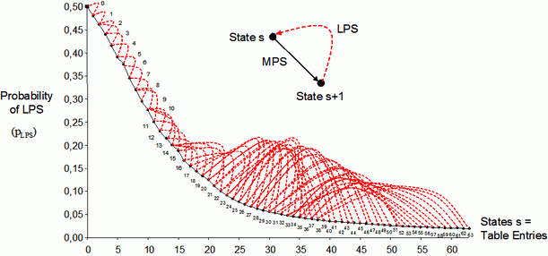

图中黑线表示出现了MPS符号，红线表示出现了LPS符号。

**上下文模型**

CABAC以slice作为算术编码的生命周期，在每个slice起始处初始化，重置概率分布。

**根据概率模型，基于上下文就转化成了根据出现的比特进行状态迁移。CABAC将此过程构造为上下文模型，并统计slice中的所有情况，制作上下文模型索引表。**

CABAC通过句法元素和帧类型获得上下文模型区间，再通过上下文区间的offset ctxIdxOffset和比特在句法元素中的序号binIdx获得多个上下文索引\(ctxIdx\)，再根据残差块类型确定最终上下文索引\(ctxIdx\)。

上下文模型区间表：

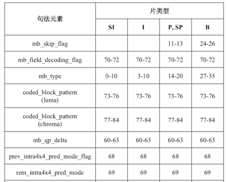

上下文模型offset索引表：

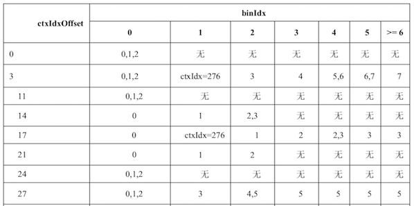

**算法流程**

在初始化后，CABAC算法流程如下：

* 二值化编码语法元素：将语法元素进行二进制算术编码出二进制串。
* 上下文建模：通过索引查表获得上下文模型，根据上下文模型获得转移状态，更新概率分布。
* 算术编码：依据更新的概率分布不断划分区间，并在此过程中依据符号不断取区间或值。

**乘法转化查表**

CABAC还做了避免乘法的优化。将每次划分区间的乘法计算转化成以状态和区间作为索引的查表。设​R为区间长度，​Px为符号概率，则新划分区间长度为​

$$
R=R \cdot P_{x}
$$

而将R​进行量化​，​

$$
ρ=(R>>6)\&3
$$

用状态代替。Px通过ρ​和状态就可以去提前统计好的表中查出新划分的区间长度。

### CAVLC

CAVLC学名基于上下文变长编码。**CAVLC利用相邻宏块的非零系数数量的相关性和系数等级的递增性来构造上下文模型，通过上下文模型和高层系数通常为+1/-1规律来编码。**

CAVLC将算法分解为语法元素：

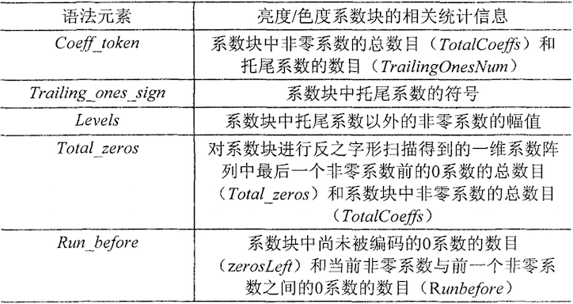

* TotalCoeffs和TrailingOnesNum：两个语法元素联合编码。根据相邻宏块的非零系数数量来选择编码表，再通过TotalCoeffs和TrailingOnesNum作为索引，获得TotalCoeffs和TrailingOnesNum的联合编码值。
* Trailing\_ones\_sign：最多将从逆序寻找三个+1/-1作为拖尾系数，拖尾系数编码仅用一比特表示符号。
* Levels：分为前缀\(level\_prefix\)和后缀\(level\_suffix\)，后缀长度\(suffixLength\)会根据当前编码的非零系数值自适应，非零系数值超过阈值后则递增一。
* Total\_zeros：根据已编码的TotalCoeffs会进行编码优化。
* RunBefore：根据已编码的Total\_zeros省略最后一个非零系数的RunBefore。

## 引用

bitstream [http://gentlelogic.blogspot.com/2011/11/exploring-h264-part-2-h264-bitstream.html](http://gentlelogic.blogspot.com/2011/11/exploring-h264-part-2-h264-bitstream.html)

CABAC [https://www.cnblogs.com/TaigaCon/p/5304563.html](https://www.cnblogs.com/TaigaCon/p/5304563.html)

CABAC [http://iphome.hhi.de/marpe/cabac.html](http://iphome.hhi.de/marpe/cabac.html)

