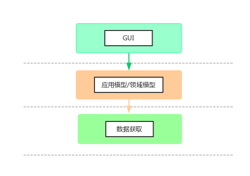
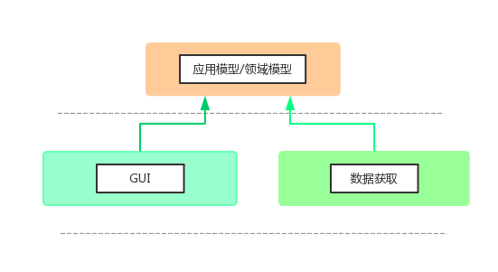
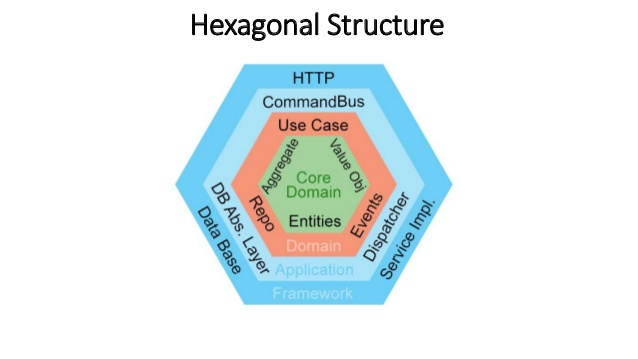

# 架构设计

## 软件工程特点

软件工程与建筑工程有些微妙的相似点，建筑工程常常也被用来比喻软件工程。软件工程却有自己的特点，而这些特点很反人类，不容易被理解。最为关键的一点就是软件工程复杂的地方不在从0到1，而在从1到100，长期维护要比创建产品困难的多。除此之外，软件工程存在以下几个困难点：

* 设计软件没有一个自然规律去遵守，建筑工程遵守承重力去设计，软件则没有，设计软件只有准则去参考。
* 软件无法用工程图纸解释出其架构的全貌，工程图纸只是管中窥豹，无法描述其内在关系和运行起来的效果。

## 软件工程方向

* 性能优化
* 架构设计
* 中间件
* 工程效能
* 质量保证

## 架构设计

软件工程做的事就是抽象，而架构设计的本质是给抽象一个指导方针，可以说是一种限制。**这种指导方针包括把握抽象的方法论\(范式\)、设立抽象边界，管理抽象组织结构、约定抽象通信方式。**其中，设立抽象边界和管理抽象组织结构最为关键。

架构的目的是为了长久的让系统“健康生长”，系统就像有机体一样，会病入膏肓。其一，这使得架构不仅仅要着眼于当下，更要顾及未来。其二，有很多因素影响系统的”健康成长“，这意味架构会涉及很多的权衡。架构为了达成长远的目的，不是一蹴而就的事情，长期的打磨才能呈现出良好的架构设计。

### 度量架构好坏

以维护系统需要投入的资源，去度量架构的好坏。资源包括时间、人力资本。架构应该使得投入维护的资源最小。

## 范式于架构的意义

* 结构化编程的意义：程序流程的层次化。直接的限制、规范了程序控制权。
* 面向对象编程的意义：多态提供一种控制依赖关系的能力，形成依赖反转，底层组件独立于高层组件。间接的限制、规范了程序控制权。
* 函数式编程的意义：不可变数据解决掉状态、并发引起的存储、死锁等一系列问题。限制、规范了赋值。

范式可以帮助架构从根本上解决问题，并且提供的解决方法很优雅。

## SOLID原则

* 单一责任原则\(Single Responsibility Principle\)：只对单一的功能负责，强调不同功能的分离。
* 开闭原则\(Open Close Principle\)：开发指的是开放拓展方式的修改，关闭指的是限制修改的影响范围。
* 里氏替换原则\(Liskov Substitution Principle\)：保证接口与其实现具有可替换性。
* 接口隔离原则\(Interface Segregation Principle\)：系统不要依赖不使用的东西。
* 依赖反转原则\(Dependency Inversion Principle\)：依赖接口，而不依赖实现。接口是对实现的依赖反转。

**SOLID原则从语义上讲是帮助工程更加坚固。核心是帮助代码可控，限制影响范围，确保影响不超过某个定义的范围，并且减少随着依赖传递出去的影响。**

总结SOLID的描述为两点：**限制影响范围就是设立抽象边界，即聚合。减少依赖就是管理组织结构，即耦合。**

## 聚合

**聚合的本质就是设立边界并限制影响。**聚合的原因无非就是相关复用或同一功能，而这两条原因可能会冲突，权衡就是其中的难点。

### 边界级别

* 源码级别：模块之间的边界，一个模块的变更可能会影响其他模块的重新编译。不同模块在同一地址空间中运行，同一进程中通信，被称作单体结构。
* 部署级别：部署单元之间的边界，部署单元为动态库，一个部署单元的变更不会影响其他部署单元部署。不同部署单元可能不在同一地址空间中运行，可能跨进程通信。
* 服务级别：系统之间的边界，一个系统的变更完全不会影响其他系统。不同系统在不同的机器上运行，通过网络包通信。

## 耦合

**耦合的本质就是依赖。**面对耦合，要做的就是管理依赖。管理依赖就是不让依赖方向随意跟随控制流程、数据流向，必要的时候要去依赖反转。依赖反转要做的就是面向接口，而不面向实现，将依赖关系从高层依赖底层实现，转换为高层、底层都依赖接口。

任何应用可以分为GUI、应用模型\(用例\)、领域模型、数据获取，其控制流向结构如下：

反转依赖后，依赖结构如下：

除了模型，都是主动依赖方，其他的都是可选项，从而形成插件式架构。只存在底层组件依赖高层组件，从而底层组件可被轻易替换。

## 层次

在不断聚合和松耦合的作用下，架构常常会形成若干个水平分层。层次是严格按照输入与输出之间的距离定义的，距离输入、输出越远，越靠近高层，距离输入、输出越近，越靠近底层。

Uncle Bob的整洁架构：

六边形架构：

不同架构呈现出来的形式不一样，而其基本思想是一致的。

## Main组件

main组件是一个特殊的组件，其任务是承载初始状态、全局设施、配置信息、外部资源。任何组件都不依赖main组件，只存在main组件依赖其他组件。main组件中负责创建依赖反转的实现方，通常使用依赖注入\(DI\)的方式。

## 引用

[https://www.kancloud.cn/architect-jdxia/architect/519429](https://www.kancloud.cn/architect-jdxia/architect/519429)

