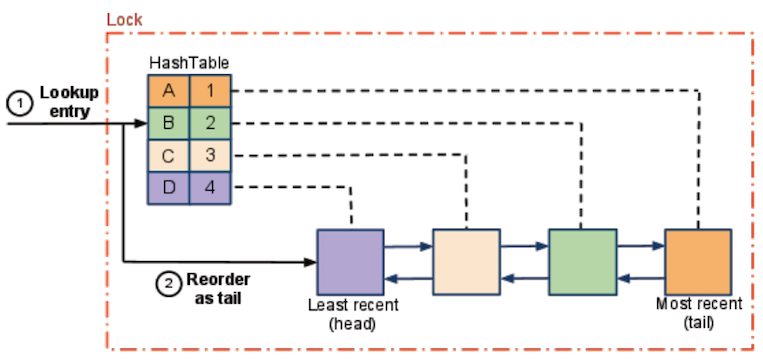

# 数据结构

> 本篇文章并不关注数据结构的实现，更加关注数据结构有趣的性质。

线性数据结构表达元素的顺序关系。

树状数据结构表达元素的层级关系。

图状数据结构表达元素之间更广泛的关系。

## 线性数据结构

线性数据结构是最经常用的数据结构类型，哈希表更是线性数据结构中最常用的数据结构，没有之一。

### **哈希表\(HashTable\)**

哈希表解决碰撞\(collision\)有拉链法\(chaining\)和开放寻址法\(open addressing\)两种方法。拉链法就是发生碰撞的元素组成一个链表，redis、java中的JDK、C++STL中的unoreder\_map就是用的这种方式。开放寻址法就是碰到碰撞，用一序列\(squence\)的探查\(probing\)重新计算元素的位置，直到找到没有碰撞的位置，查询时使用同样序列的探查查找。而序列探查又可以通过线性探查\(linear probing\)、二次探查\(quadratic probing\)、双重哈希\(double hashing\)三种方式得到，这三种方式主要的区别就在于探查次数的函数和辅助哈希函数。python实现字典就是使用的这用方式。用拉链法解决碰撞的哈希表比较常见，下面就针对用拉链法解决碰撞的哈希表聊一聊。

高效的哈希表取决于两点，一点是哈希函数导致元素分散的均匀程度，元素分布极不均匀的哈希表会从常数级访问活生生变成了线性级访问，所以说哈希函数是哈希表性能的关键。另一点是哈希表的扩容算法，由于扩容是很耗性能的，合适的扩容的频率也是高效哈希表至关重要的一点。

实际上，从哈希表的key值到映射到某个桶，分为两步。第一步，从key值的任意类型转换成非负数，这步叫做preHash。第二步，才是真正的哈希函数，将得到的非负数映射到某桶。

* preHash

preHash主要做的就是mix，就是说尽量消除输入的模式。让输入的规律性不去影响hash函数后的分配。比较常用的是开源的MurmurHash2或者djb算法，redis、hadoop等使用的就是MurmurHash2算法。

* hash

比较常见的hash函数有除法运算。将preHash所得的非负数与哈希表的桶数量取模运算。但是由于%运算，太慢了。比较常见的做法是利用&位运算来取模运算。可以这样运算：

```java
static int indexFor(int h, int length) { //length为桶的数量
     return h & (length-1);  
}
```

python中的字典、redis、JDK就是这样计算的，不过JDK还需要先将preHash所得的非负数进行右移16位，再与右移后的数进行异或运算。

```java
h ^ (h >>> 16)
```

JDK这样做是为了让高位参与到运算中。

* 扩容的时机

当哈希表中的元素数量到达一个阈值的时候，哈希表中的碰撞数量就足以使性能极具下降，这时就要需要进行扩容。扩容的时机是时间和空间的权衡，既不能频发扩容，导致哈希表性能降低。又不能一下子占过大的空间，浪费掉过多没有使用的空间。这个阈值叫做负载因子\(load factor\)，负载因子 = 现有元素数量 / 桶数量。unoreder\_map默认为1。JDK默认为0.75。JDK中头文件的注释：

> ```text
>  * <p>As a general rule, the default load factor (.75) offers a good
>  * tradeoff between time and space costs.  Higher values decrease the
>  * space overhead but increase the lookup cost (reflected in most of
>  * the operations of the <tt>HashMap</tt> class, including
>  * <tt>get</tt> and <tt>put</tt>).  The expected number of entries in
>  * the map and its load factor should be taken into account when
>  * setting its initial capacity, so as to minimize the number of
>  * rehash operations.  If the initial capacity is greater than the
>  * maximum number of entries divided by the load factor, no rehash
>  * operations will ever occur.
> ```

* 扩容的方法

扩容可以整体扩容，一次性将原表的桶重新哈希到新表中，这种扩容方法会一直只用一个表。或者分治扩容，每次对哈希表进行增删改查的时候，重新哈希一个桶，以减少扩容时带来的低效率，这种扩容方法在扩容期间会用到一个新表和一个旧表。

* 扩容的量

扩容到现有容量二倍，或者以2的指数进行扩容，这同样是时间与空间的权衡。

* 哈希函数不理想时的应对策略

在实现哈希表的时候，为避免不理想的哈希函数将哈希表的性能拖垮，引入了一个阈值。当桶中的元素超过这个阈值的时候，就认为哈希函数的选择有问题。在扩容的时候，为这个桶建立一颗红黑树来提高性能。JDK中的阈值为8。以下是如何计算出阈值为8。

> 理想的哈希函数可以保证以下三点：
>
> 1.元素被分配到某一个特定的桶是小概率事件。
>
> 2.不同元素之间，被分配到哪个桶是相互独立的。
>
> 3.元素分配到某个特定的桶的概率是固定的，即哈希函数不会受到某种模式的影响。
>
> 这三点正好使一个元素被分配到哪个桶这一事件，符合泊松分布的要求。
>
> 泊松函数如下：

$$
P(X = x) = \frac{\lambda^{x} }{x!}e^{-x}
$$

> 这一事件中x代表桶中分配元素的数量。λ代表表桶中平均被分配的元素数量。最后所得桶中分配x数量元素的概率。JDK头文件中说明λ为0.5、x为8时发生的概率为0.0000006。在hash函数这件事上，发生概率小于0.0000001被认定为小概率事件，9发生的概率小于小概率事件，所以8被认为是阈值。当哈希函数选择的有问题，导致桶中的元素大于8，这时引入红黑树弥补哈希函数带来的低效率。
>
> JDK中的相关头文件说明：
>
> ```text
>      * Because TreeNodes are about twice the size of regular nodes, we
>      * use them only when bins contain enough nodes to warrant use
>      * (see TREEIFY_THRESHOLD). And when they become too small (due to
>      * removal or resizing) they are converted back to plain bins.  In
>      * usages with well-distributed user hashCodes, tree bins are
>      * rarely used.  Ideally, under random hashCodes, the frequency of
>      * nodes in bins follows a Poisson distribution
>      * (http://en.wikipedia.org/wiki/Poisson_distribution) with a
>      * parameter of about 0.5 on average for the default resizing
>      * threshold of 0.75, although with a large variance because of
>      * resizing granularity. Ignoring variance, the expected
>      * occurrences of list size k are (exp(-0.5) * pow(0.5, k) /
>      * factorial(k)). The first values are:
>   *
>      * 0:    0.60653066
>      * 1:    0.30326533
>      * 2:    0.07581633
>      * 3:    0.01263606
>      * 4:    0.00157952
>      * 5:    0.00015795
>      * 6:    0.00001316
>      * 7:    0.00000094
>      * 8:    0.00000006
>      * more: less than 1 in ten million
> ```

### **LinkedHashMap**

在以前聊缓存的文章中提到过这个数据结构，实现LRU算法用这个数据结构是再方便不过的了。在哈希表基础上拓展出这个LinkedHashMap数据结构。哈希表已经做到了常数级的随机访问，但是如果想要顺序访问元素，比如说按插入的顺序访问元素，那就做不到了。那么，就在哈希表的实现上想办法模拟出一个队列来记录顺序，提供线性级的顺序访问。如何模拟出队列呢？为每个加入哈希表的元素记录一个prev指针和next指针，来记录元素之间的顺序就好了。再记录一个所有元素的head指针和tail指针，就以以正序和逆序访问元素了。LinkedHashMap结构如下：



### **跳表\(SkipList\)**

跳表是一个很独特的数据结构。跳表在普通的已排序链表之上，添加更多的链表模仿树状数据结构的层级\(level\)。高层级仅包含低层级的部分元素，搜索的时候从最高层级一直搜索到最低层级。相比于普通链表的搜索，会搜索更少的元素。跳表的关键就在于如何建立层级。跳表引入随机种子来解决这个问题。每个元素在加入时，会掷硬币决定元素占几层。比如，第一次掷反面，元素就在第一层。连掷了三次正面，元素就在第一、二、三层。可以看到，跳表引入了随机算法来平衡层级。以下就是随机算法是如何起作用的。

在概率分布均匀的情况下，高层级的元素数量是低层级的元素数量的一半，因为每个低层级元素是否加入到高层级的概率为1/2。也就是每两个低层元素会加入高层。那么层数就是​。每次搜索元素只需从最高层到最低层，不需要再搜索最底层就完成了，那么搜索的复杂度为​。

跳表可以改变随机算法，使复杂度更低吗？不行，以下为说明。

$$
假设，概率分布均匀，且现阶段跳表仅有两层。第一层长度为L_1，第二层长度为L_2 \\则跳表搜索的最大代价为 L_2+\frac{L_1}{L_2}\\因为L_1 = n，则当L_2=\sqrt{n}上式得最小值2\sqrt{n}\\将跳表拓展到k层，则上式为L_k+\frac{L_1}{L_2}+....+\frac{L_{k-1}}{L_k}
\\其最小值为k\cdot n^{\frac{1}{k}}\\当k=\log_{2}{n}时，上式取得最小值\\即当跳表层数为\log_{2}{n}时，搜索的复杂度最低
$$

概率分布均匀情况下的跳表，被称为"The Perfect Skip List"，其结构如下: 


可以看到，这时的跳表已经像是一颗平衡搜索树了。这就是跳表独特的地方，跳表虽然是一个线性数据结构，它确模拟出了树状数据结构。

跳表还有一个独特的地方，就是它只对局部做修改就可以维持\(maintain\)数据结构，所以在并发环境下，相比于其他的搜索树状结构，减轻了锁开销，提供了更好的性能。JDK中的ConcurrentSkipListMap就是基于跳表实现的。

> 以下将提到的数据结构，如果不熟悉，可视化工具可以帮到
>
> 你。[https://www.cs.usfca.edu/~galles/visualization/Algorithms.html](https://www.cs.usfca.edu/~galles/visualization/Algorithms.html)

## 树状数据结构

树状数据结构大部分都用来搜索。那么有了哈希表常数级的搜索，为什么还需要树状的搜索结构呢？实际上，哈希表常数级的搜索是摊还下来的结果，并不是每个操作都为常数级，这是其一。其二是树状搜索结构提供了许多哈希表不能提供的功能，比如说排序、统计、区间查找\(区间树\)。首先，先来聊一聊具有有序性的树状结构-堆。

### **堆\(Heap\)**

堆是一类数据结构，它是一种优先级队列\(Priority-Queue\)，数据结构内的元素可以根据赋予的优先级进行排列。堆分为最大堆和最小堆。顾名思义，最大堆中，堆的根节点优先级最高。最小堆中，堆的根节点优先级最低。堆任意节点优先级比子节点优先级高或者低，这就是堆的有序性。堆还有一个性质就是，除了最低层，其他层都是满节点。常见的堆有二叉堆\(Binary-Heap\)、二项堆\(Binomial-Heap\)、斐波那契堆\(Fibonacci-Heap\)、斜堆\(Skew-Heap\)等等。

接下来就来聊一聊搜索树。搜索树可以分为二叉搜索树和多叉搜索树。常用的搜索树大部分都是平衡搜索树。平衡搜索树的性质为所有节点的高度趋近于平衡，平摊下来其操作复杂度偏低。平衡搜索树保证树高为​，搜索、插入、删除复杂度为​。

搜索树在插入、删除、查找之后，会对相应的边进行旋转来维持数据结构的性质。旋转有Left旋转、Right旋转、LeftLeft旋转、RightRight旋转、LeftRight旋转、RightLeft旋转，这些旋转自然也不会违反搜索树的性质。而二叉搜索树会在插入、删除、查找之后根据不同的情况进行不同类型的旋转。

### **AVL树\(AVL-Tree\)**

AVL树是最经典的平衡二叉树。AVL树的性质就是对于任意节点，其左子树和右子树的高度差不超过1，这就基本说明了AVL树是平衡的。既然要保证左右子树的高度差，AVL树的每个节点都要记录本节点的高度，以被检查出是否需要被重新平衡。每当会影响AVL树的平衡操作执行后，就会检查相应的节点是否违反了性质，违反了性质就会重新平衡。AVL树的重新平衡涉及到LeftLeft旋转、RightRight旋转、LeftRight旋转、RightLeft旋转。以下为证明AVL树高为​。

> 假设，AVL树高为h，总节点数为n，AVL树在高与节点数之间的函数为N\(h\)。
>
> 对于h=1时，N\(h\)=1。 对于任意h大于1的AVL树，AVL树的节点数为根节点+根节点左子树节点数+根节点右子树节点数。又有AVL树具有左子树与右子树高度差不超过1的性质。

$$
即N(h)\geq 1+N(h-1)+N(h-2) \\又有N(h)=N(h-1)+N(h-2)是F_n斐波那契数列，则有N(h)\geq F_n\\又有F_n = \frac{\phi^h}{\sqrt{5}}，则有N(h)\geq \frac{\phi^h}{\sqrt{5}}\\可得 h\leq\log_{\phi}{n}，即h\leq\log_{2}{n}，即AVL树高为O(\log_{2}{n})
$$

### **红黑树\(Red-Black-Tree\)**

红黑树是最常用的平衡二叉树。红黑树有四个关键性质：

* 每个节会被着色，不是黑色就是红色。
* 根节点是黑色的。
* 每个红色节点的父亲节点是黑色的，即没有两个红色节点临接。
* 任意节点到其叶节点路径上的黑色节点的数量是一致的。

红黑树这四条性质能保证树的平衡？以下为说明。

如果树不平衡会存在节点的左子树和右子树的高度差超过1，那么来看看会不会存在这样的节点。

```text
R代表红色，B代表黑色，以下是几种30的左子树高过其右子树高度1的着色可能。
   
    B--30           B--30            B--30       
       / \            /  \             /  \
  B--20  NIL      R--20   NIL      R--20   NIL
    / \             / \              /  \   
B--10  NIL     B-- 10  NIL       R--10  NIL  
违反第四点性质  违反第四点性质     违反第三点性质
​
将上述情况拓展到任意情况，假设有任意节点x、y、z构成x的左子树高过其右子树高度1。
      x        
     / \           
    y  NIL      
   / \             
  z  NIL 
根据第四点性质，y和z必须都是红色节点。而y和z都是红色节点又与第三点性质矛盾。
可得红黑树只要维持这四个性质，便能维持树的平衡。
```

以上是直观的说明为什么红黑树是平衡的，以下来用结构归纳证明法\(数学归纳法\)来证明红黑树的树高为​。

> 假设：函数bh\(v\)代表，以v为根节点的红黑树任意一条从根节点到叶节点路径上的黑色节点的数量，这个数量不包括黑色节点本身，即根节点v。
>
> 命题：以为根节点的红黑树内部至少有个节点

$$
以v为根节点的红黑树内部至少有2^{bh(v)}-1个节点
$$

> 证明：对于红黑树高为0，其bh\(v\)为0，内部节点至少为0，命题得证。
>
> 假设对于根节点的左右子节v‘、v''点成立。

$$
即以v'、v''为根节点的红黑树内部至少有2^{bh(v')}-1、2^{bh(v'')}-1个节点 \\因为v'与v''为v的子节点，根据子节点为红色或黑色，子节点的bh等于父节点的bh或父节点的bh-1 \\即bh(v')=bh(v)或bh(v)-1、bh(v'')=bh(v)或bh(v)-1 \\则以v为根节点的红黑树内部至少有2^{bh(v)-1}-1+2^{bh(v)-1}-1+1节点 \\即则以v为根节点的红黑树内部至少有2^{bh(v)}-1节点，命题得证
$$

> 然后，使用这条证明出来的定理来证明红黑树的树高，假设红黑树的树高为h，节点数为n。
>
> 根据第三条性质，可得出红黑树黑色节点数量最少占总节点数量的一半。

$$
则n\geq2^{bh(v)}-1等价于n\geq 2^{\frac{h}{2}}-1 \\可得出h\leq2\log_{2}{n+1} \\即红黑树的树高为O(\log_{2}{n})
$$

为了记录节点的颜色，每个节点要有颜色域\(color-field\)，并且为了实现插入和删除每个节点要有指向parent节点的指针。红黑树的插入和删除涉及到Left旋转、Right旋转。红黑树如果违反了性质，会先尝试重新着色\(recolor\)，不行的话再旋转。这也是红黑树高性能的一个特点。因为旋转比重新着色更消耗性能，重新着色的话，红黑树还可以继续查询，但是旋转的话，红黑树就不能继续查询了，只能等待结构调整完再查询。

红黑树的插入和删除比较复杂，插入操作有对称的六种情况，删除有对称的八种情况。要想掌握，背下来是比较好的办法。实际上，用到再查就足够了，没必要较真。

那么AVL树和红黑树都是平衡搜索树有什么区别？红黑树一定程度上，通过重新着色代替了一部分旋转，这代表AVL树会做更多的旋转，导致AVL树也更加平衡。如果插入、删除导致旋转的操作多于查找不导致旋转的操作，红黑树性能会比AVL树更好一点。反之，AVL树性能更好一点。不过总体来说，红黑树性能会更好。

### **树堆\(Treap\)**

树堆是颗有趣的二叉平衡搜索树。它既具有二叉搜索树的性质又有堆的性质。每个节点记录一个随机的优先级，然后通过Left旋转和Right旋转维持堆的有序性。树堆是如何能保证树的平衡？以下为说明。

```text
假设，A节点大于B节点，那么A节点与B节点的相对位置有如下两种情况：
  A                B
   \              /
    B            A
  情况1         情况2
而A与B的相对位置，是情况1还是情况2在一般二叉搜索树中是根据A和B插入顺序决定的。
如果先插入的是A，则会出现情况1。如果先插入的是，则会出现情况2。
但是在Treap树中，出现情况1还是情况2是根据A与B随机出的优先级的相对大小。
也就是说在Treap树中，出现情况1还是情况2是随机的，也就等价于树的插入顺序是随机的。
```

随机的插入顺序代表着消除了输入的模式，或者说以“理想”的顺序输入，不会出现一直增序或者降序，导致二叉搜索树倾斜的非常厉害的输入顺序，以维持了树的平衡。而二叉搜索树随机的插入顺序可使树高期望为​，严谨证明看[这里](http://cs.stackexchange.com/questions/6342/proof-that-a-randomly-built-binary-search-tree-has-logarithmic-height#answer-6356)或者算导第12章第4节。树堆的优点就是实现简单，且基本能保证平衡。

### **伸展树\(Splay-Tree\)**

伸展树是颗特殊的二叉平衡搜索树，它不直接控制节点高度，但还会尽量维持树的平衡。无论增、删、查操作，伸展树都会将相应的节点伸展到根节点，以加快下次搜索。可以看出，伸展树基于局部性原理。在同一段时间内，访问相同的元素，伸展树的性能最好。伸展除了使搜索同样的元素常数级访问，在树不平衡的情况下，能使树更加平衡。当然，在树平衡的情况下，也可能会使树更加不平衡。平摊下来，伸展树不输于其他平衡搜索树，并且它还有实现简单、内存占用量小等优点。

### **B树\(B-Tree\)**

以上二叉平衡搜索树假设搜索内容都在内存中，如果要搜索的内容非常多，内存装不下，大部分都在磁盘上会出现什么问题？如果仍用二叉平衡搜索树查找，每搜索到一个未搜索过的节点都要进行磁盘IO，将节点从磁盘调度到内存中，那么整个操作的性能瓶颈就变成了磁盘IO而不是数据结构的搜索性能了。这就引出了B树，B树的每个节点大小与要调度的页的大小相近，充分利用磁盘的IO，这使B树在搜索磁盘上的内容远优于二叉平衡搜索树。B树为了保证每个节点大小与调度页的大小相近，引入一个最小度数\(minmum degree\)t的概念。B树要求每个节点包含的内容数量基于t，这样就可以根据存储的内容调整t的大小，进而调节t去保证节点的大小与调度页的大小相近。以下为B树的关键性质。

* 每个节点包含最小度数t
* 除了根节点，每个节点最少有t-1个键值。根节点最少有1个键值
* 每个节点最多有2t-1个键值
* 每个节点有键值加1个子节点
* 所有节点内的键值是增序的
* 相邻键值中间的子节点内的所有键值在相邻建值构成的范围内
* 所有叶节点在同一层，B树增长、缩减高度从根节点方向增长、缩减

相比于一般的二叉平衡搜索树增长、缩减从叶节点方向不同，B树会从根节点方向。这是因为，实际运用B树的时候，经常会将B树的前几层节点缓存在内存，只有底层会引起磁盘IO以加速访问。那么，B树从根节点方向改变节点就会比从叶节点方向改变节点快得多。以下是B树的高度为O\(logtn\)的证明。

> 假设，当B树树高为h时，含有的键值最少为n。​若B树含有的键值最少，则有根节点含有1个键值，其他节点含有t-1个键值。 第0层节点数为1，第1层节点数为2，第2层节点数为2t，第3层节点数为2t^2，则可得出第i层节点数为2t^{i-1}

$$
则有n\geq1+(t-1)\sum_{i=1}^{h}2t^{i-1}\\n\geq 1 + (t-1)\frac{2t^{h-1}}{t-1}\\n\geq2t^{h-1}+1\\h\ \leq \log_{t}{\frac{n-1}{2}}+1\\\
$$

> 命题得证。

B树的插入操作会以分裂\(split\)子节点来维持每个节点最多有2t-1个键值这一性质，删除操作会以从其他节点借\(borrow\)来维持每个节点最少有t-1个键值这一性质。 B树实际上是一类家族树，还有B+树、B\*树等等。

### **前缀树\(Trie\)**

前缀树或者叫字典树是颗多叉搜索树。前缀树主要用来记录和统计序列，它可以应用于字符串、数字、形状序列。与其他搜索树节点就代表自己的键值不同，前缀树从根节点到某个节点的路径代表此节点的键值，这点性质给了前缀树在搜索序列很大的优势。假如，所要搜寻的序列组合有N种，序列最长为M。则用二叉搜索树树去寻找序列，复杂度为​，前缀树复杂度为O\(M\)，而当N和M比较大的时候，​会比M大得多，所以，在搜索序列上，前缀树相比于二叉搜索树有很大的优势。它的这种性质，使一条路径包含很多前缀序列，让它得名为前缀树。它被运用最广泛的是在字符串上，如果每个节点包含26个字母，它可以记录下一篇文章内所有的字符串序列，相当于这篇文章的有统计功能的字典，所以又得名为字典树。

### **基数树\(Radix-Tree\)**

基数树是前缀树的变种，它是一种压缩前缀树。它自然有前缀树从根节点到某个节点的路径代表此节点的键值这一性质，并且如果某节点是其父节点的唯一子节点的话，此节点就会和父节点合并。同样地，与前缀树相同，基数树适合于搜索序列。并且基于基数树自己独有的性质，它更适合搜索那些部分序列几乎一致的序列。比如，IP地址，大部分首段序列都为192，搜索这种序列，基数树相比于前缀树复杂度更低，占的空间更少。

### **区间树\(Interval-Tree\)**

区间树不是一个具体的数据结构，它是二叉搜索树的拓展，比较常见的是将红黑树拓展为区间树。一般的二叉搜索树的节点的键为一个值，而将二叉搜索树拓展成区间树后，节点的键变为一个区间，这样区间树就可以做到重叠区间的查询，也就是查询在区间树中与被查询区间重叠的区间。区间树仅是二叉搜索树的拓展，区间树仍保留二叉搜索树的性质，它以区间的低位作为搜索树的排序位。每个节点还要记录此节点为根节点的子树的最大的区间高位，这可以用来判断所查询区间在左子树还是右子树，如果查询区间低位大于左子树记录的最大高位，则区间只可能存在右子树，否则可能存在左子树。区间树查询的区间可能存在多个重叠的区间，它会返回查询到的第一个重叠区间。

### **线段树\(Segment-Tree\)**

线段树也不是一个具体的数据结构，它是一个数据结构的设计思想，解决不同的问题，可以实现出不同的线段树。以下为线段树的关键性质。

* 所有的节点都有一个自己的单元区间，任意一个非叶子节点表示的区间为\[a,b\]，它的左子树表示的区间为\[a,\(a+b\)/2\]，右子树表示的区间为\[\(a+b\)/2+1,b\]
* 叶子节点持有线段树建立的元素的值，非叶子节点持有其子节点的”归并“值，”归并“可以自行定义，比如说相加、最大值、最小值

根据线段树分割区间的性质可以看出，假如线段树从n个元素建立，线段树叶子节点有n个，内部节点有n-1个，又因为线段树是满二叉树，所以树高为​。线段树支持从元素集合建立、查询某个区间的"归并"值、更新单个元素的单点更新、更新区间内元素的区间更新这四种操作。

线段树更新操作有个关键优化。可以看到，单点更新要更新叶节点和其父节点，复杂度为​。区间更新要更新多个叶节点，和更新这些叶节点的父节点，这样，复杂度就不可能为​了，所以引入了延迟标记\(lazy-tag\)优化。有了延迟标记优化后，更新区间只会从根节点更新到所需更新的区间这一层，不会再向下更新到叶节点。然后向所需更新的区间标上延迟标记。等到以后查询到此区间时，才更新下层节点，并向下层传递延迟标记。这有点像节点拉取更新，等到节点被查询到的时候，才会去上层节点拉取被更新过的值。这有点像节点拉取\(pull\)更新，等到节点被查询到的时候，才会去上层节点拉取被更新过的值。

当然，这里聊的树状数据结构有限。还有更多的树状数据结构比如：2-3-4树\(2-3-4-Tree\)、左高树\(Leftist-Tree\)、赢者树\(Winner-Tree\)、败者树\(Loser-Tree\)、R树\(R-Tree\)、K-d树\(K-d-Tree\)等等。

## 不相交集合

### **并查集\(Union-Find\)**

并查集是一个特殊的数据结构。并查集特殊的性质是包含的元素互相之间可以有等价关系，等价的元素组成一个集合，并查集就是由这些集合组成的。并查集除了初始化，提供find操作查找某个元素所在的集合，提供unite操作将两个集合合并成一个集合。

并查集中的每个集合可以用链表或者树表示，由链表表示集合复杂度高于用树表示集合，而且实现还更复杂。所以，几乎没有用链表表示集合，这里也以树表示集合来聊并查集。

每个集合都用一棵树来表示，那么并查集就是一个森林。并查集还隐含一个特点就是既然提供查找和合并集合，那么就需要一种方法在并查集中表示每个集合。由树表示的集合，树的根节点就在并查集中代表该集合。至此，用一个数组表示所有元素，每个元素都记录父节点的编号，就可以实现出并查集了。然而，每次合并只任意的将两个集合合并，可能会造成集合表示的树严重的不平衡。这里就引出并查集的两个优化：

* 按秩\(rank\)合并

为每棵树记录一个秩，秩代表这棵树高的上限，注意，秩不等于树的高。然后，每次合并的时候，只将秩低的树作为秩高的树的子树，来保持树的平衡。

* 路径压缩

每次查找某个元素的集合，将这个元素的父节点直接连接到根节点，减小树的高度，使树更加扁平。注意，连接到根节点的时候，不改变树的秩，这也就说明了秩不等于树高。而为什么不更改呢，如果每次查找元素的集合都改变树记录的秩不仅不会节省代价，只会增加代价。这样来想，将秩高作为子树和将秩低作为子树是不影响合并操作的复杂度的，影响的是查找操作的复杂度。而查找操作每次又有路径压缩优化，最后就相差出多搜索几个节点的复杂度。相比于每次查找操作都检查树的秩，这点代价是可以接受的。

将按秩合并和路径压缩结合起来优化并查集，可以使并查集平摊下来的复杂度降为

$$
O(\alpha (n)) ，而 \alpha (n)是n=f(x)=A(x,x)（Ackermann函数）的反函数 \\而\alpha(n)在n十分巨大的时候仍小于5
$$

即并查集平摊下来的复杂度为常数。具体证明请看算导第21章第4节。

> 可以看到，数据结构就是元素的集合，并且这个集合都有独特的性质，这些性质可以提供独特的功能。而每当数据结构执行操作，违反了性质，数据结构就会重新调整结构以维持性质。

## 引用

Java哈希表 [http://tech.meituan.com/java-hashmap.html](http://tech.meituan.com/java-hashmap.html)

Redis哈希表 [http://redisbook.com/preview/dict/incremental\_rehashing.html](http://redisbook.com/preview/dict/incremental_rehashing.html)

python字典[http://www.laurentluce.com/posts/python-dictionary-implementation/](http://www.laurentluce.com/posts/python-dictionary-implementation/)

泊松分布 [http://www.ruanyifeng.com/blog/2013/01/poisson\_distribution.html](http://www.ruanyifeng.com/blog/2013/01/poisson_distribution.html)

数据结构性质 [http://www.geeksforgeeks.org/](http://www.geeksforgeeks.org/)

线段树 [http://www.cnblogs.com/TenosDoIt/p/3453089.html](http://www.cnblogs.com/TenosDoIt/p/3453089.html)

并查集 [http://www.roading.org/algorithm/introductiontoalgorithm/Disjoint\_set.html](http://www.roading.org/algorithm/introductiontoalgorithm/Disjoint_set.html)

