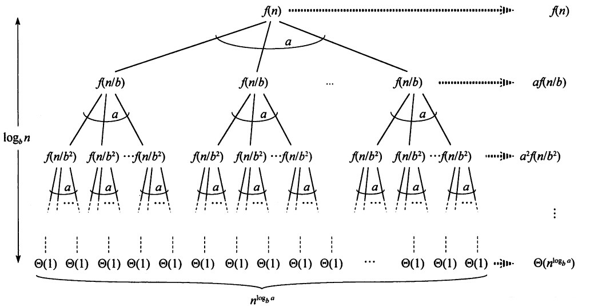

# 算法炽热

本篇主要涉及到，算法分析、渐近记法、摊还分析、概率算法分析。

## 算法分析

为什么要进行算法的分析？

进行算法分析才可以衡量算法的好坏。而算法的好坏又决定程序的性能啊。

那为什么关注性能？

这是一个很怪的问题，写程序当然要关注性能啦。算法导论开篇，对于程序性能有个让人惊呼叫绝的解释，我们可以默默记在心中，或者睡一觉忘记。第一点，性能是程序的货币。为什么用Java编程而不用C编程，尽管，Java比C满上3倍或者更多。因为Java提供面向对象的编程方式。而性能在这个选择中充当了货币的角色。比如说，我有10个性能。我可以用其中3个性能兑换Java语言，3个性能兑换用户友好性，3个性能兑换模块化。而如果，没有性能，那啥也兑换不了。性能对于程序，就像是钱对于生活。第二点，因垂死听\(interesting\)，这和为什么人们追求更快的跑车一致。

算法的快慢除了取决于算法自身，还取决于input和机器的快慢。对于不同的input可以对算法进行分类型分析，算法分析的类型可分为：

* Worst Case:最差情况分析，可以很好的衡量算法。
* Average-Case:平均情况分析，实际上是加权平均。将出现的概率作为权重，参与到计算中。
* Best-Case:最好情况分析，假象！没法去衡量算法。
* Probabilistic:概率分析，求随机算法的期望。
* Amortized:摊还分析，将代价较高操作的代价平摊到每个操作上，也就是求平均代价。
* 更多的分析，比如竞争分析等等。

## 渐进记法

在进行算法分析的时候，人们想出一种渐进的方法来进行比对。这也就是说不比对算法特定input下的快慢。比较当input趋近与无穷大的时候下的快慢。或者说注重算法增长\(growth\)的速率。

在进行渐进计法时，Θ、Ω、O这三个符号经常出现，可以从界限的角度去理解这三个符号。也可以从极限的角度去理解这三个符号。

O符号表示对于

$$
f(n)=\mathrm {O} (g(n))
$$

存在正实数c和N，使得对于n&gt;N，有

$$
\frac{|g(n)|}{|f(n)|} \ge c
$$

即g\(x\)为f\(x\)的上界。

Ω符号表示对于

$$
f(n)=\mathrm {Ω} (g(n))
$$

存在正实数c和N，使得对于n&gt;N，有

$$
\frac{|f(n)|}{|g(n)|} \ge c
$$

即g\(x\)为f\(x\)的下界。

而Θ代表g\(x\)为f\(x\)的上界与下界中间这个区间。

平时，在计算复杂度的时候，我们会凭经验，直接将原函数中的常数和低阶变量直接忽略。

比如

$$
T(n) = {4n^3} + {3n^2} + 4096
$$

可以直接得到

$$
Θ(n) = {n^3}
$$

如果从界限角度去解释，为什么忽略常数和低阶变量，会不严谨，比如说解释为计算中这些常数和低阶对于高阶影响很小。但是我们可以从极限角度来更加严谨的解释这个问题。

来看一下Θ的极限角度：

给定两个正值函数值f\(x\)、g\(x\)，并使

$$
f(n)=\mathrm {Θ} (g(n))
$$

成立的条件为，存在正实数c1和c2和N，使得对于所有n &gt; N，有

$$
c_1 \le \frac{|g(n)|}{|f(n)|} \le c_2
$$

由上式，可以得到存在正实数c和N，使得对于所有n &gt; N，有

$$
\frac{|g(n)|}{|f(n)|} = |c|
$$

对于n视作极限可得

$$
\lim_{x \to \infty}\frac{|g(n)|}{|f(n)|} = |c|
$$

则f\(x\)为g\(x\)的同阶无穷大。结论为Θ表示为，g\(x\)为f\(x\)的同阶无穷大函数。同理，O表示为g\(x\)为f\(x\)的同阶或高阶无穷大函数。Ω表示为g\(x\)为f\(x\)的同阶或低阶无穷大函数。

那么，为什么忽略常数和低阶变量就很明显了。f\(x\)在n无穷时的大小由函数中的高阶无穷大函数决定，而常数和低阶变量是f\(x\)的低阶无穷大，可以被忽略。

程序在运行上，只分迭代和递归。要区分递归和分治，递归是程序物理上运行时的实现，而分治是种算法设计的方法。下面，通过迭代和递归算法分析来开启算法分析的大门。

## 迭代算法分析

插入排序是经典的迭代排序算法，下面以插入排序为例，进行迭代算法分析。下面是伪代码：

```text
Insertion-Sort arr[n]
for i from 2 to n
    temp <- arr[i]
    for j from i-1 to 1 And arr[j] > temp
       arr[i+1] <- arr[i]
       arr[i] <- temp
    end
 end
```

插入排序的循环实际上是

```text
for (int i = 2; i <= n; ++i)
  for (int j = i - 1; j >= 1; --j)
```

这相当于进行了n-1次的对比，每次对比又进行了i-1次的交换，将其累加起来就得到时间复杂度。

$$
T(n) = \sum_{i=2}^{n}i-1=\frac{(1+n-1)(n-1)}{2}=\frac{n^2-n}{2} =Θ(n^2)
$$

如果有c为常数，循环如下

```text
for (int i = 1; i <= n; i *= c)
```

$$
T(i)表示关于执行的次数i的函数，T(i)=c^i，令T(i)=n，则T(n)=Θ(\log_{c}{n})
$$

如果有c和k为常数，pow为求i的c次方，循环体如下

```text
for (int i = k; i <= n; i = pow(i,c))
```

$$
T(i)表示关于执行的次数i的函数，T(i)=k^{c^i}，令T(i)=n，则T(n)=Θ(\log_{k}{\log_{c}{n}})
$$

## 递归算法分析

递归算法有三种分析方法。

* 递归树

这种方法最直观，但不是很严谨。

假设某递归公式为

$$
T(n)=2T(\frac{n}{2})+n
$$

那么画出大致的的递归树，让每个节点代表，这个节点的复杂度

```text
           n        ----------n
          / \
        n/2 n/2      ---------n
      / \    / \
    n/4 n/4 n/4 n/4   --------n
   .................  
  Θ(1) .......... Θ(1)  ------n
```

现在只要将所有节点相加，就可以计算出总复杂度了。递归树的每一层相加都为n。而递归树的高度与底部节点的值有如下关系:

$$
1 = \frac{n}{2^{h-1}}，则h=\log_{2}n+1
$$

那么最后的复杂度为每层节点的值乘以树的高

$$
O(n\log_{2}n)
$$

再看一个复杂点的例子，假设某递归公式为：

$$
T(n)=T(\frac{n}{2})+T(\frac{n}{4})+n^2
$$

画出递归树：

```text
               n^2                 ----------n^2
          /         \
       (n/2)^2    (n/4)^2           ---------5n^2/16
      /     \      /     \
 (n/4)^2 (n/8)^2 (n/8)^2 (n/16)^2    --------25^2/256
..................................   
Θ(1) ........................... Θ(1)  ------5^kn^2/16^k
```

可以看到，递归树的每一层相加起来是一个等比数列，则将所有节点相加为：

$$
(1+\frac{5}{16}+\frac{25}{256}+....+\frac{5^k}{16^k})n^2
$$

由等比数列的性质

$$
1+\frac{5}{16}+\frac{25}{256}+....+\frac{5^k}{16^k}<2
$$

得出复杂度为

$$
O(n^2)
$$

* 结构归纳法

这种方法是数学归纳法在计算机领域的应用，称为结构归纳法。结构归纳法做的就是先提出一个猜想，先看最基本的结构是否符合猜想。然后假设问题某结构符合这个猜想，最后看嵌套符合这个猜想的结构是否也符合猜想，如果基本机构符合，嵌套结构也符合，证明猜想是正确的。这种方法有个蛋疼的地方就是，你需要猜对答案，再证明他。

某递归公式为

$$
T(n)=4T(\frac{n}{2})+n，且T(1)=O(1)
$$

第一步先做猜想，往往第一步是最困难的，猜想

$$
T(n)=O(n^2)，且T(n)\le c_1n^2-n \\对于n=1，T(1)=c_1-1，符合T(1)=O(1) \\假设T(\frac{n}{2})成立，则T(n)=4(c_1\frac{n^2}{4}-\frac{n}{2})+n\\T(n) =c_1n^2-n\\T(n)\leq c_1n
$$

猜想的时候需要数学技巧，想办法消除递归公式中的n，去得出最后的证明结果，如果猜

$$
T(n)\le c_1n^2
$$

会无法得出正确的证明。

用结构归纳法证明递归树的第一个例子：

$$
T(n) = 2T(\frac{n}{2})+n ，且T(1)=O(1) \\ 猜想:T(n) = O(n\log_{2}n)，且T(n)\le c_1n\log_{2}n+n \\ 对于n=1时，T(1)=1，符合T(1)=O(1) \\ 假设对于T(\frac{n}{2})成立，则T(n)证明如下：\\ T(n)=2(c_1\frac{n}{2}\log_{2}\frac{n}{2} + \frac{n}{2})+n \\ T(n) = 2(c_1\frac{n}{2}\log_{2}{n}-c_1\frac{n}{2}+\frac{n}{2})+n \\ T(n)=c_1n\log_{2}n-c_1n+2n \\ T(n)=c_1n\log_{2}n+(2-c_1)n \\ 存在c_1>1时，T(n)\le c_1nlog_{2}{n}+n
$$

同样，猜的时候要运用些数学技巧，如果猜

$$
T(n)\le\log_{2}n
$$

得出T\(1\)&lt;=0，就无法得出正确的证明了。实际上，我们刚证明了一遍快排和归并排序的时间复杂度。

* 主定理

主定理使用有一定范围，只能对形如以下递归公式：

$$
T(n)=aT(\frac{n}{b})+f(n)
$$

主定理是从递归树方法中总结出来的经验公式，下图为上面递归公式的通项递归树。



$$
树高为\log_{b}n，叶子节点的个数为a^{\log_{b}n}，即n^{\log_{b}a}，叶子节点层的复杂度为Θ(n^{\log_{b}a})
$$

从图中我们可以看出，从f\(n\)伸展到叶子节点层，每层节点的规模为上层节点乘以a除以b，是一个常数。也就是说，f\(n\)到叶子节点层要不然递增，要不然递减，要不然整个递归树不同层数几乎相等。

主定理就是比较f\(n\)与叶子节点的时间复杂度，实际上就是在将所有节点累加求和的时候，找出谁是高阶无穷大函数，最后整体的复杂度就由高阶无穷大函数决定:

当叶子节点复杂度较大时，T\(n\)的复杂度就是叶子节点的复杂度。

$$
T(n)=O(n^{\log_{b}a})
$$

当叶子节点和f\(n\)复杂度几乎相等时，T\(n\)的复杂度就是叶子节点复杂度乘上树高，并且忽略b常数的大小。

$$
T(n)=Θ(n^{\log_{b}a}\log_{2}n)
$$

当f\(n\)复杂度较大时，T\(n\)的复杂度就是f\(n\)的复杂度。

$$
T(n)=Θ(f(n))
$$

主定理在一种情况下不适用，就是叶子层节点复杂度与f\(n\)复杂度相差多项式级别的时候。比如下面两种情况

$$
O(叶子层)=n,O(f(n))=n\log_{2}{n}或O(叶子层)=n,O(f(n))=\frac{n}{\log_{2}{n}}
$$

* 总结

在平时编写代码，碰到的复杂度不会太复杂。大部分是主定理可以解决的。比如：

$$
T(n)=2T(\frac{n}{4})+n^2 \\ n^{\log_{b}{a}}=O(\sqrt{n}) \\ f(n)=Θ(n^2) \\ 根据主定理，T(n)=Θ(n^2)
$$

主定理不能解决，就要猜出答案，然后用结构归纳法证明，有些问题比较好猜，比如：

$$
T_1(n)=T_1(\frac{n}{2})+T_1(\frac{n}{4})+T_1(\frac{n}{8})+n \\ 我们熟悉递归T_2，T_2(n)=2T_2(\frac{n}{2})+n \\ T_2和T_1比，2 \cdot\frac{n}{2} > \frac{n}{2}+\frac{n}{4}+\frac{n}{8}
$$

T2每层递增的更多，那么叶子层节点复杂度肯定要高。已知T2的叶子层节点和f\(n\)几乎相等，那么T1叶子层节点复杂度应该比f\(n\)小。则可猜所求式复杂度为Θ\(n\)。再通过结构归纳法可以很容易证明。

还有形如：

$$
T(n)=T(n-1)+\frac{1}{n}
$$

对于这种T\(n\)递归中包含T\(n-1\)的，递归的公式可化为

$$
T(n)=\sum_{i=1}^{n}f(i)
$$

本例为调和级数

$$
T(n)=\sum_{i=1}^{n}\frac{1}{i}=\log_{2}{n}+c \\ Θ(\log_{2}{n})
$$

再进行结构归纳法证明也比较简单。

复杂的，不好猜的，就用递归树解:

$$
T(n)=\sum_{i=0}^{递归树高 }\cdot c\cdot每层的节点数\cdot此层节点的复杂度
$$

比如:

$$
T(n)=4T(\frac{n}{2}+2)+n \\ T(n)=\sum_{i=0}^{\log_{2}{n}}\cdot c\cdot4^i\cdot(\frac{n}{2^i}+2) \\ T(n)=\sum_{i=0}^{\log_{2}{n}}\cdot c\cdot (n\cdot2^i+2\cdot4^i) \\ T(n)=c\cdot n\sum_{i=0}^{\log_{2}{n}}2^i+2\cdot c\sum_{i=0}^{\log_{2}{n}}4^i \\ T(n)=c\cdot n(\frac{2^{\log_{2}{n}+1}-1}{2-1})+2\cdot c(\frac{4^{\log_{2}{n}+1}-1}{4-1}) \\ T(n)=c\cdot n(2n-1)+\frac{2\cdot c\cdot(4n^2-1)}{3} \\ T(n)=2cn^2-cn+\frac{8}{3}\cdot c\cdot n^2-\frac{2}{3}c \\ T(n)=O(n^2)
$$

还有：

$$
T(n)=4T(\frac{n}{2})+n^2\log_{2}{n} \\ n^{\log_{b}{a}}=O(n^2)，f(n)=O(n^2\log_{2}{n})，n^{\log_{b}{a}}和f(n)相差多项式级别，所以主定理不适用，那就使用递归树方法 \\ T(n)=\sum_{i=0}^{\log_{2}{n}}\cdot c\cdot4^i\cdot\frac{n}{2^i}^2\cdot\log_{2}{\frac{n}{2^i}} \\ T(n)=\sum_{i=0}^{\log_{2}{n}}\cdot c\cdot n^2\cdot(\log_{2}{n}-i) \\ T(n)=\sum_{i=0}^{\log_{2}{n}}\cdot c\cdot n^2\cdot\log_{2}{n}-\sum_{i=0}^{\log_{2}{n}}\cdot c\cdot n^2\cdot i \\ T(n)=c\cdot n^2\cdot\log_{2}{n}\cdot\log_{2}{n}-c\cdot n^2\cdot\frac{(1+\log_{2}{n})\log_{2}{n}}{2}  \\ T(n)=c\cdot n^2\cdot\log_{2}{n}\cdot\log_{2}{n}-c\cdot n^2\cdot\log_{2}{n} \\ T(n)=O(n^2\log_{2}{n}\log_{2}{n})
$$

最难的一种，就是用变量调换方法，将原关系式转换成我们熟悉的形式，假如某递归公式为：

$$
T(n)=2T(\sqrt{n})+\log_{2}{n} \\ 令m=\log_{2}{n}，则T(2^m)=2T(2^{\frac{m}{2}})+m \\ 令S(m)为关于m的函数，则S(m)=2S(\frac{m}{2})+m \\ 然后用主定理得出S(m)=O(m\log_{2}{m}) \\ 再将m置换回n，T(n)=O(\log_{2}{n}\log_{2}{\log_{2}{n}})
$$

还有：

$$
T(n)=\sqrt{n}T(\sqrt{n})+n \\ \frac{T(n)}{n}=\frac{T(\sqrt{n})}{\sqrt{n}}+1 \\ 令S(n)=\frac{T(n)}{n}，则S(n)=S(\sqrt{n})+1 \\ 令n=2^{2^m}，则S(2^{2^m})=S(2^{2^{m-1}})+1 \\ 令S(m)为关于m的函数，则S(m)=S(m-1)+1 \\ S(m)=O(m)，则S(n)=O(\log_{2}{\log_{2}{n}}) \\ T(n)=O(n\log_{2}{\log_{2}{n}})
$$

## 概率分析

概率分析会使用应用概率的概念去分析算法，基本只出现在对随机算法的分析。而使用了随机数生成器去影响算法的行为，就被认作随机算法。随机算法分为两种，一种是将输入的模式消除，随机化输入，比如快排随机划分pivot。另一种是算法本身做选择时随机化，比如跳表随机选择增长层数。

算导以快排为例进行概率分析，这里不是完整的证明过程，主要关注一下与概率分析有关的关键部分。

如果输入是已排好序数组和逆序的数组，此时为快排的最坏情况，递归公式变为

$$
T(n)=T(n-1)+Θ(n)，T(n)=Θ(n^2)
$$

如果输入使每次划分点都在数组的中间，此时为快排的最好情况，递归公式为

$$
T(n)=2T(\frac{n}{2})+Θ(n)，T(n)=Θ(n\log_{2}{n})
$$

那这么多的输入情况，如何求出快排的平均情况复杂度呢？将输入随机化，这样就可以认为输入为均匀分布，求出所有可能输入的概率乘以其复杂度的总和，就是期望值，就求出了快排的平均情况复杂度。

$$
设X_k为k点被选择为pivot的事件，则k被选中的次数X_k=\begin{equation}  
\left\{  
             \begin{array}{lr}  
             1 & 如果k被选为pivot \\  
             0 & 如果k未被选为pivot\\  
             \end{array}  
\right.  
\end{equation} \\ 期望E(X_k)=0\cdot Pr(k被未选中的概率)+1\cdot Pr(k被选中的概率) =\frac{1}{n} \\ pviot可被选择的范围为[0,n-1]，当选择pviot点为k时，递归公式可转化为T(n)=T(k)+T(n-k-1)+Θ(n) \\ 则T(n)的期望值为所有可能的期望值总和，E(T(n))=\sum_{k=0}^{n-1}E[X_k(T(k)+T(n-k-1)+Θ(n))] \\ 而根据两个互相独立的随机变量的乘积的期望等于这两个随机变量期望的乘积，E(T(n))可以转化为 \\ E(T(n))=\sum_{k=0}^{n-1}E(X_k)\cdot E(T(k)+T(n-k-1)+Θ(n)) \\ 又因为E(X_k)=\frac{1}{n}，T(k)与T(n-k-1)在k从0到n-1的累加中是互相逆序且结果相同，E(T(n))可以转化为 \\ E(T(n))=\frac{2}{n}\sum_{k=0}^{n-1}E(T(k)+Θ(n)) \\ 然后用数学归纳法证明出，E(T(n))\leq n\log_{2}{n}，就可以得出快排的平均情况复杂度为O(n\log_{2}{n})
$$

可以看到，对随机算法的概率分析就是在求随机算法的期望。

## 摊还分析

有些算法和数据结构，同一个操作或者步骤，会根据实际情况改变复杂度，这种情况要想更加严谨的分析算法就不能按一种复杂度来简单分析。比如，凡是需要扩容的数据结构，其插入操作就要包含扩容的复杂度，哈希表插入的复杂度是Θ\(1\)，扩容的复杂度是Θ\(n\)，进行分析的时候，不能忽略扩容，可以进行摊还分析。摊还分析就是将代价较高操作的代价平摊到每个操作上，也就是求平均代价。摊还分析有三种分析方法，聚集法、记账法、势能法。下面就是用这三种方法分析哈希表的插入复杂度，假设哈希表以2的幂数进行扩容。

* 聚集法

聚集法就是将所有操作的实际复杂度加起来，然后除法求平均。

$$
设C_i为第i个插入的代价，则C_i=\begin{equation}  
\left\{  
             \begin{array}{lr}  
             i & 如果i-1为2的幂数 \\  
             1& 如果i-1不为2的幂数\\  
             \end{array}  
\right.  
\end{equation} \\ 则C_{insert-total}(n)=\sum_{i=1}^{n}C_i=n+\sum_{j=0}^{\log_{2}{n-1}}2^j\leq 3n=Θ(n) \\ C_{insert-average}=\frac{C_{insert-total}}{n}=Θ(1)
$$

结论为，平摊扩容的代价给每个插入后，平均的插入代价为Θ\(1\)。

* 记账法

记账法就是给每个操作一个摊还代价，其中包括预支的扩容代价，每个操作将预支的代价先存储起来，等到扩容的时候，再取出预支的扩容代价花费。

给每个插入操作3单位的摊还代价，每个插入操作会花费一个单位代价来进行插入，存储两个单位代价。当扩容发生的时候会从存储的代价扣除，如果存储不够扣的，就表明给每个插入操作的摊还代价少了，没法继续分析了。所以要求：

$$
设\mathop{C_i}\limits_{}^{\verb!^!}为第i个插入的摊还代价，\sum_{i=1}^{n}C_i\leq\sum_{i=1}^{n}\mathop{C_i}\limits_{}^{\verb!^!}，对于所有的n
$$

假如表中的容量为m，有m/2个元素。如果我给每个操作3单位的摊还代价，等到表中m个元素，需要扩容的时候，已经存储了2乘以m/2个代价。也就说每到需要扩容时，扩容会正好将存储的代价全部用光，然后剩下此步新给的2单位代价，表的插入就会一直这样循环下去。那么，我就可以认为每次插入的时间复杂度就为Θ\(3\)，也就是Θ\(1\)。

* 势能法

在记账法中，先假定了摊还代价，然后分析整个过程存储的代价。而势能法正好相反，先假定存储的代价，然后计算摊还代价。

将存储的代价用势能来表示\(真是不知道这帮人是怎么想到的。。\)，并让每一步插入操作，将数据结构映射成新的数据结构。用函数表示势能函数，表示新的数据结构。

$$
用\phi函数表示势能函数，D表示新的数据结构。每次插入操作，会让数据结构D_{i-1}->D_i \\ 对于\phi函数，有\mathop{C_i}\limits_{}^{\verb!^!}=c_i+\phi(D_i)-\phi(D_{i-1})，即平摊代价=实际代价+势能变化 \\ 总摊还代价为，\sum_{i=1}^{n}\mathop{C_i}\limits_{}^{\verb!^!}=\sum_{i=1}^{n}(C_i+\phi(D_i)-\phi(D_{i-1}))=\sum_{i=1}^{n}C_i+\phi(D_n)-\phi(D_0)\geq \sum_{i=1}^{n}C_i \\ 假设每一步存储的代价，\phi(D_i)=2^i-2^{\log_{2}{i}} \\ \mathop{C_i}\limits_{}^{\verb!^!}=c_i+\phi(D_i)-\phi(D_{i-1}） \\ =\begin{equation}  
\left\{  
             \begin{array}{lr}  
             i & i-1是2的幂数\\  
             1 & i-1不是2的幂数\\  
             \end{array}  
\right.  
\end{equation} +(2^i-2^{\log_{2}{i}})-(2^{i-1}-2^{\log_{2}{i-1}}) \\
$$

$$
=\begin{equation}  
\left\{  
             \begin{array}{lr}  
             3 & i-1是2的幂数\\  
             3 & i-1不是2的幂数\\  
             \end{array}  
\right.  
\end{equation} \\ 即\mathop{C_i}\limits_{}^{\verb!^!}=3，则插入的复杂度为Θ(1)
$$

### 引用

算导的第四章习题 [http://atekihcan.github.io/CLRS/](http://atekihcan.github.io/CLRS/)

