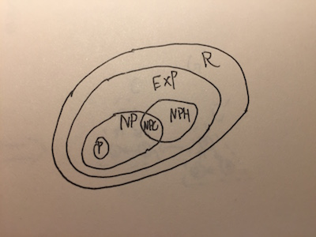
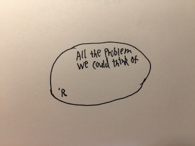

# 算法灰烬

本篇主要涉及到问题的复杂度性归类，R、EXP、P、NP、NPC、NPH

为了更好的研究问题，人们将问题根据其算法的复杂度划分为不同的类型。有趣的是，由于人们现阶段对这些问题认识的还不够深入，导致这些类型并不是非黑既白，通常是包含关系。很明显，最困难的问题是算法根本无法解决的问题。而在生活中，算法能够解决的问题仅仅是微不足道的一部分。这确实会使喜欢算法的人很伤心，这也是为什么最后一篇文章标题叫做算法灰烬。

### R\(Recurrence\)

R类问题指的就是有限时间内可以解决问题，也就是可解决的问题。

### EXP\(Exponential\)

EXP类问题指的是能在指数复杂度解决问题。

### P\(Polynomial\)

P类问题指的是能在多项式复杂度解决的问题。而不能在多项式复杂度解决的问题是NP吗？不是这样的，如果没找到在多项式复杂度解决问题的解并不代表就没有，有可能现在人们局限于此。所以，人们又建立了另一个分类NP，来代表这些问题。

### NP\(Nondeterministic-Polynomial\)

NP类问题指的是非确定的P类问题。那么所有在多项式复杂度找不到解的问题都属于NP类问题吗？也不是这样的。如果我能证明某个问题只能在指数复杂度找到解，那这个问题就不属于NP，属于EXP。NP类问题定义，能在多项式复杂度验证一个可能解。毕竟，能在多项式复杂度验证一个可能解，才可能有多项式复杂度求出解。

### NPC\(Nondeterministic-Polynomial-Complete\)

了解了P与NP，可以看到P与NP之间千丝万缕的联系。根据定义只要问题是P类问题，就是NP类问题，但是NP类问题与P类问题什么关系，还没有人能够证明出来。人们偏向于NP类问题不等价于P类问题。为什么不等价就引出了NPC类问题。在NP问题中，有一些问题长久以来人们一直尝试，但都找不到多项式复杂度的解，这些问题被建立为NPC类问题。可以看出，NPC问题是NP问题中最难的一部分问题。也就是这些在NP类问题中的NPC类问题找不到多项式复杂度的解，让人们更加相信，NP类问题不等价于P类问题。

那么，假如有一个NP类问题，怎么知道它是不是NPC类问题？这就用到了通用技巧-归约\(Reducibility\)。

假如，有两个问题A和B。如果，能在多项式复杂度将问题A的输入转化为问题B的输入，然后通过问题B的算法求解出问题B的解，再在多项式复杂度将问题B的解转化为问题A的解，得到问题A的解。就认为问题A可以归约为问题B。

回到问题，假如所有的NP类问题都可以归约成这个NP类问题，那么这个NP类问题就是NPC类问题。这也是NPC问题的定义。人们已经发现了很多NPC问题，并且还在不断增多。

### NPH\(Nondeterministic-Polynomial-Hard\)

根据NPC类问题的定义，如果问题属于NP类问题，并且所有NP类问题都可以归约成这个问题，那么这个问题就是NPC类问题。NPH类问题与NPC类问题差不多，问题可以不属于NP类问题，但是所有NP类问题还都可以归约成这个问题，这个问题就是NPH类问题。NPH类问题可能会比NPC类问题还要难。

以下为所提到的算法类型全家福。​

最后再献上一张，算法与人类。​

