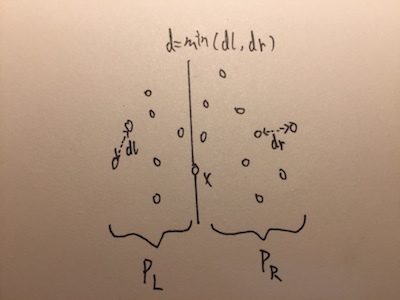
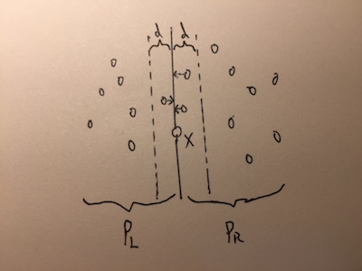
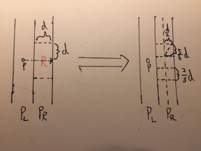
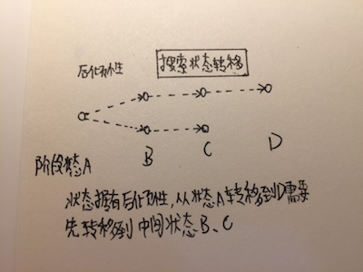
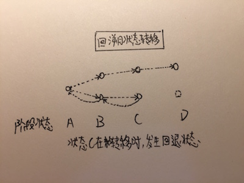
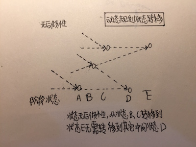
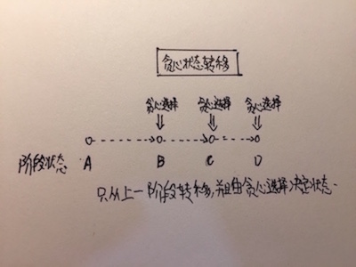

# 算法升腾

本篇主要涉及到，分治、回溯、动态规划、贪心。

## 分治

分治思路：

* 分解\(Divide\)：将原问题分解成许多相似的、规模更小的子问题。
* 解决\(Conquer\)：递归解决划分后的子问题。
* 合并\(Combine\)：将所有子问题的解合并成原问题的解。

分治的作用：大部分暴力法\(brute-force\)采用分治思想可以降低复杂度

$$
Θ(n)->Θ(\log_{2}{n})或Θ(n^2)->Θ(n\log_{2}{n})
$$

分治和递归解决问题还不一样，比如树的遍历和树的遍历变种操作都是递归解决问题，但不是分治算法。

分治的最典型的例子就是归并排序、归并排序的变种数组中的逆序对、二分查找。常见的分治都是将问题分解成两个规模相近的子问题，想一下递归树就知道，分解成两个规模相近的子问题比分解成两个规模走极端的子问题复杂度要低。

* 乘方问题\(Pow\)

给出一个x，求x的n阶数。

朴素思想很简单，一个for循环连乘n个x就可以，复杂度如下：

$$
T(i)=\sum_{i=1}^{n}1=Θ(n)
$$

运用分治思想解决问题，x想不出可以分的方式，n想一想可以分解。将x的n次方，分解成两个x的n/2次方，2个同样的次方，这样就可以节省一次计算的时间。则如果为偶数如果为奇数

$$
则x^n=\begin{equation}  
\left\{  
             \begin{array}{lr}  
             x^{\frac{n}{2}}\cdot x^{\frac{n}{2}} & 如果n为偶数 \\  
             x^{\frac{n-1}{2}}\cdot x^{\frac{n-1}{2}} & 如果n为奇数\\  
             \end{array}  
\right.  
\end{equation}
$$

分解后，递归的解决n/2的问题。然后判断一下奇、偶数将结果合并起来就得到了解。

```text
伪代码：
POW(x,n)
  if n == 0
    return 1
  let result = POW(x, n/2) 
  result = result * result
  if n为奇数
    result = result * x
  return result
```

$$
时间复杂度：T(n)=T(\frac{n}{2})+Θ(1)=Θ(\log_{2}{n})
$$

* 整数乘法\(Integer-Multiply\)

给出两个n位的整数A和B，求他们的乘积C。

朴素思想就是同十进制计算乘法一样，从低位到高位，一位一位乘，然后相加。比如11010101乘以01111101：

```text
                1 1 0 1 0 1 0 1
             ×  0 1 1 1 1 1 0 1
             --------------------
                1 1 0 1 0 1 0 1
              0 0 0 0 0 0 0 0
            1 1 0 1 0 1 0 1
          1 1 0 1 0 1 0 1
        1 1 0 1 0 1 0 1
      1 1 0 1 0 1 0 1
    1 1 0 1 0 1 0 1
  0 0 0 0 0 0 0 0
 -------------------------------- 
0 1 1 0 1 0 0 0 0 0 0 0 0 0 0 1
```

$$
时间复杂度为：T(i)=\sum_{i=1}^{n}\sum_{j=1}^{n}1=Θ(n^2)
$$

分治思想，将整数分解成n/2高位和n/2低位。两个整数分解为4个n/2位整数。以11010101和01111101为例：

```text
 1101  0101      0111  1101 
 |-a-| |-b-|     |-c-| |-d-|
```

这样，两个整数相乘可以转化为计算4个n/2位整数相乘。再对这4个n/2位整数相乘递归解决。最后将4个n/2位整数合并起来就得到了解。

$$
合并：A*B=(a\cdot c)<<\frac{n}{2}+(a\cdot d+b\cdot c)<<\frac{n}{4}+b\cdot d
$$

```text
伪代码:
INTEGER-MULTIPLY(A,B,n)
  if n == 1
    return A * B
  else
    let e = MULTIPLY(A的前n/2位,B的前n/2位,n/2)
    let f = MULTIPLY(A的前n/2位,B的后n/2位,n/2)
    let g = MULTIPLY(A的后n/2位,B的前n/2位,n/2)
    let h = MULTIPLY(A的后n/2位,B的后n/2位,n/2)
  return e << n/2 + (f + g) << n/4 + h
```

$$
时间复杂度：T(n) =4T(\frac{n}{2})+Θ(n)
$$

然而将暴力跟改为分治没有节省复杂度，这也就是为什么开头讲的大部分算法更改为分治可以降低复杂度。由上面的递归公式可以看出，要想降低复杂度只能从4上做手脚，改变其他参数都不会有实质上的改变。

Karatsuba放法，就是将上面公式中的4变成3。

$$
将合并中的(a\cdot d+b\cdot c)转化为(a\cdot c + b\cdot d-(a-b)\cdot(c-d))
$$

这样只需要求3个整数的乘积就可以得出解，

$$
时间复杂变为：T(n)=3T(\frac{n}{2})+Θ(n)=Θ(n^{\log_{2}{3}})
$$

虽然最后没有降低一个等级，但是在实际运行中，还是减少了很多运算时间。

* 矩阵乘法\(Square-Matrix-Multiply\)

给出两个n\*n的矩阵A和B，求他们的乘积矩阵C。

$$
矩阵乘积公式，对于A(a_{ij})和B(b_{ij})，c_{ij}=\sum_{k=1}^{n}a_{ik}\cdot b_{kj}
$$

朴素思想就是3层for循环，得出的矩阵C的行数为A的行数，C的列数为B的列数，C每个值为A的对应列乘以B的对应行。

$$
时间复杂度T(i)=\sum_{i=1}^{n}\sum_{j=1}^{n}\sum_{k=1}^{n}1=Θ(n^3)
$$

分治思想，这个问题很难想到如何分解。将矩阵分解成4个n/2的矩阵块\(block\)。

$$
矩阵C=矩阵A\cdot矩阵B转化为：\left[                
 \begin{matrix}
   r& s \\
   i & u \\
  \end{matrix}
  \right]=\left[                
 \begin{matrix}
   a& b \\
   c & d \\
  \end{matrix}
  \right] \cdot \left[                
 \begin{matrix}
   e& f \\
   g & h \\
  \end{matrix}
  \right]
$$

矩阵都转化为了4个字母表示的矩阵块，而一个矩阵块的值等于2对矩阵块的乘积，比如r:其他矩阵块也类似：

$$
r=a\cdot e+b\cdot g
$$

$$
其他矩阵块也类似：s=a\cdot f+b\cdot h，t=c\cdot e+d\cdot g，u=c\cdot f+d\cdot h
$$

在将两个矩阵乘积分解成8对矩阵块乘积后，每对矩阵块乘积又可以递归解决。最后将8对矩阵块乘积的结果合并起来就得到了解。

```text
伪代码：
SQUARE-MATRIX-MULTIPLY-RECURSIVE(A,B)
  n = A.rows
  let C = new n * n Matrix
  if n == 1
    C = (1)
  else
    r = SQUARE-MATRIX-MULTIPLY-RECURSIVE(a,e) + SQUARE-MATRIX-MULTIPLY-RECURSIVE(b,g)
    s = SQUARE-MATRIX-MULTIPLY-RECURSIVE(a,f) + SQUARE-MATRIX-MULTIPLY-RECURSIVE(b,h)
    t = SQUARE-MATRIX-MULTIPLY-RECURSIVE(c,e) + SQUARE-MATRIX-MULTIPLY-RECURSIVE(d,g)
    u = SQUARE-MATRIX-MULTIPLY-RECURSIVE(c,f) + SQUARE-MATRIX-MULTIPLY-RECURSIVE(d,h)
    combine(r,s,t,u)
  return C
```

$$
时间复杂度：T(n)=8T(\frac{n}{2})+Θ(n^2)，根据主定理T(n)=Θ(n^3)
$$

类似整数乘法，将暴力跟改为分治没有节省复杂度。用同样的思想去降低复杂度，在上面递归公式中的8做手脚。

Strassen方法，就是将上面公式中的8想办法变成7。

```text
伪代码：
SQUARE-MATRIX-MULTIPLY-RECURSIVE(A,B)
  n = A.rows
  let C = new n * n Matrix
  if n == 1
    C = (1)
  else
    r = SQUARE-MATRIX-MULTIPLY-RECURSIVE(a,e) + SQUARE-MATRIX-MULTIPLY-RECURSIVE(b,g)
    s = SQUARE-MATRIX-MULTIPLY-RECURSIVE(a,f) + SQUARE-MATRIX-MULTIPLY-RECURSIVE(b,h)
    t = SQUARE-MATRIX-MULTIPLY-RECURSIVE(c,e) + SQUARE-MATRIX-MULTIPLY-RECURSIVE(d,g)
    u = SQUARE-MATRIX-MULTIPLY-RECURSIVE(c,f) + SQUARE-MATRIX-MULTIPLY-RECURSIVE(d,h)
    combine(r,s,t,u)
  return C
```

这些假设可以代入证明，这里就不做了。可以看到只用假设7个矩阵块的乘积，也就是说只求7个矩阵块的乘积就可以求出解。

$$
时间复杂度：T(n)=8T(\frac{n}{2})+Θ(n^2)，根据主定理T(n)=Θ(n^3)
$$

与整数乘法一样，虽然最后没有降低一个等级，但是在实际运行中，还是减少了很多运算时间。

* 最接近点对\(Closest-Pair-Of-Points\)

给出n个点，求n个点中点对的最小距离。

背景：求两点p、q之间的距离为

$$
DistanceOfPoints=\sqrt{(p_x-q_x)^2+(p_y-q_y)^2}
$$

朴素想法就是求所有点对的距离，然后得出最小值。

```text
伪代码：
BRUTE-FORCE(points,n)
  let min = MAX_FLOAT
  for i from 1 to n
    for j from i+1 to n
      if DistanceOfPoints(points[i],points[j]) < min
        min = DistanceOfPoints(points[i],points[j])
    end
  end
  return min
```

$$
时间复杂度为：T(i)=\sum_{i=1}^{n}\sum_{j=i+1}^{n}=O(n^2)
$$

分治思想就是将n个点先按x坐标排序，然后从x坐标将点分解成两部分。



而每个部分又可以递归解决，直到分解到3个点的时候就可以直接比对找出最小距离。合并的过程会复杂点，PL与PR两部分的最小距离并不是整体的最小距离，还有可能存在PL中的点距PR中的点小于两部分的最小距离。



假设两部分的最小距离为d，那么还要求所有距分割线d内的点之间的距离。

```text
伪代码：
CLOSEST-PAIR-OF-POINTS(points,n)
  if n <= 3
    return BRUTE-FORCE(points,n)
  let mid = n / 2
  Point midPoint = points[mid]
  let dl = CLOSEST-PAIR-OF-POINTS(points,mid)  
  let dr = CLOSEST-PAIR-OF-POINTS(points+mid,n-mid)  
  let d = min(dl,dr)  
  let strip be new Array
  let j = 0
  for i from 1 to n
    if abs(points[i].x - midPoint.x) <= d
      append points[i] to strip
      ++j
  end
  return min(d,STRIP-CLOSET(strip,j,d))
  
STRIP-CLOSET(strip,n,d)
  let min = d
  qsort(strip)
  for i from 1 to n
    for j from i+1 to n and strip[i].y - strip[j].y < min
      if DistanceOfPoints(strip[i],strip[j]) < min
        min = DistanceOfPoints(strip[i], strip[j])
    end
  end
  return min
```

这个算法还有个有趣的地方，可以看到STRIP-CLOSET里面有个双层for循环，实际上内层循环最多执行6次。

以下是几何证明：



> 做点p的y坐标的平行线，以构造出宽为d，长为2d的区域R，使得所有可能距点p距离小于d的点都在其中。
>
> 再将区域R划分成6个等大小的区域，每个区域内的最大点距离为5d/6。已知所有区域R中的点之间距离小于等于d，所以这6个等大小的区域都最多包含一个点。因为距点p距离小于d的点都在区域R中，区域R包含的点不会超过6个。所以，距点p小于d的点不会超过6个。即内层循环最多执行6次。

$$
时间复杂度为：T(n)=2T(\frac{n}{2})+n+\log_{2}{n}+n=O(n\log_{2}{n}\log_{2}{n})
$$

## 状态转移

从本质上讲，计算机求解问题，是先把问题表述成一个初始状态，状态就是抽象化的存储器存储的数据。求解问题就是不断转移初始状态，直到某个所求状态。空间复杂度就是存储了多少状态，时间复杂度就是进行了多少次状态转移。比如，拿经典的机器人走格子举例，机器人一开始在左上角，是个初始状态，如果只可以向右、向下走，那么向右和向下走一步就是转移状态，如果要求到达右下角最少走多少步，那么右下角就是所求状态。

接下来，从不同时刻将状态划分阶段。比如，机器人从左上角走的向右和向下的状态都是属于同一个阶段，走到新格子后，再向右向下走的状态又属于同一个新的阶段。阶段也就包括了此时刻下所有可能状态。

求解问题就表述成前一阶段的状态转移到后一阶段的状态，直到所求阶段。将问题表述成了状态和阶段后，就可以更加从本质上理解搜索、动规、贪心了。

还拿机器人走格子为例，如果机器人可以向上、向下、向左、向右走，求到右下角的最短路径。求解，要将所有有可能的路径都计算出来，前面阶段进行的状态转移对后面所有阶段的状态转移都有影响，因为这会导致路径不同。也就是说，从前面某个阶段状态，需要依次转移到中间阶段状态，再转移到所求阶段状态。这就是搜索，包括深搜和广搜



如果机器人的路径上有阻碍物，机器人走过几步后，无论怎么走也到不了右下角，这时机器人就要回退到上一步，选择不同的走法去求解。这就是回溯，会出现回退状态。



如果机器人只能向右、向下走。那么，走到某个格子只能从上面格子走过来或者从右边格子走过来，你不需要求解所有路径，只要从到左边格子的路径和到上面格子的路径，这两条路径中选择就可以了。也就是说，此阶段的状态转移只受到上某个阶段状态转移的影响，其他以前阶段的状态都已经转移好了，你不需要关注以前所有阶段如何状态转移。即此阶段的状态从上某个阶段转移过来，不需再转移到其他中间状态，也叫作无后倾性。而此阶段最优状态可以从前面某个状态的最优状态获得叫做最优子结构。这就是动态规划。



贪心就是在动规上添加一个限制，此阶段的最优状态只能由上个阶段的最优状态得到。所以说，能用贪心解决的方法，就一定能用动规解决，不过可能要麻烦的多。



总结：将求解问题表述成状态和阶段后，不同算法的区别就在于状态转移的特征。

## 回溯

回溯=深搜+界限条件或者说收敛条件。回溯是建立在深搜之上的，回溯状态转移特征就是在深搜状态转移特征基础上再加上回退到上步状态。回溯会表现出枝剪，但我认为这不是回溯的本质。回溯遇到界限条件就会触发状态回退。即求解的时候，状态回退发生在当前求解失败以后。

```text
回溯多解模板：
FindSolution(n,other params)
  if find a soltion
    solutionCount++
    return
  for val from first to last
    if isValid(val,n)
      appendValue(val,n)
      FindSolution(n+1,other params)
      removeValue(val,n)
  end
 
回溯单解模板：
FindSolution(n,other params)
  if find a soltion
    return true
  for val from first to last
    if isValid(val,n)
      appendValue(val,n)
      if FindSolution(n+1,other params)
        return true
      removeValue(val,n) 
  end
  return false
```

* 骑士巡游\(Knight's-Tour\)

给出一个n乘以n的棋盘，一只国际象棋的骑士从左下角。骑士可以横向跳动一格纵向跳动两格，或者横向跳动一格纵向跳动两格。求骑士是否可以跳到所有格子。

骑士每步有八种跳的方式，骑士一直向未到达过的格子跳，直到跳完所有能到达的格子。如果能达到的格子不是全部的格子，这时，回退状态还可以从倒数第二步继续求解。那么，这个问题也就符合回溯的状态转移特征。

求解的时候，一维数组xMove表示横向能够移动的方向。一维数组yMove表示纵向能够移动的方向。二维数组table表示跳到过的格子。

```text
伪代码：
KNIGHTS-TOUR(x,y,xMove,yMove,table,n,count)
  if count == n
    return true
  for i from 1 to 8
    let next_x = x + xMove[i]
    let next_y = y + yMove[i]
    if validPos(next_x,next_y,table,n)
      table[next_x][next_y] = 1
      if KNIGHTS-TOUR(next_x,next_y,xMove,yMove,table,n,count+1)
        return true
      table[next_x][next_y] = -1
  end
  return false
 
validPos(x,y,table,n)
  if x > 0 && x < n && y > 0 && y < n && table[x][y] == -1
    return true
  return false
```

* N皇后问题\(N-Queens\)

求出一个n乘以n的棋盘，在棋盘上放n个皇后。皇后会吃掉同一行、同一列、同一斜线的其他皇后。求有多少种放法。

在第一行中某一列放一个皇后，然后到下一行不会被吃掉的位置放一个皇后，直到放到最后一行。这时，如果回退状态还可以在最后一行继续求其他解。那么，这个问题也就符合回溯的状态转移特征。

求解的时候有些编程技巧，用一个数组queens表示已放的皇后的位置。

```text
伪代码：
N-Queens(queens,total,irow,n)
  if irow == n
    total = total + 1
    return
  for i from 1 to n
    if validPos(queens,irow,i)
      add i to queens
      N-Queens(queens,total,irow+1,n)
      remove last element from queens
  end

validPos(queens,irow,icol)
  if irow < queens.length
    return false
  for i from 1 to queens.length
    if queens[i] == icol || abs(irow-i) == abs(icol-queens[i])
      return false
  end
  return true
```

* 汉密顿回路\(Hamiltonian-Cycle\)

给出一张无向图，汉密顿回路定义为仅遍历所有节点一次形成的路径，加上路径的首节点和尾节点连接的边。求给出的图是否存在汉密顿回路。

从任意节点开始遍历其临接的节点，不遍历重复的节点，直到遍历所有节点就找到一个遍历所有节点一次形成的路径。如果不存在连接首尾的路径，回退状态还可以在路径上倒数第二个节点继续求解。那么，这个问题也就符合回溯的状态转移特征。

求解的时候，用path一维数组表示遍历经过的节点。

```text
伪代码：
HAMILTONIAN-CYCLE(graph,path,n,pos)
  if pos == n
    if graph[path[0]][path[pos-1]] == 1
      return true
    else 
      return false
  for v from 1 to n
    if validPos(graph,path,v,pos)
      path[pos] = v
      if HAMILTONIAN-CYCLE(graph,path,n,pos+1) == true
        return true
      path[pos] = -1
  end
  return false
        
validPos(graph,path,v,pos)
  if graph[pos-1][v] == 0
    return false
  for i from 1 to pos
    if path[i] == v
      return false
  end
  return true
```

* 图的着色问题\(M-Coloring Problem\)

给出一张无向图和m种颜色，向图中的节点着色，着色要求为临接的节点不能着上同种颜色，求m种颜色是否能满足着色要求。

挨个给节点着色，给节点着色的时候，着非临接节点的颜色，直到所有节点都被着上颜色。如果某个节点所有颜色都不能满足着色要求，回退状态还可以在上个节点更换着的颜色继续求解。那么，这个问题也就符合回溯的状态转移特征。

求解的时候，一维数组colors表示节点已着的颜色。

```text
伪代码：
M-COLORING-PROBLEM(graph,colors,m,n,v)
  if v == n
    return true
  for c from 1 to m
    if validPos(graph,colors,c,v,n)
      colors[v] = c
      if M-COLORS-PROBLEM(graph,colors,m,n,v+1)
        return true
      colors[v] = -1
  end
  return false
      
validPos(graph,colors,c,v,n)
  for i from 1 to n
    if graph[v][i] && c == colors[i]
      return false
  end
  return true
```

## 动态规划

动态规划有多种理解方式，最常见的就是将原问题划分到规模最小的子问题求解，然后将子问题最优解记下来，增大子问题，一直递推到原问题。动规分为top-down and memoization和bottom-up求解方式。动态规划的英文名字叫做Dynamic Programming，翻译成中文更应该翻译成动态格子法，而不是动态规划。格子就代表的是备忘，缓存求解过的子问题，然后节省重复求子问题的时间。我一直理解划分子问题+备忘是动规的核心。

实际上，上面所讲到的都是手段，没从本质上理解动规。还是要从状态转移去理解动态规划。

理解动规实际上有两种角度，一种是上面提到的划分阶段，另一种是不划分阶段。分阶段是为了更明确的表达出无后倾性，如果不分阶段，后无效性的信息就要放到每个状态中。这样，所有动态规划问题就可以将所有状态转化为一张图。求最优解，就是在求初始状态和最终状态的最短路径，就将问题转化成了求图的两个节点的最短路径。Youtube上算导的课上和普林斯顿的课件上都提到了这种理解方式。上面两种理解方式都没问题，我个人偏向从第一种理解，这样更方便理解搜索和贪心。

理解了动规后，解决问题时，看是否能找到动态规划的状态转移特征，就可以判断是否能用动态规划了，然后再找出状态转移方程就能通过动态规划求出解了。然而对于不同的问题，这还是蛮困难的。对于我这种智商捉急的同学，只能多多练习了。

* 最长子序列问题\(LCS\)

给出一个长度为m的字符串x，一个长度为n的字符串y，求两个字符串的最长公共的子序列字符串的长度。

假设有两个字符串x为ABCBDAB，y为BDCABA。

现在x中前3个字母ABC和y中前3个字母BDC寻找LCS，这作为一个状态A，x中前2个字母和y中前2个字母寻找LCS为状态B。可以看到，如果第3个字母相等，那么前3个字母的LCS就等于前2个字母的LCS加一，也就等价于状态A可以从前阶段的状态B转移过来，并且没有影响其他字母寻找LCS，也就等价于没有转移到其他中间阶段的状态。所以，这个问题就符合动规的特征。

$$
定义二维数组dp_{ij}=最长公共子序列(x[1....i]y[1....j])，即dp_{ij}为x下标为i，y下标为j时的最长公共子序列 \\ 则状态转移公式为：dp[i,j]=\begin{equation}  
\left\{  
             \begin{array}{lr}  
             dp[i-1][j-1]+1 & x[i]=y[i] \\  
             max(dp[i-1][j],dp[i][j-1]) & x[i]\not= y[i]\\  
             \end{array}  
\right.  
\end{equation}
$$

```
伪代码：
LCS(x,y)
  let m = x.length
  let n = y.length
  let dp[m][n] be new Tables
  for i from 1 to m
    dp[i][0] = 0
  end
  for j from 1 to n
    dp[0][j] = 0
  end
  for i from 1 to m
    for j from 1 to n
      if x[i] == y[j]
        dp[i][j] = dp[i-1][j-1] + 1
      else
        dp[i][j] =  max(dp[i-1][j],dp[i][j-1])
    end
  end
  return dp[m][n]
```

$$
时间复杂度为：Θ(m*n)
$$

* 矩阵乘法链\(Matrix-Chain-Multiplication\)

背景：多个矩阵相乘，根据结合律可以随意交换乘法的顺序，但是其计算代价却不同。

```text
比如矩阵ABC链乘，有两种顺序
(AB)C = A(BC)

假设A为  10 × 30 , B为 30 × 5 , C 为 5 × 60
(AB)C = (10×30×5) + (10×5×60) = 1500 + 3000 = 4500 次运算
A(BC) = (30×5×60) + (10×30×60) = 9000 + 18000 = 27000 次运算
可见，不同顺序，计算代价相差很大，尽管数学上等价，计算机上并不等价。
```

给出一个长度为n的数组p，代表矩阵A\_1一直链乘到A\_n，元素p\[i-1\]代表矩阵Ai的行数，元素p\[i\]代表矩阵A\_i的列数，求出最小的链乘代价。

假设，i表示多个矩阵相乘开始矩阵的标号，j表示结束矩阵的标号，现在A\_iA\_j的最小代价为状态A，而A\_iA\_j之间必定有括号，那么A\_iA\_j的最小代价，实际上就是找使A\_iA\_j之间链乘起来最小值的括号位置。再设k为放括号的位置，也就是要计算A\_iA\_k乘以A\_K+1A\_j，而A\_iA\_k和A\_k+1A\_j不就是前阶段的状态嘛，等价于状态A直接从以前状态转移过来，并且没有影响其他A\_mA\_n的最小代价，等价于状态转移没有转移到其他中间阶段的状态，动规不就解起来了嘛。

$$
定义二维数组dp_{ij}=矩阵链乘最小代价(A_i.....A_j)，即dp_{ij}为A_i链乘到A_j的最小代价 \\ 则状态转移公式为：dp[i,j]=\begin{equation}  
\left\{  
             \begin{array}{lr}  
             0 & i=j \\  
             min(dp[i,k]+dp[k+1,j]+p_{i+1}p_kp_j)，对于k属于[i,j) & i<j\\  
             \end{array}  
\right.  
\end{equation}
$$

在实现的时候，还要用到个技巧。因为最后要求出dp{1}{n}，要以i到j长度递增进行循环。

```text
伪代码：
MATRIX-CHAIN-MULTIPLICATION(p)
  let dp[n][n] be new Tables
  for i from 1 to n
    dp[i][i] = 1
  end
  for L from 2 to n
    for i from 1 to n-L+1
      let j = i+L-1
      for k from i to j-1
        dp[i][j] = min(dp[i][k]+dp[k+1][j]+p[i-1]*p[j]*p[k])
      end
    end
  end
  return dp[1][n]
```

$$
时间复杂度为：O(n^3)
$$

* 最优二叉搜索树\(Optimal-BST\)

给出一个已排序的长度为n的数组p，代表一组搜索码，一个已排序的长度为n的数组q，代表这组搜索码的搜索代价。求建立一颗二叉搜索树，使其搜索代价最小。二叉搜索树节点的搜索代价为节点的高乘以搜索码的搜索代价。

假设，i表示数组中建立二叉搜索树开始元素的标号，j表示数组中建立二叉搜索树结束元素的标号，i到j组成的二叉搜索树的最小代价为状态A。求一颗二搜索树的最小代价，就是求根节点的代价加上左子树的代价加上右子树的代价的最小值。因为p和q已排序，求p\_ij建立的二叉搜索树的最小代价，就是求i到j中谁作为根节点使得根节点的代价，加上i到根节点组成的左子树的代价，加上根节点到j组成的右子树的代价的最小值。假设，根节点为k，左子树就为p\_ik，右子树为p\_kj。p\_ik和p\_kj就是前阶段状态，等价于状态A直接从以前状态转移过来，并且没有影响其他pi到pj的最小代价，等价于状态转移没有转移到其他中间阶段的状态，这个问题也就符合动规的状态转移特征。

$$
定义二维数组dp_{ij}=建立二叉搜索树最小代价(p_i.....p_j)，即dp_{ij}为从p_i到p_j所有元素建立二叉搜索树的最小代价 \\ 则状态转移公式为：dp[i,j]=\sum_{k=i}^{j}q_k+min(dp[i,r-1]+dp[r+1,j])对于r在[i,j]
$$

```text
伪代码：
OPTIMAL-BST(p,q,n)
  let dp[n][n] be new Tables
  for i from 1 to n
    dp[i][i] = q[i]
  end
  for L from 2 to n
    for i from 1 to n-L+1
      let j = i+L-1
      dp[i][j] = MAX_INTEGER
      for r from i to j
        let cost = dp[i][r-1] + dp[r+1][j] + Sum Of Q From i to j
        if dp[i][j] < cost
          dp[i][j] = cost
      end
    end
  end
  return dp[1][n]
```

$$
时间复杂度为：O(n^3)
$$

可以看出最优二叉搜索树和矩阵乘法链解法很像。

* 最长回文子序列\(LPS\)

给出一个长度为n的字符串x，求这个个字符串的最长回文的子序列字符串的长度。

假设有一个字符串x为BBABCBCAB。

现在子串A为第二个字母开始到第五个字母，其LPS为3，为状态A。如果第一个字母等于第六个字母，那么子串从第一个字母到第六个字母的LPS，为子串A的LPS加上2，此为状态B。等价于状态B从状态A直接转移过来，并且状态转移过程中没有更改别的子串的LPS，等价于没有状态转移没有转移到其他中间阶段状态，这个问题也就符合动规的状态转移特征。

$$
定义二维数组dp_{ij}=最长回文子序列(x[i....j])，即dp_{ij}为x的下标从i到j的子串的最长回文子序列 \\ 则状态转移公式为：dp[i,j]=\begin{equation}  
\left\{  
             \begin{array}{lr}  
             dp[i+1][j-1] & x[i]=[j] \\  
             max(dp[i][j-1]，dp[i+1][j])，对于k属于[i,j) & x[i]\not= x[j]\\  
             \end{array}  
\right.  
\end{equation}
$$

此问题同样要以长度进行循环。

```text
伪代码：
LPS(x,n)  
  let dp[n][n] be new Tables
  for i from 1 to n
    dp[i][i] = 1
  end
  for L from 2 to n
    for i from 1 to n-L+1
      let j = i+L-1
      if x[i] == x[j]
        dp[i][j] = dp[i+1][j-1] + 2
      else
        dp[i][j] = max(dp[i][j-1], dp[i+1][j])
    end
  end
  return dp[1][n]
```

$$
时间复杂度：O(n^2)
$$

LPS和LCS很像，实际上LPS问题可以转化为原串与翻转后的串的LCS问题。

* 最长增长子序列\(LIS\)

给出一个长度为n的数组x，求数组中最长的增长子序列。

假设有数组10、22、9、33、21、58、80、90。

这个问题需要进行转化，如果求前几个数字的LIS，最后一个数字包括在LIS中就好求了，如果不包含就难求了。而整个数组的LIS肯定是以其中一个数字结尾的。那原问题就转化成先求解以所有数字结尾的LIS，然后从中挑最大的LIS。经过转化后，前4个数字的LIS为4，为状态A。前面4个数字的LIS，就等于前面某个小于第四个数字的数的LIS加1，这个数字的LIS为状态B。等价于状态A由状态B转移过来，并且状态转移过程中没有改变其他数字的LIS，等价于没有状态转移没有转移到其他中间阶段状态，这个问题也就符合动规的状态转移特征。

$$
定义一维数组dp_{i}=最长增长子序列(x[i])，即dp_{i}为以i下标元素结尾的最长增长子序列 \\ 则状态转移公式为：dp[i]=\begin{equation}  
\left\{  
             \begin{array}{lr}  
             max(1+dp[k]) & 存在k，使k<i且x[k]<x[i] \\  
             1 & 不存在k，使k<i且x[k]<x[i]\\  
             \end{array}  
\right.  
\end{equation}
$$

```text
伪代码：
LIS(x,n)
  let dp[n] be new Tables
  for i from 1 to n
    dp[i] = 1
  end
  for i from 1 to n
    for k from 1 to i
      if x[i] > x[k] And dp[i] < dp[k] + 1
        dp[i] = dp[k] + 1
    end
  end
  let res = 0
  for i from 1 to n
    res = max(res, dp[i])
  end
  return res
```

$$
时间复杂度：O(n^2)
$$

LIS还可以转化成原数组和排序后的数组的LCS问题。

* 编辑距离\(Edit-Distance\)

给出一个长度为n的字符串x，长度为y的字符串y。并且给出一个字符替换、插入、删除的代价，求将x转换为y的最小代价。

假设，x字符串为str1，y字符串为str2。

现在x的前3个字符编辑到y前3个字符的最小代价为0，为状态A。x编辑到y的最小代价为状态B，如果x的第四个字符和y的第四个字符相等，那么状态B可以直接由状态A转移过来。如果不相等，那么就要对x的第四个字符进行替换、插入、删除中的一种操作。替换的话，实际上就是求x的前3个字符编辑到y前3个字符的最小代价加上替换x第四个字符的代价。插入的话，实际上就是求x编辑到y前3个字符的最小代价加上插入y第四个字符。删除的话，实际上就是求x得前三个字符编辑到y的最小代价加上删除x第四个字符的代价。上面的所有情况，都是状态B由之前状态转移过来，并且状态转移过程中没有改变其他字符情况的编辑代价，等价于没有状态转移没有转移到其他中间阶段状态，这个问题也就符合动规的状态转移特征。

$$
定义二维数组dp_{ij}=最小编辑代价(x[i]y[j])，即dp_{ij}为x的子串[0,i]编辑到y的子串[0,j]的最小代价 \\ 则状态转移公式为：dp[i,j]=\begin{equation}  
\left\{  
             \begin{array}{lr}  
             dp[i-1][j-1] & x[i]=y[j] \\  
             min(dp[i][j-1]+IC,dp[i-1][j-1]+RC,dp[i-1][j]+DC) & x[i]\not=y[j]\\  
             \end{array}  
\right.  
\end{equation}
$$

```text
伪代码：
EDIT-DISTANCE(x,y)
  let n = x.length
  let m = y.length
  let dp[n][m] be new tables
  for i from 1 to n
    dp[i][0] = i
  end
  for j from 1 to m
    dp[0][j] = j
  end
  for i from 1 to n
    for j from 1 to m
      if x[i] == y[j]
        dp[i][j] = dp[i-1][j-1]
      else
        ICost = dp[i][j-1] + CostOfInsert(y[j])
        RCost = dp[i-1][j-1] + CostOfReplace(x[i]->y[j])
        DCost = dp[i-1][j] + CostOfDelete(x[i])
        dp[i][j] = min(ICost,RCost,DCost)
    end
  end
  return dp[n][m]
```

$$
时间复杂度为：Θ(m*n)
$$

仔细想想，搜索的状态转移特征是，从前面某阶段转移到中间阶段再转移过来，求解空间就像是树状。而动规的状态转移特征是，从前面某阶段直接"跳""过来，求解空间更像是图状。动规从根本上改变了解决问题的方式，不仅仅是备忘缓存这么简单。

## 贪心

贪心是种启发式算法，也就是说算法的行为根据某条规则，这条规则也叫贪心选择。

上面已经讲到过，贪心与动规的关系。这里用状态转移公式去表述下贪心和动规的关系：

$$
greed[i]=greed[i-1]+greedChoice
$$

可以看出，贪心的递归公式可以算是动规的变种。那么，贪心和动规难道就没有不同？

动规是自底向上求解，也就是从更小问题的状态转移到更大问题的状态。而贪心是自顶向下求解，从更大问题的状态转移到更小问题的状态。如果遇到的问题要想解决，必须要先解决更小问题的状态。那么，贪心就没法求解了。比如背包0-1问题和分数背包问题可以很好的解释贪心与动规的区别。

结论:能用贪心解决，肯定能用动规解决。能用动规解决的问题，不一定能用贪心解决。

* 活动选择问题\(Weighted-Interval-Scheduling\)

给出n个活动的集合S{a1...an}，还有这些活动有开始时间si和结束时间fi，集合S已按活动开始时间排序。求每次只能进行一个活动的情况下，集合S中最多能安排几个活动。

比如：

```text
集合S包括6个任务：
S = {a1,a2,a3,a4,a5,a6}
s[i] =  {1, 3, 0, 5, 8, 5};
f[i] =  {2, 4, 6, 7, 9, 9};
最多可安排的任务是：
 {a1, a2, a4, a5}
```

假设S\_ij代表在ai结束后开始，a\_j开始前结束的最大活动选择集合，并且认为这为状态A。而S\_ij必定包含一个活动。求S\_ij，就是在找包含哪个活动可以让求出a\_i到a\_j之间的最大活动数量。设这个活动为k，求S\_ij就是求S\_ik和S\_kj的最大值，这就等价于状态A可以从前阶段状态转移过来。那么求解时，可以限制S\_ij必须包含某个活动，即限制状态A必须从前面某个特定阶段转移过来。这个问题也就可以尝试使用贪心来解决。

直觉上，先选最先完成的活动，然后留下尽可能多的时间给别的活动。既然活动已经按序排好，第一次选的就是a\_1，然后选a1结束后的第一个开始的活动，然后一直这样选择下去。这是一个直觉上的贪心选择。下面来证明一下，是否正确。

> 假设：S\_k为包含部分活动的集合，a\_m为S\_k中结束最早的活动，
>
> 命题：a\_m在S\_k的某个最大活动选择集合中。
>
> 证明：令A\_k为S\_k的一个最大活动选择集合，a\_j是A\_k中最早结束的活动。如果a\_m=a\_j，则命题得证。如果a\_m不等于a\_j，则令A\_k‘=A\_k-a\_j+a\_m，即A\_k'为从A\_k中去除a\_j加上a\_m的集合。因为，a\_m的结束时间小于等于a\_j的结束时间，所以A\_k‘集合中没有重叠的活动，又因为A\_k的数量与A\_k’相等。所以A\_k‘也为一个最大活动选择集合，命题得证。

可以看到贪心算法最重要的部分就是验证贪心策略的正确性。

```text
伪代码：
WEIGHTED-INTERVAL-SCHEDULING-GREEDY(s,f)
  let n = s.length
  let A be new Set
  let k = 1
  for m from 2 to n
    if s[m] earlier than f[k]
      add am to sets A
      k = m
  end
  return A
```

$$
时间复杂度为：Θ(n)
$$

* 霍夫曼编码\(Huffman-Code\)

霍夫曼编码是种压缩数据的编码方式。他的基本思想就是用更短的字符表示出现频率更高的字符，用更长的字符表示出现频率更低的字符。

```text
假设：
字符      a   b   c   d   e    f
频率      45  13  12  16  9    5
定长编码  000 001 010 011 100  101
变长编码  0   101 100 111 1101 1100
```

可以看出使用变长编码方式可以节约很多空间。

霍夫曼编码就是建立一颗二叉树来实现这种思想。字符的编码用从根节点到该字符的叶子节点的路径表示，编码0为左节点，编码1为右节点。非叶子节点的频率为左子树和右子树频率之和。

假设T表示树，c表示字符，freq表示c的频率，dT表示字符c在树T中的高，则整棵树的代价为：

$$
B(T)=\sum_{对于所有c}c. freq\cdot d_T{c}
$$

只要求出B\(T\)的最小代价时的一棵树，就能构造出最小代价的编码方式。

直觉上，让频率小的路径短，频率高的路经长，就是最小代价，也就是每次从所有节点中找出频率最小的两个节点合并成一颗树就可以，这样频率小的深度最大。实际上这也就是贪心选择。下面来证明一下，是否正确。

> 命题：x与y是频率最小的两个兄弟节点，在一颗最小代价树中深度最大。
>
> 假设T为一颗代价最小的树，a、b为T深度最大的两个兄弟叶子节点。
>
> 由于x、y为频率最小的两个节点，有x.freq&lt;=a.freq、y.freq&lt;=b.freq。
>
> 在T中交换x与a得到一颗新树T'，再在T'中交换y与b得到一颗新树T''，得到x与y在T''中为深度最大的两个兄弟节点。
>
> T和T'的代价差为：

$$
B(T)-B(T')=\sum_{对于所有c}c.freq\cdot d_T(c)-\sum_{对于所有c}c.freq\cdot d_{T'}(c) \\ =x.freq\cdot d_T(x)+a.freq\cdot d_T(a)-x.freq\cdot d_{T'}(x)-a.freq\cdot d_{T'}(a) \\ =x.freq\cdot d_T(x)+a.freq\cdot d_T(a)-x.freq\cdot d_T(a)-a.freq\cdot d_T(x) \\ =(a.freq-x.freq)(d_T(a)-d_T(x)) \\ 又因为a.freq-x.freq\geq0，且d_T(a)-d_T(x)\geq0，所以原式\geq0 \\ 同理可以得出B(T')-B(T'')\geq0，最后得出B(T)\geq B(T'') \\ 又因为B(T)为一颗最小代价树，B(T)\leq B(T'')，可得出B(T)=B(T'')
$$

> 即得出T''可以是一颗最小代价树，命题得证。

实现这个算法还需要一个优先队列，最简单的就是二叉堆。从优先队列中取出两个最小节点，将其合并后再插入优先队列，直到只有一个节点，就得到了最小代价树。

```text
伪代码：
HUFFMAN-CODE(C)
  let Q be new PriorityQueue(C)
  let n be amount of C
  for i from 1 to n-1
    let x = EXTRACT-MIN(Q)
    let y = EXTRACT-MIN(Q)
    let z be new Node
    z.left = x
    z.right = y
    z.freq = x.freq + y.freq
    INSERT(Q,z)
  end
  return EXTRACT-MIN(Q)
```

$$
时间复杂度为：O(n\log_{2}{n})
$$

可以看到在证明贪心选择的时候，也有技巧。比如想证明A，假定已成立的B，将B中的条件置换成A中的条件从而得到C，如果C成立的话，命题就得证。这个技巧叫Cut-And-Paste\(剪切-粘贴\)，将B中某些条件“剪切”掉，然后“粘贴”上A中的条件，很形象。

> 算法将计算机求解问题看做状态转移。而编程语言将编程看做数据计算过程。仔细想想，这两者是共通的，两种不同角度对计算机本质的理解。
>
> 当不同领域的理解，发出共鸣时，说明我们更加接近了“真相”。

## 引用

状态转移：[http://www.zhihu.com/question/23995189](http://www.zhihu.com/question/23995189)

数据计算过程：[http://blog.sunnyxx.com/2014/10/14/fp-essential/](http://blog.sunnyxx.com/2014/10/14/fp-essential/)

