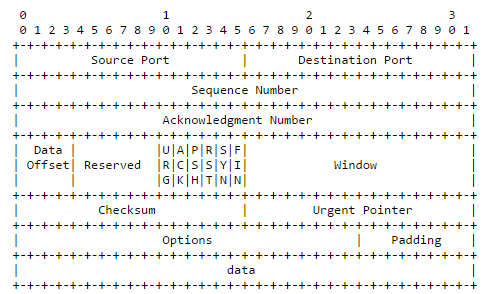
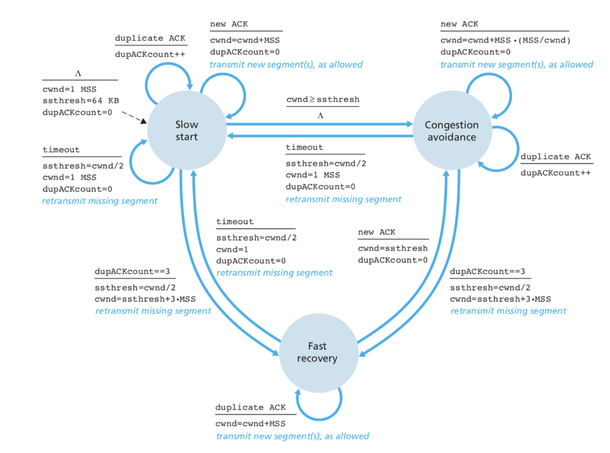
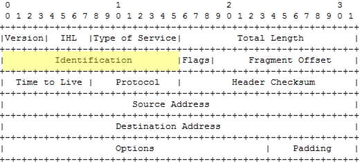
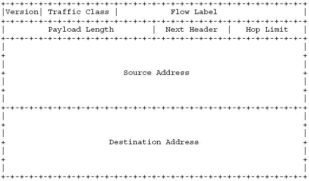

# TCP/IP协议族基础

TCP/IP是互联网的基础协议族，它包括大大小小几十个协议。本篇文章主要涉及到就是HTTP、TCP、IP、TLS协议。TCP/IP代表的是现代网络通信模型，即**协议分层**或**协议栈**，书本上的网络模型一般是七层或者五层，完全可以对其简化，认知为四层。

```text
    Application layer           ->HTTP
-------------------------- 
     Transport layer            ->TCP
--------------------------
     Internet layer             ->IP
--------------------------
      Link layer                ->Ethernet
```

应用层、传输层、网际层、连接层，很直白的分层抽象，层与层互相隔离。不过，可以尝试换个角度来整体理解一下这四层。网络所做的就是传输数据，这四层就是数据在不同阶段的不同形式。应用层是数据的最终形式，传输层是数据的字节\(文本\)形式，网际层是数据的二进制形式，连接层是数据的信号形式\(这主要指的是连接层的最底层部分，电缆传输的就是电信号\)。

数据在发送通过这四层的时候，每经过一层会将数据作为payload，并加上这一层的控制信息作为header或footer。而到达目的地后，再这通过四层时，每层会将相应的header或footer剥离，最后给接收方一个与发送方发送的一模一样的数据。

## HTTP

HTTP是最被人熟知的协议，书本已经把HTTP讲的很透彻了。书本上没有提到的是HTTP协议内部是一个，字符串解析器。HTTP协议以分隔标识\(CRLF\)将数据解析成请求行/响应行、header、body构成的报文。而其请求行/响应行、header中的key-value field依照协议标准进行字符串匹配，其body承载的数据形式由使用者来决定。

### 多路复用\(Multiplexing\)

多路复用是HTTP2.0引入的优化，多路复用不光指多个请求、响应可以使用同一条链接，这是HTTP keep-alive的支持，而是可以做到多个请求、响应在同一时间使用同一条链接。

这代表HTTP传输要分帧\(frame\)，任何传输体会被切分成多帧，而每帧上标识所属的传输体，接收方收到后进行相应的组装。传输体被切分后，其一问一答组成一个整体，学名叫做流\(stream\)。

### hpack

hpack是HTTP2.0引入的一个针对协议head key-value形式的压缩算法，被发明出来用于HTTP2.0的head compress。理论基础很简单，协议head中这种key-value形式的字段都是约定出来的，那就将常用的key-value制作个码表，通信双方只传输序号就好了。HTTP2.0就规定了[码表](https://http2.github.io/http2-spec/compression.html#static.table.definition)，除了常用的key-value，对很多无法总结出常用value的field只能包含其key，并对其value采用静态huffman编码。

接下来就是hpack的关键点，这样的表是通信上下文无关的，任意通信都用同一张表，叫做静态表\(static table\)。而除了静态表，还有针对通信上下文的动态表\(dynamic table\)。实现上来说，上下文有关指的就是同一个TCP连接。

动态表与静态表制式一致，如果有不存在码表的key-value出现了就向动态表插入。动态表有空间限制，就像队列一样，从头部插入、尾部吞出。

#### **编解码**

具体在编解码时，是否允许用码表、key-value哪个在码表中，总的来看case比较多。而第一字节就是设计来区别不同case，这里就举几个case以加深理解。

**key-value都在码表中**

```text
  0   1   2   3   4   5   6   7
+---+---+---+---+---+---+---+---+
| 1 |        Index (7+)         |
+---+---------------------------+
```

**key在、value不在**

```text
0   1   2   3   4   5   6   7
+---+---+---+---+---+---+---+---+
| 0 | 1 |      Index (6+)       |
+---+---+-----------------------+
| H |     Value Length (7+)     |
+---+---------------------------+
| Value String (Length octets)  |
+-------------------------------+
```

**key不在、value不在**

```text
0   1   2   3   4   5   6   7
+---+---+---+---+---+---+---+---+
| 0 | 1 |           0           |
+---+---+-----------------------+
| H |     Name Length (7+)      |
+---+---------------------------+
|  Name String (Length octets)  |
+---+---------------------------+
| H |     Value Length (7+)     |
+---+---------------------------+
| Value String (Length octets)  |
+-------------------------------+
```

## TCP

TCP是个可靠传输协议，在如此动荡\(不安\)的网络环境里，想要确保这一点可不容易，TCP独有很多机制来做到这一点。TCP也是一个实践性很强的协议，TCP中很多为什么这么做，都是应用于网络中实践出真知得出的“真理”。

TCP还是一个面向连接的协议，建立连接是通过大名鼎鼎的三次握手，断开连接通过四次挥手。这个连接不是建立物理上的连接，而是逻辑上建立了连接。连接也就指的是，发送方和接收方都要初始化一些状态会被用来跟踪\(track\)发送过程，也就说TCP是个有状态的协议。

TCP提供端到端的服务，它会具体到应用程序的port。不同于IP提供点到点的服务，如果将发送数据比作送快递的话，IP提供的服务就是，快递员准确的送到你家，TCP提供的服务就是，不仅送到你家，还将快递准确的交到接收人的手上。

### 可靠协议

可靠传输协议要求，双方的报文段\(segment\)必须都能无损的到达，并且发送方和接收方最后的报文段顺序需要一致。这代表，首先报文段要有**序号**，其次报文段要可以**检测**出是否无损，接着为了让对方知晓报文段意境可靠到达需要—**确认**，而如果认为对方没有接收到报文段只有一个补救措施—**重传**，而认为没有接收到报文段依靠—计时器超时。

**确认**最简单的确认做法就是，一方发送报文段，另一方再发送一个单独做**确认**的报文段，但这样太低效了。不如，在发送自己的报文段的时候，顺便**确认**下所接受的报文段。上面说的这个几点在TCP协议中都有体现，更直接的在TCP header中就有体现。

### TCP Header



Source Port和Destination Port代表目的和源端口。

Sequence Number代表报文段的序号来表示顺序。Acknowledgment Number代表发送方作为接收方已接收的报文段，并且期望收到下个报文段的开始序列号。TCP将传送数据看做成数据的字节流，而不是一个个单独的报文段。这点从Sequence Number就可以看出，Sequence Number以传送的字节数作为单位，而不以报文段的数量作为单位。

Data Offset作为对齐的空位，Reserved作为保留位。

Flag包括Urgent、Ack、Push、Reset、Syn、Fin这6位。Urgent作为报文段的紧急数据标识，但具体如何处理交给接收方决定。Reset作为报文段的连接异常结束或端口号错误的标识。而Ack确认、Syn同步、Fin结束在三次握手和四次挥手中作为关键标识位。Push代表TCP不再等待是否还有其他报文段到达，马上交给上层应用层。

Window位作为**流量控制**的基础。

Check Sum作为校验位，校验报文段是否在传输过程中受损。Urgent Pointer在Urgent位为1时，才会出现，指向紧急数据的最后一个字节。

Options常见的标识有nop、TS val\(time stamp\)、ecr\(echo reply\)、mss。nop标识类似气泡指令，作为占位。而TS val和ecr分别代表发送方的时间戳和接收方的时间戳，基于这两个时间戳来计算出RTT往返时间 \(round-trip time\) ，RTT会被用来衡量重传计时器的超时时长。mss\(Maximum Segment Size\)指的是，连接层每次传输的数据有个最大限制MTU\(Maximum Transmission Unit\)，一般是1500比特，超过这个量要分成多个报文段，mss则是这个最大限制减去TCP的header，光是要传输的数据的大小，一般为1460比特。

### 三次握手

三次握手，只能由客户端向服务端发起。第一次客户端发送SYN为1，序列号seq为某序列号，表示客户端想要建立连接。第二次服务端返回ACK、SYN都为1，序列号seq为某序列号，确认号为接收的序列号加1，表示确认服务端也想要建立连接。第三次客户端发送ACK为1，确认号为所接收序列号加1，再次确认，然后连接建立。

而要握三次手是为了防止失效的报文段又到达了服务端产生错误连接。假设，客户端发送的第一个报文段延时到达了服务端，这个报文应被认为失效。但服务端误认为客户端想要建立一个新连接，就发出了确认，若没有第三次确认再建立起连接。服务端就错误地建立起一个连接。

如果三次握手失败，服务端并不会马上放弃，服务端还会尝试重新发送确认，默认重试5次，间隔从1秒开始，后来每次是前一次的2倍。5次重试后，未果则放弃连接。

### 四次挥手

四次挥手，客户端和服务端都可以发起。第一次发送方发送FIN为1、ACK为1，序列号为某序列号，表示发送方想结束连接。第二次接收方发送ACK为1，确认号为接收序列号加1，表示我还没有准备好结束连接。第三次接收方发送FIN为1、ACK为1，序列号为某序列号，表示我已经准备好结束连接了。第四次发送方，发送ACK为1，确认号为所接收序列号加1，表示确认，结束连接。

### 半关闭

在四次挥手的基础上，发送方可以在接收第二次接收方发送ACK后，可以形成发送方不再发送报文段，但仍然接收接收方发送的报文段的这种现象。这就形成了半关闭。

学习协议，光看书和概念，味如嚼蜡。还是动手实验，才会有更深的体会，推荐tcpdump工具。[tcpdump如何使用点我](http://mrpeak.cn/blog/tutorial-tcpdump/)。用tcpdump截的报文段：

```text
16:26:13.702723 IP 10.174.73.57.65133 > 120.92.234.238.http: Flags[S], seq 37233370769,win 65535,
       ↓        ↓         ↓                    ↓        ↓       ↓       ↓               ↓
    发送时间   IP协议    源IP.port     到   目的IP.port http协议 Flags位 seq确认号       win大小
​
options [mss 1460,nop,wscale 5,nop,nop,TS val 1021470802 ecr 0, sackOK, eol], length 0
                                 ↓                                               ↓
                             options位                                  报文段不包含header的长度
```

### TCP的确认方式

TCP在发送报文段的时候，可以顺便确认下所接受的报文段。这导致TCP确认会延迟，去等待是否有报文段发送，让报文段捎上确认。延迟一般为200毫秒。

TCP使用了**累计确认**。接收方为了交付给应用层正确的顺序，只有顺序正确的报文段会被确认然后交付给上层。发送方如果收到了接收方的某个确认号，即使这个确认号以前的报文段没有收到确认号也会被认为正确接收。

TCP还会使用**选择确认**\(selective acknowledgement\)。假设，发送方发送了多个报文段，初始的报文段出现了问题，没有抵达接收方。发送方会仅仅认为这个初始的报文段失效了，而后发送的几个报文段准确到达了接收方。也就是说，后发送的报文段虽然没有接收到直接的确认，而发送方选择性的确认了他们。接收方会将后发送的失序报文段先放入缓冲\(buffer\)中。这就是TCP实践出真知的最好例子。网络环境抖动一般会影响单个报文段，而不会影响一大片的报文段。

基于上面所说的**累计确认**和**选择确认**，若是报文段失效，发送可能会收到多次对于同一个报文段的冗余确认，若是收到了三次冗余确认，就认为这个报文段失效了，TCP不会等待计时器**超时重传**，TCP会直接启动**快速重传**\(fast retransmit\)，直接重传。这一点，就是以时间和数据量两个指标作为衡量重传的条件。

同样，还是用工具实践一下有意思一点，推荐使用WireShark，WireShark的Filter非常强大，在进行网络诊断的时候非常有用。WireShark会根据TCP header中的Sequence Number，分析出冗余ACK、快速重传等现象，[具体点我](https://wiki.wireshark.org/TCP_Analyze_Sequence_Numbers)。WireShark在Filter中输入tcp.analysis.fast\_retransmission，就可以找出快速重传的报文段。

### 流量控制

**流量控制**是发送方发送和接收方处理速度匹配的过程。

TCP连接发送的报文段，都会放入上文所说的缓冲中等待应用程序取出。如果一端持续发送报文段，另一端一直没有及时处理完并接着取出报文段，就会造成缓冲溢出。这时，就需要进行双方的速度匹配，进行**流量控制**。接收方会将自己的缓冲剩余空间rwnd告诉发送方，发送方为了控制速度，只能再发送所得到的剩余空间rwnd容量的报文段。由于上文所说TCP采取的确认方式，发送方得到的这个rwnd容量不会限制已发送而未得到确认的报文段，这些报文段很可能已经在接收方的缓冲中了，只限制将要发送的报文段。

将传送数据看做数据流后，上面的这个过程就像在以序号作为基准在数据流上移动窗口一样，所以得名流量窗口。而剩余空间rwnd，也就是TCP header中的window位。

这里还有个经典问题，如果一方接收到了零剩余空间信息，这方就再也不发送报文了。这样处理当然不合理，TCP为应对这个情况会有个计时器\(persist timer\)，出现这种情况就会让计时器记时，当计时器触发，这方会发送个剩余空间探测报文段\(window probe\)，以检测是否可以重新发送报文段。如果一直没有剩余空间，计时器永远不会终止，仍会做重新记时、超时的循环。

在WireShark中可以通过tcp.analysis.zero\_window\_probe、tcp.analysis.window\_full找出剩余空间探测报文段和通知发送方接收方空间已满的报文段。

### 拥塞控制\(Congestion-Control\)

TCP如果不照顾网络总体状况，一股脑的传送数据的话，在极差的网络环境下只会恶性循环，可以直接搞瘫网络。而传送数据太小心的话又不能充分利用带宽资源。所以，**拥塞控制**就是一个动态平衡的策略。**拥塞控制**就是一个由三个状态组成的有限状态机\(FSM\)，这三个状态是**慢启动**\(slow start\)、**拥塞避免**\(congestion avoid\)、**快速恢复**\(fast recovery\)。

在一头扎进这三个状态之前，思考一下TCP是如何认知拥塞的。

* TCP要根据自己的有限信息判定网络拥塞，只要出现超时重传就认为网络拥塞了。
* TCP要判定不是网络拥塞而只是抖动，只要出现快速重传就被认为抖动。
* TCP要判断快要拥塞了，TCP会在每次发生拥塞后，记录下导致发生拥塞的报文段的数量的一半，最小不能小于2单位\(mss\)报文段，这个值被用来衡量下次是否快要拥塞。
* 相对于拥塞，TCP还要判断网络良好，只要没有发生重传，TCP就认为一切顺利。

```text
|  不拥塞   |    快要拥塞       |   抖动   |  拥塞   |
     ↑              ↑               ↑         ↑
|正常收到ACK|到了上次拥塞一半的量| 快速重传 | 超时重传 |
```

TCP有了这四个认知，就可以模型化的照顾网络总体情况了。TCP以cwnd标识能够发送的报文段的量，**拥塞控制**整个过程也像是在数据流上移动窗口，所以也叫拥塞窗口。

首先，**慢启动**。

在**慢启动**阶段，TCP以cwnd为1作为初始量，然后每确认一个报文段，都会为cwnd加1。这样，如果TCP一直保持最大限度的发送报文段，每过一个RTT，TCP发送的报文段量就会翻倍。所以，在**慢启动**阶段，TCP是指数级增长。**慢启动**的语义是，现在网络状态拥塞了，开始极少的发送，慢慢过渡增加起来发送量。

其次，**拥塞避免**。

当cwnd增长到快要拥塞的时候会状态迁移到**拥塞避免**。上文说到为标志快要拥塞会维护一个值ssthresh\(slow start threshold\)，当cwnd大于等于ssthresh，**慢启动**迁移到**拥塞避免**状态。进入拥塞状态后，每确认一个报文段，都会为cwnd加1/cwnd。这样，如果TCP一直保持最大限度的发送报文段，每过一个RTT，TCP发送的报文段量会加1。所以，在**拥塞避免**状态，TCP是线性增长。**拥塞避免**的语义是，网络状况快要拥塞，小心一点。

然后，**快速恢复**。

不管是**慢启动**还是**拥塞避免**，出现了快速重传，都迁移到**快速恢复**。既然发生了抖动，那就适当的降低cwnd，将cwnd除2，并且维护ssthresh记录拥塞的量，将cwnd的值赋给ssthresh。发生**快速恢复**就说明出现了3次冗余ACK，TCP基于选择确认，认为引起3次冗余ACK的报文段顺利到达，将cwnd加上3个单位\(mss\)的量。如果再收到这个报文段的冗余ACK，为cwnd加1。如果收到了非这个报文段的冗余ACK，表明这个报文段正确到达了，将ssthresh赋给cwnd，并结束**快速恢复**，迁移到**拥塞避免**状态。所以，在**快速恢复**状态，TCP增长的量级在**拥塞避免**和**慢启动**之间。**快速恢复**的语义是，出了抖动，少发送一点，尽快的把缺失的补上，回到正轨上后小心一点。

最后，状态变迁。

如果出现超时重传，无论在哪个状态都迁移到**慢启动**，将cwnd重置为1。这样，这三个状态都可以两两互相迁移到。TCP的**拥塞控制**就在迁移状态中度过。



### 糊涂窗口综合症\(Silly-Window-Syndrome\)与Nagle算法

**流量控制**很好的照顾了接收方，但是也引来了问题，如果接收方一直告诉发送方的剩余空间rwnd很小。那么发送方将一直发送内容很小的报文段。相对于TCP header20字节，如果每次内容只有个位数字节，那这样网络基本上就都在传输控制信息，网络使用率就太低了。这就出现了糊涂窗口综合症。而出现这种情况发送方和接收方自然也都有自己的应对办法。

对于接收方一般会使用David D Clark’s的策略，就是“欺骗”发送方，如果是剩余空间很小的情况，干脆就通告发送方剩余空间是零，这样发送方就不会再发送小内容了。等到剩余空间超过1单位或者剩余空间超过缓冲的一半的时候，再不“欺骗”发送方。

对于发送方会使用Nagle算法。就是对于小内容的停等协议。如果是小内容的话，要查看是否所有已发送的小内容都已被确认，都被确认才能发送，这就形成了对小内容的停止发送等待确认的协议。 Nagle认为小内容就是小于1单位\(mss\)的量。

Nagle算法不光是设计来解决发送方的糊涂窗口综合征，它还减轻了拥塞。它可以将多个等待的小内容合并成一个数据报发送。这样直接的减少数据报的数量，从而减轻了拥塞。

### 总结

TCP协议是个可靠协议，通过**序号**、**校验和**、**超时重传**、**快速重传**、**确认**来做到这点。并且还要照顾接收方和网络总体状况，主要体现在**流量控制**和**拥塞控制**。它还是个会建立连接的协议，需要在双方记录一些状态去跟踪传输过程。并提供端到端的服务。

## IP

IP协议最大的任务就是寻路，找到发往目的地的路径然后发送过去，也就是说IP协议提供“点到点”的服务。IP协议不是可靠传输协议，只能尽力将数据报\(digram\)发送到目的地。这也代表着，数据报和数据包之间是独立的，没有状态。

### IP协议寻路

IP协议不可能一次性将数据报发送到目的地，必须经过多个中转站。如果要求一次性发送到目的地，要求双方有个独有的连接，然而为网络上所有人都建立这样一个连接是不可能的。并且这个中转站不可能强大到知道整个网络的拓扑结构，它只知道周围的节点的拓扑结构。

这就呈现出了IP寻路模型。路由器充当中转站的角色，主机和路由器都有一个路由表，路由表指示周围路由器的拓扑结构，就像一个地图一样，数据报通过查询路由表的结果寻路到下一个路由器。下一个路由器以同样方式负责寻路到再下一个路由器。这样，每一个路由器只负责到下一跳路由器\(next-hop router\)。最后IP协议通过多个路由器就到达了目的地。路由表不仅可以通过精确的目的地主机号寻路，还可以以子网的网络号寻路。当然还有保底的默认路径。

子网作为比主机更大粒度的划分网络，以子网寻路可以极大的减少路由表的体积。相当于通过加大划分的粒度，减少了维护整个网络系统的成本。

IP协议寻路还有更多的问题。比如，主机也可以将数据报以发送给自己，当发现IP地址是自己时，数据报会交给以太网环回程序，环回程序将数据报加入本地的IP队列与其他数据报一视同仁。

主机可以被设置成路由器转发数据报，如果主机接收到了不是自己IP地址的数据报，只要被设置可以转发出去。如果没有寻路到下一跳，主机要返回一个ICMP\(网络控制消息协议\)，代表差错。

ICMP还可以用来重定向，比如说主机想发送一个数据报到目的地，可以发送给A和B，寻路的结果下一跳为A，主机发送给了A。A寻路的下一跳为B，发送给了B，A可以侦测出这个情况，然后发送给主机一个重定向ICMP，让主机的路由表修改为寻路到B。

### 数据分片\(IP-Fragmentation\)

当数据报量超过了MTU，对比于TCP的分段，IP要分片。然而，这两个步骤互不干扰，是完全隔离开的。IP分片后，接收方接收到数据报后，将分片要重新组合起来。IP分片对于UDP协议比较有用，对TCP没有太大用处，TCP更希望自己来分段，而不靠IP去分片。IP不是个可靠协议，如果分片其中的一片出了问题，TCP也无法重传单个分片，自然TCP就更希望自己来分段，做到重传单个分段。

### IP Header

IP协议分为IPv4和IPv6版本，两种版本header不相同，版本在Version区域区分。首先IPv4，



其次，IPv6



IPv4 header一般为20字节，IPv6 header一般为40字节。IPv4中address为32位，而IPv6增大到了128位。这样就从address分配紧张到地球上的每一颗砂砾都能有IP address了！

TTL和Hop Limit都是表示IP协议还能跳的路由器数量，如果为零了，则数据报会被丢弃，并返回一个ICMP通知源主机。Traceroute程序就是这样收集数据报被丢弃后发送的ICMP实现的。

IPv4用Identification唯一识别数据报\(分片数据报相同\)，Fragment offset标识分片的起始位置。而在IPv6中都可以用更加灵活的Next Header表示，Next Header就像链表一样，可以连接多个"Header"，拓展出多个Header。除了分片的起始位置、还可以表示同IPv4 protocol一样能表示的上层协议。

## TLS

TLS是加密通信的工业标准，其标准仍在不断的迭代中。**现代加密通信模型是加密加上认证**。而这两个过程也是TLS握手的主要任务，其中包含的知识点比较多，建议先掌握模型，再掌握算法，最后再看流程和优化。

### 加密模型

由于对称加密比非对称加密效率快很多，导致TLS不可能一直使用非对称加密，而光使用对称加密又无法交换秘钥，所以一般要搭配使用。TLS在握手阶段使用的是非对称加密，通信阶段使用的是对称加密。

而无论对称加密还是非对称加密，都无法摆脱中间人攻击\(Man-in-the-middle attack\)，中间人按照通信交换秘钥规则，在发送方面前充当接收方，在接收方面前充当发送方，双方无从知晓。只能引进数字证书解决这个问题。

数字证书就是数字签名生成的证书，数字签名指的是将内容哈希，生成消息摘要，然后用私钥加密，连同内容一起返回。接收方用公钥解密并比对摘要。

发送方拿CA颁发的公钥去解接收方从CA拿到的私钥，通过CA，发送方信任接收方的身份。

### 静态RSA和动态Diffie-Hellman

TLS非对称加密算法主要涉及两种：静态RSA和动态Diffe-Hellman，静态RSA算法是不具备前向安全性\(forward-secure\)的，TLS在1.3中废弃了静态RSA。前向安全性指的是，接收方在某次通信中私钥暴露了，其之前通信仍是安全的。具备前向安全性就要求用来加密的秘钥不能为一成不变的，要能做到快速动态生成。

RSA算法不“生成”秘钥，只用非对称密钥加密对称秘钥。用来加密的秘钥对每次都是一样的，被加密的对称秘钥本质是由三个随机数构成的，这三个随机数为密钥引入随机性。而具体是三次的原因是，即使每次随机是伪随机，三次伪随机也接近“真”随机了。

DH算法用非对称密钥“生成”对称密钥。用来加密的密钥是每次动态生成的，被加密的对称密钥本质是由两个随机数和对方的公钥和自己的私钥通过算法“生成”的。这就要求通信双方掌握对方的公钥和自己的私钥，DH算法可以保证对方使用同样的方法“生成”的秘钥是一致的。

### TLS1.2 full handshake

TLS1.2握手需要经过四次通信，即2-rtt。四次握手的主要目的就是先商定非对称加密算法再计算出对称秘钥。对称秘钥叫做会话秘钥\(session key\)，暗示每次会话的秘钥都不同。

如果使用静态RSA，前三次通信方都要给对方一个随机数。第二次通信接收方会将公钥发送过来，第三次随机数比较特殊叫做premaster secret，用公钥加密后传输。而公钥是以数字证书形式给的。

如果使用动态DH，第二次不仅要把公钥发送过来，还要带上DH参数。第三次通信生成自己的公私钥后，要把自己的公钥和DH参数发送过去。

### TLS1.2 会话恢复\(session resumption\)

每次通信都额外要2-rtt成了性能瓶颈，要想办法通过短路\(short-circuit\)去减少rtt。对于同个会话，可以缓存对称秘钥以减少握手到1-rtt。这要求前两次通信双方交换会话识别，如果一致的话，再需要一次通信就可以建立加密通信了。

### TLS1.3 full handshake

TLS1.3中移除了静态RSA，也就不需要商定非对称加密算法的流程了，只要满足DH要求就可以了。前两次通信，双方将DH参数和自己的公钥放在KeyShare拓展中发送给对方，之所以在拓展中是为了兼容TLS以前版本。

### TLS1.3 PSK\(pre share key\)

TLS1.3中同样有类似会话恢复的方法，短路去减少rtt。通信双方不仅可以复用对称密钥，还可以将认证从非对称加密的数字证书替换成对称密钥加密，这要求接收方不仅要在握手结束发送要复用的对称密钥，还要发送对称密钥加密后的产物pre\_shared\_key，用来加密的对称密钥保留在接收方。再通信时，发送方将加密后的产物发送过去，接收方能够解密开，就形成了认证。

### TLS1.3 0-rtt draft

TLS还起草了0-rtt这样的“无延迟”握手，若想做到0-rtt，必须要在握手的同时发送加密的应用数据。而加密需要对方的公钥和DH参数，这就要求对方在上次握手完毕后，预留公钥和DH参数，而用这种方法生成的秘钥叫做Static Secret。这种0-rtt相对于full handshake每次握手动态生成秘钥，是半静态的\(semi-static\)。

### TLS1.3 0-rtt draft 动态变种

半静态的0-rtt握手是丢失前向安全换回来的，针对这种情况，可以要求第二次通信再计算新的公钥和私钥，然后将公钥和DH参数发送过来，以后通信用新生成的密钥加密。这种动态的变种舍弃了第一次通信的应用数据的安全性，提升了后续的应用数据安全性。

## 引用

TCP [http://coolshell.cn/articles/11609.html](http://coolshell.cn/articles/11609.html)

TCP/IP详解 卷1:协议

计算机网络自顶向下方法

TLS handshake：[https://timtaubert.de/blog/2015/11/more-privacy-less-latency-improved-handshakes-in-tls-13/](https://timtaubert.de/blog/2015/11/more-privacy-less-latency-improved-handshakes-in-tls-13/)

Diffie-Hellman：[https://l2x.gitbooks.io/understanding-cryptography/docs/chapter-3/diffie-hellman%E5%AF%86%E9%92%A5%E4%BA%A4%E6%8D%A2.html](https://l2x.gitbooks.io/understanding-cryptography/docs/chapter-3/diffie-hellman%E5%AF%86%E9%92%A5%E4%BA%A4%E6%8D%A2.html)

现代加密通信协议：[https://blog.helong.info/blog/2015/09/07/tls-protocol-analysis-and-crypto-protocol-design/](https://blog.helong.info/blog/2015/09/07/tls-protocol-analysis-and-crypto-protocol-design/)

