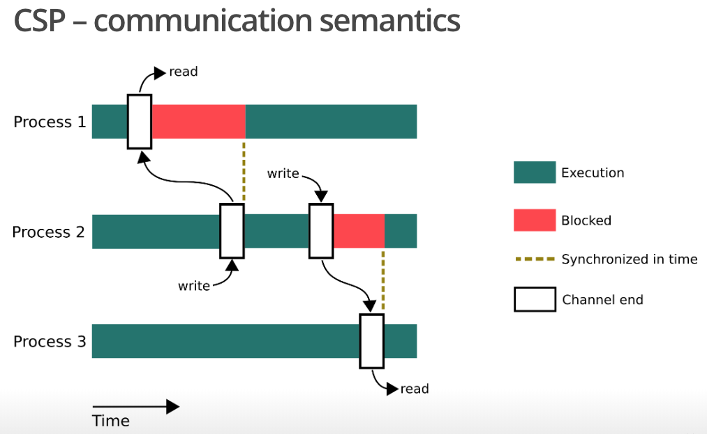
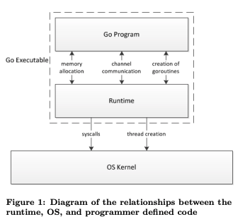
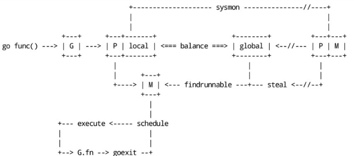

# golang特性

golang是一门简短、高效的语言。简短指的是：

* **golang尽可能的浓缩概念中的精华**。比如，golang没有直接引入面向对象编程范式，但吸收了面向对象编程的成功点，并用另一种方式实现出来，甚至golang没有引入任何范式。
* **golang对引入特性很克制**，比如，golang中不存在泛型、方法注解、宏等容易给语言添加复杂度的特性。

高效指的是：

* **天生能够充分利用多核机器及其IO**。
* **机器代码运行效率很高**。

golang的简短给人以解释型语言的假象，而其作为编译型语言又有高效的特点，golang在解释型语言和编译型语言之间做了很好的平衡。

## 范式\(接口\)

golang中是没有任何范式的，有的只是组成范式的基本元素。其中，最特殊的就是接口\(interface\)。接口特殊的就是其具体类型的实现方式，完全不用任何显示声明，只要实现方法就好，这种方式的好处就在于，没有了显示引用，可以解开包引用依赖。

面向对象编程调用方法一共就两种方式：动态发消息\(**dynamic dispatch**\)、静态调用。而接口调用函数实现的思路就类似**dynamic dispatch**。这是由编译期和运行时协作实现的。

接口值内部包含两个指针，一个指针指向itable，另一个指针指向实际数据。其中，itable包含实现该接口的函数列表，这是在编译期生成的。编译期间会生成接口和具体类型的函数列表，并根据接口和具体类型两个列表匹配出itable包含的函数列表。在运行时，接口值再跳转到itable调用函数，这种方式与**dynamic dispatch**如出一辙。

itable结构如下：

```go
// layout of Itab known to compilers
// allocated in non-garbage-collected memory
// Needs to be in sync with
// ../cmd/compile/internal/gc/reflect.go:/^func.dumptypestructs.
type itab struct {
  inter *interfacetype
  _type *_type
  hash  uint32 // copy of _type.hash. Used for type switches.
  _     [4]byte
  fun   [1]uintptr // variable sized. fun[0]==0 means _type does not implement inter.
}
```

其中，**fun**就是函数列表，它是一个只有一个指针元素的数组，指针指向的地址以字典顺序排列着具体类型实现的函数指针。具体匹配算法在[iface.go](https://github.com/golang/go/blob/master/src/runtime/iface.go)代码中，最重要的是这句：

```go
*(*unsafe.Pointer)(add(unsafe.Pointer(&m.fun[0]), uintptr(k)*sys.PtrSize)) = ifn
```

向**fun**指向的地址，添加一个函数指针。除此之外，**iface.go**中还实现了**itabTable**全局表。

接口值内部结构为：

```go
type iface struct {
  tab  *itab
  data unsafe.Pointer
}
```

### interface{}

**interface{}**是个特殊的存在，从语义上讲，由于任何类型都实现了空函数列表的，所以**interface{}**代表Any任何类型。从实现上讲，**interface{}**是接口，但由于其特殊性，**interface{}**值内部是与**iface**类似的**eface**结构：

```go
type eface struct {
  _type *_type
  data  unsafe.Pointer
}
```

**eface**根本不包含**itab**。

## 并发程序设计

golang中每个go语句都是一个goroutine，goroutine是个独特的概念，goroutine与线程没有必然的关联，多个goroutine完全可以运行在同一线程上。其中，goroutine隐藏了线程管理的细节，这就是语言级别的支持并发。

### Communicating Sequential Process Model

并发带来的共享资源问题在golang中也有解决方案，将共享资源转化为通信问题，golang基于CSP模型在并发中通信。模型中的通信基本单位叫做process，多个process通过channel通信，通信过程是线性阻塞的。



golang鼓励共享数据只在一个goroutine访问，其他goroutine访问通过channel。而不是在一个goroutine中加锁控制，其他goroutine通过锁访问。这正是golang提倡的：不要通过共享内存来通信，而应该通过通信来共享内存。

### Schedule

goroutine隐藏了线程管理，真正的线程管理是由golang的runtime来完成的，即golang语言本身。当用户的go程序进行特定操作时，会经过go runtime。这时，控制权就交给了go runtime，go runtime会完成线程管理、垃圾回收相关工作。而线程管理的过程就是schedule。



最初，schedule的模型比较简单，**G**代表goroutine等着去执行，**M**代表线程可以执行。整个模型就是，**G**不断的加入runnable队列，**M**不断去runnable队列找**G**来执行，当有**G**导致**M**阻塞，空闲**M**队列将激活一个空闲的**M**，去找**G**执行。这个模型比较直白，但是有明显的性能问题，整个模型中有多个全局队列和全局变量，这要求实现的结构中大量的持有锁并进行锁操作。

schedule的模型加入**P**解决这个问题。**P**代表抽象的处理，执行**G**不仅需要**M**，还需要**P**。每个**P**有自己的**G**队列和**M**，避免大量的访问全局变量。**G**和**M**分配给**P**以后，**P**通过Work Sharing和Work Stealing算法平衡全部的**G**和**M**。Work Sharing指的是**P**生成新的线程，会把部分的线程共享给其他**P**。Work Stealing指的是**P**会从其他**P**处偷**G**或**M**。



### 线程栈

上述schedule很好的管理了线程，但是还有个必须要解决的问题，线程栈空间。一般语言中，对线程栈空间的管理是会分配固定大小的空间，如果有大量的线程并发就会将空间耗尽，导致程序宕机。golang很好的解决了这个问题。起初，golang用**split stack**解决这个问题。**split stack**会根据程序的规模，自行扩张、收缩，高效利用存储空间。在每个函数起始部分加入判断栈是否会溢出的检查，如果将要溢出，将会去申请另一片内存作为新的栈空间继续运行，这两片栈空间不是物理上连续的所以命名为**split stack**。但是这个解法带来的问题就是连续来回扩张、收缩成本太昂贵。所以，golang进化到**stack copying**解决这个问题。同样等到空间将要溢出时，将原栈拷贝到两倍大小的新空间继续运行，这就省去了多次自行扩张、收缩的成本。

## Slice

**Slice的本质是数组的快照**，设计来高效的利用数组的内存。从根本上，**Slice**是这样设计的，数组设计为不可变的，而一个数组可以对应多个**Slice**，而**Slice**是可变的。在只读、区间不相关的情况下，多个**Slice**高效的利用了同一个数组。**Slice**不只存在golang中，不同语言的设计初衷是一样的，实现细节上会有差异。

**Slice**指向原数组，并记录**Slice**起始到原数组结束的容量：

```text
type Slice struct {
    ptr *[]
    len,cap int
}
```

## 引用

[Dynamic Dispatch in Object Oriented Languages](http://condor.depaul.edu/ichu/csc447/notes/wk10/Dynamic2.htm)

[Go Data Structures:Interface](http://condor.depaul.edu/ichu/csc447/notes/wk10/Dynamic2.htm)

[Go Runtime Scheduler](https://speakerdeck.com/retervision/go-runtime-scheduler)

[Analysis of the Go runtime scheduler](https://speakerdeck.com/retervision/go-runtime-scheduler)

[CSP And Actor](http://jolestar.com/parallel-programming-model-thread-goroutine-actor/)

